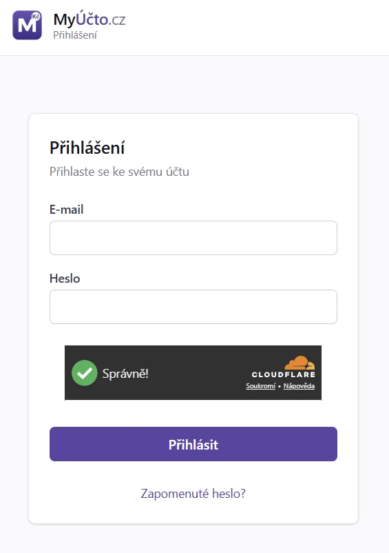

# 8. Přihlášení a uživatelský profil

> Návod, jak se přihlásit (heslem nebo přístupovým klíčem), obnovit zapomenuté
> heslo, nastavit silné ověření, upravit profil a zamknout aplikaci. Pro každého
> uživatele MyÚčta.

## 8.1 Kdy to potřebujete

- Přihlašujete se poprvé nebo po odhlášení.
- Zapomněli jste heslo.
- Chcete přidat přístupový klíč (passkey), zapnout TOTP nebo si vytvořit záložní kódy.
- Chcete změnit jazyk, jméno nebo heslo.
- Odcházíte od počítače a chcete aplikaci zamknout, nebo chcete nastavit
  automatické zamknutí po nečinnosti.
- Aplikace je zamčená a potřebujete ji odemknout.
- Aplikace vás zablokovala po několika neúspěšných pokusech.

## 8.2 Než začnete

- Máte účet, který pro vás založil správce (první účet vzniká v
  [setup wizardu](07_Setup_wizard.md)).
- Pro přihlášení bez hesla musí správce passwordless přihlášení povolit a vy
  musíte mít zaregistrovanou passkey.
- Pro obnovu hesla e-mailem musí mít instalace nastavené SMTP.

## 8.3 Krok za krokem: přihlášení

### 8.3.1 Přístupovým klíčem (bez hesla)

1. Na přihlašovací obrazovce klikněte na **Přihlásit přístupovým klíčem**.
2. V systémovém dialogu vyberte účet a potvrďte otiskem, obličejem, PINem nebo
   jinou metodou zařízení. E-mail ani heslo nezadáváte.

### 8.3.2 E-mailem a heslem

1. Zadejte **E-mail** a **Heslo**.
2. Klikněte na **Přihlásit**.
3. Má-li účet zapnuté silné vícefaktorové ověření, potvrďte passkey nebo zadejte
   kód z autentikátoru (**Ověřovací kód (2FA)**).

**Jak poznáte, že je hotovo:** otevře se [Přehled (dashboard)](10_Prehled.md).

| Pole | Význam |
|---|---|
| Přihlásit přístupovým klíčem | Přihlášení bez e-mailu a hesla; zobrazí se jen při povolení správcem |
| E-mail | Login zadaný při registraci |
| Heslo | Heslo zadané při registraci |
| Zapomenuté heslo? | Odkaz na obnovu, viz [§ 8.4](#84-krok-za-krokem-zapomenute-heslo) |

## 8.4 Krok za krokem: zapomenuté heslo

1. Na přihlašovací obrazovce klikněte na **Zapomenuté heslo?**.
2. Zadejte e-mail účtu a klikněte na **Poslat odkaz na obnovu**.
3. V e-mailu otevřete odkaz (platí 1 hodinu) a nastavte nové heslo.

**Jak poznáte, že je hotovo:** přihlásíte se novým heslem.

Nedorazil-li e-mail, zkontrolujte spam a požádejte správce, ať ověří SMTP
(`cfg.php` → `smtp.*`). V krajním případě správce nastaví heslo z CLI, viz
[§ 8.9](#89-kdyz-neco-nejde).

## 8.5 Krok za krokem: silné ověření (passkey, TOTP, záložní kódy)

### 8.5.1 Přidání přístupového klíče

1. V pravém horním rohu klikněte na své jméno a v nabídce zvolte **Přístupové klíče**.
2. Klikněte na **Přidat přístupový klíč**.
3. Zadejte **Název přístupového klíče** (např. Pixel 9).
4. Potvrďte registraci. Podle stavu účtu aplikace vyžádá ověření (viz tabulka v
   [§ 8.10.3](#8103-cerstve-overeni-pri-zmene-passkey)).
5. Nejlépe přidejte dva klíče, případně jeden klíč a aktivní TOTP.

**Jak poznáte, že je hotovo:** klíč je v seznamu s datem vytvoření.

Klíč můžete **Přejmenovat** nebo **Odebrat**. Odebrání je citlivá operace a
potvrzuje se jiným klíčem, nebo TOTP kódem.

### 8.5.2 Zapnutí TOTP

1. Klikněte vpravo nahoře na své jméno a zvolte **2FA / TOTP**.
2. Klikněte na **Nastavit TOTP**.
3. Naskenujte QR kód v autentikační aplikaci (Google Authenticator, Authy,
   1Password, Bitwarden, Microsoft Authenticator), případně vložte secret ručně.
4. Zadejte šestimístný kód a klikněte na **Aktivovat TOTP**.

**Jak poznáte, že je hotovo:** stav ukazuje „TOTP je aktivní.“ Při dalším
přihlášení se zeptá na kód.

### 8.5.3 Záložní kódy

1. Klikněte vpravo nahoře na své jméno a zvolte **Přístupové klíče**.
2. V sekci **Záložní kódy** klikněte na **Vygenerovat záložní kódy**.
3. Kódy hned uložte (**Stáhnout jako soubor** nebo **Kopírovat**) mimo počítač,
   ze kterého se přihlašujete.

**Jak poznáte, že je hotovo:** vidíte „Zbývá N z N kódů.“ Kódy se zobrazí jen
při vygenerování, server je podruhé neukáže.

### 8.5.4 Přihlášení s druhým faktorem

- Zadáte-li správné heslo, nabídne se jen metoda, kterou účet skutečně má.
- Máte-li passkey i TOTP, můžete místo passkey zvolit **Použít kód z autentikátoru**
  a zadat aktuální šestimístný kód.
- Nemáte-li klíč ani autentikátor, zvolte **Nemám klíč ani autentikátor - použít
  záložní kód** a zadejte jeden ze záložních kódů (každý funguje jen jednou).

## 8.6 Krok za krokem: změna profilu a hesla

1. Klikněte na své jméno vpravo nahoře a zvolte **Změna hesla**. Otevře se
   stránka **Profil** se záložkami.
2. Vyplňte **Aktuální heslo**, **Nové heslo** a **Potvrzení nového hesla**.
3. Klikněte na **Změnit heslo**.

**Jak poznáte, že je hotovo:** aplikace ohlásí „Heslo úspěšně změněno“. Na tomto
zařízení zůstanete přihlášeni, ostatní přihlášení (mobil, jiný prohlížeč) se z
bezpečnostních důvodů odhlásí.

Stránka **Profil** má tyto záložky:

| Záložka | Význam |
|---|---|
| Změna hesla | Změna stávajícího hesla (vyžaduje původní) |
| 2FA / TOTP | Zobrazit stav a aktivovat pomocí QR a ověřovacího kódu |
| Přístupové klíče | Přidat, pojmenovat, přejmenovat nebo odvolat přístupový klíč; záložní kódy |
| Zámek aplikace | Převzít interval správce nebo zvolit vlastní přísnější interval |
| Klávesové zkratky | Přehled klávesových zkratek |

Jazyk rozhraní přepnete tlačítkem s vlajkou v horní liště. **Jméno** (zobrazuje
se v rozhraní a v logu činnosti) a **Jazyk** účtu (`cs` nebo `en`, používá se
i pro e-mailové šablony) mění správce v `Systém → Uživatelé`.

## 8.7 Krok za krokem: zamknutí a odemknutí aplikace

### 8.7.1 Zamknutí hned

1. Klikněte vpravo nahoře na své jméno a zvolte **Zamknout**.

**Jak poznáte, že je hotovo:** obsah aplikace překryje zamčená obrazovka.

### 8.7.2 Automatické zamknutí po nečinnosti

1. Klikněte vpravo nahoře na své jméno a zvolte **Zámek aplikace**.
2. Zvolte **Použít nastavení správce**, nebo **Vlastní interval** a zadejte počet minut.
3. Klikněte na **Uložit interval**.

**Jak poznáte, že je hotovo:** aplikace potvrdí uložení a po zvolené době
nečinnosti se sama zamkne.

Vlastní kladný interval může být jen kratší nebo stejný jako limit správce.
Pokud správce automatický zámek nevynucuje (`0`), můžete jej pro svůj účet
dobrovolně zapnout v rozsahu 1 až 1440 minut.

### 8.7.3 Odemknutí

1. Na zamčené obrazovce klikněte na **Odemknout přístupovým klíčem** a potvrďte
   systémový dialog. E-mail a heslo znovu zadávat nemusíte.
2. Není-li passkey dostupná, klikněte na **Odhlásit** a přihlaste se znovu
   včetně MFA. Aplikace nejprve bezpečně ukončí zamčenou session.

**Jak poznáte, že je hotovo:** vrátíte se tam, kde jste skončili.

## 8.8 Krok za krokem: odhlášení

1. V pravém horním rohu klikněte na své jméno.
2. V nabídce zvolte **Odhlásit**. Na mobilu je tlačítko **Odhlásit** dole v
   postranním menu.

**Jak poznáte, že je hotovo:** vidíte přihlašovací obrazovku. Session se zruší
okamžitě i na serveru.

Zavřete-li jen okno bez odhlášení, session má absolutní platnost nejvýše
**30 dní**. Během ní se může dříve zamknout po nečinnosti.

## 8.9 Když něco nejde

<!-- cols: 34 30 36 -->
| Co vidíte | Proč | Co udělat |
|---|---|---|
| Objevila se CAPTCHA | 5 neúspěšných pokusů během 5 minut z jedné IP | Vyřešte ji a pokračujte. Hláška „Vyřešte prosím ověření CAPTCHA.“ znamená, že jste ji vynechali |
| „Příliš mnoho pokusů. Zkuste to později.“ | IP je zablokovaná (10 selhání za 15 minut = blok 15 minut) | Počkejte 15 minut, nebo požádejte správce o reset hesla z CLI: `php api/bin/set-password.php tvuj@email.cz` |
| E-mail s obnovou hesla nedorazil | Spam nebo nenastavené SMTP | Zkontrolujte spam, správce ověří `smtp.*` v `cfg.php`, v krajním případě nastaví heslo z CLI |
| „Tento prohlížeč přístupové klíče nepodporuje.“ | Prohlížeč nebo zařízení passkey neumí | Použijte e-mail a heslo, kód z autentikátoru, nebo požádejte správce o obnovu MFA |
| „Ověření přístupovým klíčem bylo zrušeno.“ | Zrušili jste systémový dialog | Zkuste to znovu, nebo použijte **Použít kód z autentikátoru** |
| Přišli jste o passkey i autentikátor | Není čím se ověřit | Použijte záložní kód, jinou passkey nebo TOTP, případně správce provede CLI rescue ([101. Bezpečnost](101_Bezpecnost.md)) |
| Aplikace se opakovaně přepíná mezi úvodní stránkou a přihlášením | Service worker z jiné aplikace na stejné adrese | V nástrojích prohlížeče pro vývojáře zvolte Application → Storage → Clear site data a přihlaste se znovu |
| „Tuto session nelze odemknout přístupovým klíčem.“ | Účet nemá passkey | Klikněte na **Odhlásit** a přihlaste se znovu |
| Po zamknutí zmizel rozepsaný formulář | Android ukončil stránku v paměti | Neuložené změny se ztratily. Před zamčením ukládejte rozpracovanou práci |

## 8.10 Podrobnosti a pravidla

### 8.10.1 Brute-force ochrana

Po **5 neúspěšných pokusech** během 5 minut z jedné IP se objeví **CAPTCHA**
(Cloudflare Turnstile). Po **10 selháních** během 15 minut se IP zablokuje na
15 minut. Po **30 selháních za hodinu** je lockout 24 hodin a uživateli na
e-mail přijde upozornění.

Zapomenete-li heslo a omylem se 5× spletete, CAPTCHA se objeví: vyřešte ji a
pokračujte. Pokud se zablokujete, počkejte 15 minut nebo požádejte správce,
aby heslo resetoval z CLI: `php api/bin/set-password.php tvuj@email.cz`.

### 8.10.2 Vícefaktorové ověření

Passkey lze použít přímo k přihlášení bez e-mailu a hesla, pokud tuto možnost
povolil správce, nebo jako silný druhý krok po zadání e-mailu a hesla.
Systémový dialog zařízení může použít otisk prstu, obličej, PIN, gesto, heslo
zařízení nebo externí bezpečnostní klíč. MyÚčto konkrétní metodu nevybírá a
biometrická data nikdy nedostane.

Druhý krok nabízí pouze metody, které účet skutečně má. Vybírá je server až po
ověření hesla. Účtu bez zaregistrované passkey se tedy passkey nenabídne a při
jediné dostupné metodě se rovnou zobrazí pole pro kód, bez mezikroku s výběrem.
Tlačítko **Přihlásit přístupovým klíčem** patří k prvnímu kroku (nahrazuje
e-mail a heslo), takže po odeslání hesla zmizí.

Zrušení systémového dialogu passkey TOTP samo nespustí.

Pro případ, že přijdete o passkey i autentikátor, si vygenerujte záložní kódy
(viz [§ 8.5.3](#853-zalozni-kody)). Obnova přístupu jde také jinou passkey, TOTP
nebo administrátorským CLI rescue. Podrobnosti jsou v
[101. Bezpečnost](101_Bezpecnost.md).

### 8.10.3 Čerstvé ověření při změně passkey

Přidání nebo odvolání passkey vyžaduje čerstvé ověření existujícím silným
faktorem, a to podle toho, co účet zrovna má:

| Stav účtu | Co registrace vyžádá |
|---|---|
| Žádný silný faktor | Aktuální heslo |
| Aktivní TOTP, zatím žádná passkey | **Povinně kód z autentikátoru**, jiný silný faktor k ověření neexistuje |
| Alespoň jedna passkey | Potvrzení existující passkey; kód z autentikátoru je volitelná alternativa |

### 8.10.4 E-maily o hesle ve spravované instalaci

Ve spravované instalaci posílá obnovu hesla, pozvánku k nastavení hesla a
přihlašovací kódy systém pod odesílatelem nastaveným provozovatelem hostingu.
Tyto zprávy nepřebírají firemní odesílací profil, logo ani kontaktní patičku a
neobsahují hlavičku Reply-To. Odesílání faktur nadále používá firemní nastavení.
Ve vlastní (self-hosted) instalaci se i u systémových zpráv používá nastavený
firemní profil a jeho obvyklé náhradní hodnoty.

### 8.10.5 Zámek aplikace

Zámek je uložený na serveru: nejde jen o překryv obrazovky a zamčená session
nemůže číst ani měnit business data přes API.

Zámek zachová rozepsaný formulář pouze po dobu, kdy prohlížeč drží stránku
v paměti. Pokud Android stránku ukončí, neuložené změny se ztratí. Webová PWA
také nedokáže garantovat zákaz screenshotu ani skrytí náhledu v Android Recents.

## 8.11 Související kapitoly

- [První spuštění (setup wizard)](07_Setup_wizard.md)
- [Přehled (dashboard)](10_Prehled.md)
- [Bezpečnost](101_Bezpecnost.md)
- [Řešení problémů](999_Reseni_problemu.md)
