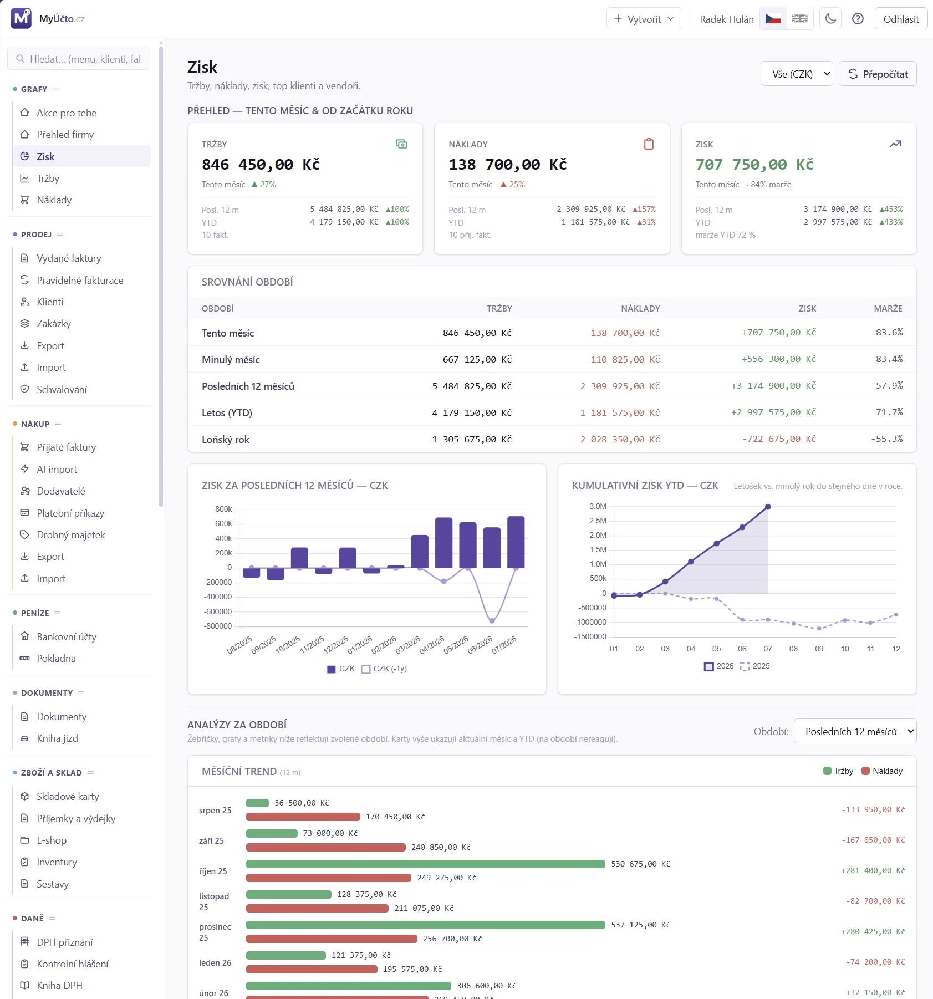

# 10. Přehled (dashboard)

> Návod, jak číst úvodní obrazovku po přihlášení, jak z ní založit doklad,
> projít úkoly, které na vás čekají, a jak si přizpůsobit menu, panely
> a vzhled aplikace. Pro každého uživatele.

Přehled je úvodní obrazovka po přihlášení: kolik jste vystavili, co je po splatnosti, jaký je obrat za letošní a loňský rok a kdo jsou vaši top klienti. V hlavním menu je to první položka sekce **Grafy**, označená jako **Akce pro tebe**.



## 10.1 Kdy to potřebujete

Kapitolu otevřete, když:

- se ráno přihlásíte a chcete vědět, co dnes udělat,
- chcete rychle založit fakturu, klienta nebo jiný doklad,
- potřebujete poslat upomínku po splatnosti,
- začínáte s novou firmou a nevíte, co nastavit dřív,
- chcete změnit menu (nahoře, vlevo, kompaktní), rozdělit obrazovku na víc panelů nebo přepnout světlý a tmavý režim,
- čísla na přehledu nesedí.

<!-- cols: 24 40 36 -->
| Kdy | Co udělat | Kde v aplikaci |
|---|---|---|
| denně | Projít frontu úkolů a vyřídit, co hlásí | widget **Akce pro tebe** na Přehledu |
| denně | Zkontrolovat doklady po splatnosti a poslat upomínky | tabulka **Po splatnosti** pod grafy |
| před termínem DPH a KH | Zkontrolovat daňové termíny | widget **Daňový kalendář** |
| do 20. dne měsíce | Odeslat připravené měsíční hlášení (JMHZ) | položka **Odešli měsíční hlášení** v **Akce pro tebe** |
| při zavádění firmy | Projít průvodce prvním nastavením | Přehled, dokud nemáte doklady |

## 10.2 Než začnete

- **Oprávnění k zápisu.** Widget **Akce pro tebe**, průvodce prvním nastavením a rychlé vytváření (**+**) vidí jen uživatelé s právem zápisu. U role jen pro čtení jsou skryté.
- **Aktivní firma.** Všechna čísla se týkají firmy zvolené v přepínači firem. Máte-li víc firem, přepněte nejdřív na tu správnou. V režimu horního menu je přepínač uprostřed spodní lišty, v režimu levého menu vpravo v hlavičce.
- **Měny.** Dlaždice s obratem v EUR se zobrazí jen u aktivní měny EUR (`Systém → Sazby a číselníky`).
- **Podvojné účetnictví.** Položky **Zaúčtuj doklady** a **Zkontroluj integritu deníku** se zobrazí jen firmám v tomto režimu.

## 10.3 Krok za krokem: Projít úkoly po přihlášení

1. Přihlaste se. Otevře se Přehled (nebo `Grafy → Akce pro tebe`).
2. V horní části najděte widget **Akce pro tebe**. Odznak ukazuje počet úkolů.
3. Klikněte na položku, kterou chcete vyřídit. Aplikace vás přenese na filtrovaný seznam nebo správnou obrazovku (např. **Pošli upomínky** otevře faktury po splatnosti).
4. Vyřiďte úkol a vraťte se na Přehled.
5. Úkol, který teď řešit nechcete, skryjte v jeho menu: **Den**, **Týden**, **Pro historická data** nebo **Navždy**.

**Jak poznáte, že je hotovo:** položka z widgetu zmizí a odznak klesne. Při skrytých položkách se dole objeví odkaz **Obnovit skrytá (N)**, kterým je vrátíte.

Co která položka znamená, popisuje [§ 10.10.6](#10106-akce-pro-tebe).

## 10.4 Krok za krokem: Poslat upomínku po splatnosti

1. Na Přehledu sjeďte pod grafy do tabulky **Po splatnosti**. U každé faktury vidíte počet dní po splatnosti.
2. Klikněte na číslo faktury. Otevře se [detail faktury](16_Faktura_PDF.md).
3. Klikněte na **Odeslat upomínku**.
4. V potvrzovacím dialogu zkontrolujte příjemce a odeslání potvrďte.

Chcete-li upomenout víc faktur najednou, klikněte v hlavičce tabulky na **Zobrazit vše**. Otevře se seznam faktur po splatnosti, kde upomínky pošlete hromadně (viz [Upomínky](22_Upominky.md)).

**Jak poznáte, že je hotovo:** faktura přejde do stavu **Upomínka** a položka **Pošli upomínky** v **Akce pro tebe** ubyde.

## 10.5 Krok za krokem: Založit nový doklad nebo záznam

1. Klikněte na tlačítko **+** vpravo v horní liště.
2. Vyberte, co chcete založit:
   - **Vydaná faktura** - prázdný koncept v [Editoru faktury](15_Faktura_editor.md),
   - **Zálohová faktura** - editor rovnou v režimu proforma,
   - **Pravidelná fakturace** - nová [šablona](17_Pravidelne_fakturace.md),
   - **Klient** - okno pro založení klienta (s vyhledáním v ARES),
   - **Dodavatel** - nový dodavatel (firma),
   - **Přijatá faktura** - nová [přijatá faktura](23_Prijate_faktury.md),
   - **Nový účetní zápis** - ruční zápis do účetního deníku, pokud k němu máte oprávnění,
   - **Kniha jízd** a **Tankování** - nová jízda nebo tankování v [Knize jízd](36_Kniha_jizd.md),
   - **Nová příjemka**, **Nová výdejka** a **Nová skladová karta** - jen u firmy se zapnutým skladem.
3. Vyplňte a uložte.

**Jak poznáte, že je hotovo:** doklad je v příslušném seznamu a na Přehledu se promítne do čísel.

> [!TIP]
> Stejné zkratky najdete jako nenápadné **+** u příslušné položky v popup menu sekce (objeví se po najetí myší). Rychle půjde i klávesová zkratka, viz [§ 10.8](#108-krok-za-krokem-klavesove-zkratky).

## 10.6 Krok za krokem: Průvodce prvním nastavením

Dokud v systému nejsou žádné doklady ani klienti, Přehled místo prázdných grafů ukáže **průvodce prvním nastavením**.

1. Otevřete Přehled. Průvodce je nahoře.
2. Procházejte kroky shora a klikněte na **Otevřít** u kroku, který chcete udělat (seznam kroků je v [§ 10.10.14](#101014-pruvodce-prvnim-nastavenim)).
3. Hotový krok označte **Označit jako hotové**.
4. Až skončíte, klikněte na **Skrýt průvodce**.

**Jak poznáte, že je hotovo:** ukazatel ukáže „N z M hotovo". Skrytého průvodce vrátíte odkazem **Zobrazit průvodce**.

Odškrtávání je jen vaše poznámka, aplikace nic nekontroluje a odškrtnutí nemá vliv na chování. Stav se ukládá per uživatel.

## 10.7 Krok za krokem: Přizpůsobit menu, panely a vzhled

### 10.7.1 Změna stylu menu

1. Na dostatečně široké obrazovce klikněte ve spodní liště na **Styl menu**.
2. Vyberte horní menu, plný levý panel, nebo kompaktní levý pruh.

Na menší obrazovce klikněte ve spodní liště na **Menu vlevo** (kompaktní pruh), zpět se vrátíte tlačítkem **Hamburger**. Podrobnosti jsou v [§ 10.10.8](#10108-navigace-a-rozlozeni-menu).

### 10.7.2 Více panelů

1. V horní liště (mezi šířkami 1 024 a 1 535 px ve spodní liště) zvolte rozložení s jedním, dvěma nebo třemi panely.
2. Kliknutím do panelu ho aktivujete. Další položka menu se otevře v aktivním panelu.
3. Šířku panelů změníte tažením předělu.

Dva panely jsou dostupné od šířky pracovního prostoru 1 100 px, tři od 1 600 px. Pravidla jsou v [§ 10.10.10](#101010-vice-panelu-pracovniho-prostoru).

### 10.7.3 Světlý a tmavý režim a jazyk

1. Ve spodní liště klikněte na ikonu slunce nebo měsíce - přepne se **světlý** a **tmavý** motiv.
2. Kliknutím na vlaječku přepnete jazyk na druhý dostupný.

Volba se uloží v prohlížeči. Podrobnosti jsou v [§ 10.10.12](#101012-vzhled-jazyk-svetly-a-tmavy-rezim).

### 10.7.4 Přepnutí firmy

1. Použijte přepínač firem (spodní lišta uprostřed, v levém menu vpravo v hlavičce).
2. Nebo stiskněte **Alt+Q** (hledání) či **Ctrl+K** (paleta příkazů) a ve skupině **Přepnout firmu** zadejte název nebo IČ.

## 10.8 Krok za krokem: Klávesové zkratky

1. Otevřete uživatelské menu pod svým jménem a klikněte na **Klávesové zkratky** (stejná obrazovka je v **Profilu** jako záložka **Klávesové zkratky**).
2. Pro každý viditelný bod menu, položky **Přidat / Nová** i hledání ve spodní liště zadejte kombinaci kláves.
3. Uložte.

**Jak poznáte, že je hotovo:** kombinace funguje a je uložená u vašeho účtu, takže se přenáší mezi prohlížeči. Kolizní nebo prohlížečem vyhrazenou kombinaci nelze uložit.

Výchozí zkratky jsou v [§ 10.10.11](#101011-klavesove-zkratky).

## 10.9 Když něco nejde

<!-- cols: 34 30 36 -->
| Co vidíte | Proč | Co udělat |
|---|---|---|
| Čísla na Přehledu nesedí (např. po ruční úpravě v databázi) | Statistiky se přepočítávají při vystavení, zrušení nebo úhradě faktury | Správce spustí přepočet z příkazové řádky (viz [§ 10.10.13](#101013-aktualizace-dat)) |
| Chybí widget **Akce pro tebe** | Role je jen pro čtení | Požádejte správce o oprávnění k zápisu |
| Chybí **Zaúčtuj doklady** nebo **Zkontroluj integritu deníku** | Firma nevede podvojné účetnictví | Je to správně, položky se týkají jen podvojného účetnictví |
| Chybí dlaždice v EUR | Měna EUR není aktivní | Aktivujte ji v `Systém → Sazby a číselníky` |
| Chybí průvodce prvním nastavením | Firma už eviduje doklad (třeba jen přijatou fakturu) | Je to správně, rozhoduje existence dokladu, ne jeho částka nebo rok |
| Úkol **Odešli měsíční hlášení** zmizel, ale protokol z ČSSZ nemáte | Položka mizí odesláním, ne přijetím | Protokol sledujte v [Podání a hlášení](85_Podani_a_hlaseni.md) |
| Při Ctrl+klik se otevřela nová záložka | Ctrl+klik v posledním panelu, Cmd+klik a prostřední tlačítko myši otevírají záložku prohlížeče | Použijte Ctrl+klik v panelu, který není poslední |
| Odkaz na doklad jiné firmy se nezobrazil | K té firmě nemáte přístup | Požádejte správce o přiřazení |
| Horní menu přešlo samo na levý panel | Názvy sekcí se do horní lišty nevešly | Zvětšte okno, přetékající horní variantu nelze vynutit |
| Zkratku nelze uložit | Kombinace koliduje nebo je vyhrazená prohlížečem | Zvolte jinou kombinaci |

## 10.10 Podrobnosti a pravidla

### 10.10.1 KPI dlaždice

Horní řada dlaždic se přizpůsobí počtu aktivních měn (4 až 6 dlaždic):

<!-- cols: 30 70 -->
| Dlaždice | Význam |
|---|---|
| **Obrat YYYY (CZK)** | Součet všech vystavených (i nezaplacených) faktur v CZK za aktuální rok. Pod číslem je pro porovnání obrat minulého roku ve stejném období. |
| **Obrat YYYY (EUR)** | Totéž pro EUR, jen pokud je měna EUR aktivní v číselnících. |
| **Vystaveno YYYY** | Počet faktur za rok (všechny stavy kromě konceptů). |
| **Po splatnosti** | Suma neuhrazených faktur po splatnosti, součet CZK a EUR, červeně. Klik otevře filtrovaný seznam. |
| **Ø doba úhrady** | Průměrný počet dní mezi vystavením a zaplacením (jen letošní zaplacené faktury). |

### 10.10.2 Top klienti

Levý koláč ukazuje 3 největší klienty letos, pravý 3 největší loni. Hover nad výsečí ukáže jméno klienta a obrat, klik na legendu výseč odfiltruje.

> [!TIP]
> Máte-li přístup k více firmám, koláč ukazuje data jen pro aktuálně vybranou firmu.

### 10.10.3 Stav faktur

Koláč rozdělí letošní faktury podle stavu:

- zelená - **Zaplaceno**,
- fialová - **Odesláno** (klientovi šel e-mail s PDF, čeká se na platbu),
- žlutá - **Vystaveno (neodesláno)** (vystaveno, ale zatím neodesláno),
- oranžová - **Upomínka** (po splatnosti, byla odeslána upomínka),
- černá - **Storno / dobropis**.

### 10.10.4 Obrat po měsících

Spodní dva grafy ukazují měsíční obrat (CZK a EUR samostatně). Letošní rok je plnou barvou, minulý prázdnou pro porovnání. Hover nad sloupcem ukáže přesnou částku.

### 10.10.5 Po splatnosti a nezaplacené faktury

Pod grafy je tabulka:

- **Po splatnosti** (červená) - faktury ve stavu odesláno, vystaveno nebo upomínka, které překročily splatnost, s počtem dní po splatnosti. Upomínku pošlete z detailu faktury tlačítkem **Odeslat upomínku**.
- **Nezaplacené (před splatností)** - faktury ve stejných stavech, které ještě nejsou po splatnosti.

Klik na číslo faktury otevře [Detail faktury](16_Faktura_PDF.md).

### 10.10.6 Akce pro tebe

Widget úplně nahoře na Přehledu (nad KPI dlaždicemi) je průběžně skládaná fronta věcí, které čekají na váš zásah, s odznakem počtu. Vidí ho každý, kdo smí zapisovat (u role jen pro čtení je skrytý). Každá položka se zobrazí jen tehdy, když má co hlásit.

<!-- cols: 22 40 38 -->
| Položka | Kdy se objeví | Vede na |
|---|---|---|
| Pošli upomínky | Faktury po splatnosti bez odeslané upomínky | Faktury (filtr po splatnosti) |
| Spáruj platby z banky | Nespárované bankovní transakce | [Banka](29_Banka.md) |
| Vystav pravidelné faktury | Splatné pravidelné faktury čekají na vygenerování | [Pravidelné faktury](17_Pravidelne_fakturace.md) |
| Zaplať dodavatelům | Přijaté faktury po splatnosti se skutečným zůstatkem po odečtení banky a zápočtů | Přijaté faktury (filtr po splatnosti) |
| Zkontroluj koncepty přijatých faktur | Rozpracované koncepty přijatých faktur | [Přijaté faktury](23_Prijate_faktury.md) (filtr koncept) |
| **Zaúčtuj doklady** | Jen podvojné účetnictví, viz [§ 10.10.6.1](#101061-zauctuj-doklady) | Filtrovaný seznam vydaných, přijatých faktur nebo banky |
| **Zkontroluj integritu deníku** | Jen podvojné účetnictví, viz [§ 10.10.6.2](#101062-zkontroluj-integritu-deniku) | [Účetní deník](52_Ucetni_denik.md) |
| Termín DPH / KH | Blíží se nebo uplynul termín podání | [Výkazy DPH](41_Vykazy_DPH.md) |
| Souhrnné hlášení za uplynulý měsíc | Termín SH | [Souhrnné hlášení](44_Souhrnne_hlaseni.md) |
| Kontaktuj neaktivní klienty | Klienti bez aktivity delší dobu (riziko odchodu) | [Zisk](11_Zisk.md) |
| **Odešli měsíční hlášení** | Připravené měsíční hlášení (JMHZ) čeká na odeslání na ČSSZ, viz [§ 10.10.6.3](#101063-odesli-mesicni-hlaseni) | [Podání a hlášení](85_Podani_a_hlaseni.md) |

Každá položka má menu se skrytím (na den, týden, natrvalo, nebo jen pro historická data). Po skrytí se dole objeví odkaz **Obnovit skrytá (N)**.

Přijatá faktura plně vyrovnaná bankou, vzájemným zápočtem nebo zápočtem proti účtu se v položce **Zaplať dodavatelům** znovu nenabízí. U částečné úhrady se do souhrnů a platebních příkazů započítá jen zbývající částka.

#### 10.10.6.1 Zaúčtuj doklady

Zobrazí se jen firmám v režimu **podvojné účetnictví** (daňová evidence zaúčtování nepoužívá). Sečte tři zdroje nezaúčtovaných dokladů a u každého ukáže samostatný klikatelný štítek s počtem:

- **Vydané** - vydané faktury, dobropisy a daňové doklady k platbě bez zaúčtování (mimo koncepty a stornované), vede na seznam vydaných faktur s filtrem nezaúčtovaných (viz [§ 14.11.4](14_Faktury.md#14114-filtry)).
- **Přijaté** - přijaté faktury bez zaúčtování (mimo koncepty a stornované), vede na seznam přijatých faktur s filtrem nezaúčtovaných (viz [§ 23.11.1](23_Prijate_faktury.md#23111-seznam-prijatych-faktur)).
- **Banka** - nevyřízené návrhy zaúčtování bankovních transakcí, vede na [Banku](29_Banka.md).

Zálohové (proforma) faktury se do počtu záměrně nepočítají. Nejsou daňový doklad, zaúčtování u nich zůstává trvale prázdné, takže by číslo jen uměle nafukovaly. Klik na hlavní řádek otevře první neprázdný zdroj, klik na štítek rovnou jeho filtrovaný seznam. Jak zaúčtování z detailu dokladu funguje, popisují kapitoly [Faktury](14_Faktury.md) a [Přijaté faktury](23_Prijate_faktury.md).

#### 10.10.6.2 Zkontroluj integritu deníku

Také jen podvojné účetnictví. Na rozdíl od ostatních položek nepočítá nic naživo, čte poslední uložený běh **nočního kontrolního jobu** (viz [§ 52.14.11 Kontrola integrity deníku](52_Ucetni_denik.md#521411-kontrola-integrity-deniku-nocni-job)), aby dotaz na dashboard zůstal levný. Pokud job našel nesrovnalost mezi doklady a deníkem, položka se zobrazí se závažností **vysoká** a počtem nálezů v popisku. Klik, na hlavním řádku i na kterémkoli štítku rozpadu, vede vždy na [Účetní deník](52_Ucetni_denik.md). Aplikace nemá samostatnou stránku s výpisem jednotlivých nálezů, ty najdete jen přes příkazovou řádku (viz [§ 52.14.11](52_Ucetni_denik.md#521411-kontrola-integrity-deniku-nocni-job)).

#### 10.10.6.3 Odešli měsíční hlášení

Objeví se, jakmile je měsíční hlášení zaměstnavatele (JMHZ) **připravené k odeslání** na ČSSZ a nikdo je neodeslal. Má závažnost **vysokou** a v popisku počet takových podání. Klik vede na obrazovku mzdových podání.

Odeslání zůstává na výslovném potvrzení člověka. Je to právní úkon přičitatelný zaměstnavateli a poslední okamžik, kdy si někdo může všimnout, že je něco špatně. Automatické odeslání by tento okamžik vzalo. Zapomenout na něj ale znamená propásnout lhůtu do 20. dne následujícího měsíce, a to je chyba, která se sama ničím neprojeví. Proto hlášení visí mezi úkoly tak dlouho, dokud je skutečně neodešlete.

Položka **zmizí odesláním, ne přijetím**. Na protokol z ČSSZ se nečeká, ten sledujete dál v [Podání a hlášení](85_Podani_a_hlaseni.md). Nabízí se jen ostré prostředí a jen kanál ČSSZ: testovací podání nikdo podávat nemusí a podání na portál zdravotní pojišťovny aplikace odeslat neumí, protože žádná ze sedmi pojišťoven nemá zveřejněné strojové rozhraní. Vyzývat k úkonu, který se odsud udělat nedá, by bylo horší než mlčet.

### 10.10.7 Daňový kalendář

Widget **Daňový kalendář** (pod dlaždicemi, vedle nadcházejících záloh) shrnuje blížící se daňové termíny aktuálního dodavatele do jednoho seznamu:

- **DPH přiznání** a **Kontrolní hlášení** - podle periodicity dodavatele (měsíčně nebo čtvrtletně, viz [Výkazy DPH](41_Vykazy_DPH.md)).
- **Souhrnné hlášení** - jen pokud má firma za předchozí měsíc EU B2B plnění.
- **Zálohy na daň a pojistné** - z [Daně z příjmů, část Zálohy na daň a pojistné](43_Dan_z_prijmu.md#435-krok-za-krokem-zalohy-na-dan-a-pojistne), s částkou a stavem naplánováno nebo zaplaceno.
- **Roční přiznání DPFO/DPPO** - standardní termíny (papírově 1. 4., elektronicky začátkem května, posunuto z 1. 5. na nejbližší pracovní den). OSVČ v paušálním režimu se nezobrazuje (nepodává DPFO).

Každá položka nese odznak **Podáno** nebo **Nepodáno**, odvozený z toho, zda pro dané období existuje archivované podání (`Daně → EPO podání a archív`). Generování EPO XML se tam ukládá automaticky. U záloh odznak místo toho ukazuje **Zaplaceno** nebo **Splatné**. Klik na položku otevře příslušný výkaz.

### 10.10.8 Navigace a rozložení menu

Na desktopu má aplikace dvě stálé lišty:

- **horní lišta** - logo vede domů, za ním jsou názvy sekcí hlavního menu. Položky sekce se otevřou po najetí myší, kliknutím nebo z klávesnice.
- **kontextová nápověda (?)** - otevře manuál rovnou na kapitole odpovídající aktuální obrazovce.
- **uživatelské menu** - pod jménem uživatele jsou Změna hesla, 2FA / TOTP, Přístupové klíče, Zámek aplikace, Klávesové zkratky a Odhlásit.
- **spodní lišta** - vlevo společné hledání v menu, klientech a dokladech, uprostřed přepínač firem (jen v režimu horního menu) a vpravo jazyk, světlý nebo tmavý motiv a na širokém desktopu také verze a odkazy aplikace. Na užším desktopu se sem z horní lišty přesune přepínač panelů, rychlé vytvoření a nápověda, verze a odkazy ustoupí.
- **režim levého menu** - přepínač firem se přesune do pravé části hlavičky, kde je od ostatních akcí oddělený svislou čárou.

Máte-li víc firem, hledání (**Alt+Q**) i paleta příkazů (**Ctrl+K**) nabízí ve skupině **Přepnout firmu** i firmy podle názvu nebo IČ. Aktuální firma se nenabízí.

Otevřete-li odkaz na doklad jiné firmy (vydaná či přijatá faktura, zápis v deníku, pokladní doklad, ostatní položka, bankovní výpis, dokument, skladový doklad nebo objednávka) a máte do té firmy přístup, aplikace na ni přepne sama a doklad otevře. Do firmy, ke které přístup nemáte, se nepřepíná a doklad se nezobrazí.

Pokud v sekci **Systém** zůstane pouze **Nápověda (manuál)**, horní menu tuto sekci nezobrazuje. Nápověda je dál dostupná přes kontextovou ikonu.

Pokud by se názvy sekcí do horní lišty nevešly, aplikace to změří a automaticky zobrazí menu jako trvalý levý panel. Na dostatečně široké obrazovce můžete mezi horní a levou variantou přepnout tlačítkem **Styl menu** ve spodní liště. Přetékající horní variantu nelze vynutit. Výchozí je horní menu, ručně zvolená levá varianta se uloží do cookie tohoto prohlížeče. Přepínač rozložení nabízí horní menu, plný levý panel a kompaktní levý pruh. Sbalovací šipka v prvním řádku plného panelu přepne na kompaktní pruh s výraznými barevnými ikonami sekcí, šipka nahoře v pruhu znovu otevře plný panel. Všechny varianty používají stejné sekce, například **Sklad** a **Nástroje**.

Na menších obrazovkách se v hlavičce vedle loga zobrazuje celý název aplikace a hlavní nabídka se otevírá tlačítkem **☰** zprava. Přepínač firmy pod hlavičkou využívá celou dostupnou šířku. Jazyk a motiv zůstávají ve spodní liště, jazyk přepíná jediná vlaječka na druhý dostupný jazyk.

Na menší obrazovce lze tlačítkem **Menu vlevo** ve spodní liště nahradit hamburger kompaktním levým pruhem. Volba je dostupná, pokud pruh a rozbalené menu společně zaberou nejvýše 90 % šířky obrazovky (při běžné velikosti textu je to šířka alespoň 400 px). Barevné ikony a názvy sekcí zůstávají viditelné, klepnutí otevře položky vedle pruhu. Tlačítkem **Hamburger** se vrátíte k hamburgeru. Volba se ukládá v prohlížeči. Dokud pro menší obrazovku nevyberete jiný režim, přebírá se kompaktní menu z desktopového nastavení. Při dalším zúžení se dočasně zobrazí hamburger, po rozšíření se kompaktní menu vrátí.

### 10.10.9 Struktura menu

<!-- cols: 20 80 -->
| Sekce | Důležité samostatné body |
|---|---|
| **Grafy** | Akce pro tebe, Přehled firmy, Zisk, Tržby, Náklady, při zapnutých dimenzích také Dimenze |
| **Prodej** | Vydané a pravidelné faktury, klienti, zakázky, AI import, export a import |
| **Nákup** | Přijaté faktury, Příchozí doklady, AI import, dodavatelé, platební příkazy, drobný majetek, export a import |
| **Peníze** | Bankovní účty a Pokladna |
| **Dokumenty** | Dokumenty a Kniha jízd |
| **Sklad** | Skladové karty, příjemky a výdejky, E-shop, inventury a sestavy |
| **Daně** | Daňové výkazy, Daňový optimalizátor a samostatný **Hromadný export** |
| **Účetnictví** | **Přehled firem**, Účetní deník, Automat, K doúčtování, účetní výkazy, kontroly, mzdy a majetek |
| **Nástroje** | Šablony, Účtový rozvrh, Zápočty, Aktivace a doúčtování, Inventarizace účtů, výkazy kapitálu, Spojené osoby, Uzávěrka, Účetní nastavení a jako poslední **EPO podání a archív** |
| **Firma** | Nastavení firmy, integrace, AI nastavení, branding, kategorie, API tokeny a Chybějící doklady |
| **Systém** | Sazby a číselníky, samostatné **Daňové konstanty**, dodavatelé, uživatelé, role, e-maily, log, plánované úlohy, aktualizace a licenční položky |

### 10.10.10 Více panelů pracovního prostoru

Na široké desktopové obrazovce můžete zvolit rozložení s jedním, dvěma nebo třemi stejně širokými panely. Dva panely jsou dostupné od šířky pracovního prostoru 1 100 px, tři od 1 600 px. Na užším okně se aplikace vrátí k jednomu panelu. Přepínač rozložení je v horní liště, mezi šířkami 1 024 a 1 535 px se přesune do spodní lišty, aby horní menu zůstalo viditelné co nejdéle. V režimu dvou nebo tří panelů změníte šířku tažením svislého předělu myší nebo klávesami šipka vlevo a vpravo po zaměření předělu. Obsah stránky se přeskupuje podle skutečné šířky svého panelu, ne podle šířky okna prohlížeče.

Kliknutím do panelu jej aktivujete. Barevná horní hrana ukazuje, do kterého panelu se otevře další položka hlavního menu, výsledek globálního hledání, příkaz z palety nebo rychlá akce **+**. Aktivní panel přepnete klávesami **Ctrl+Alt+1**, **Ctrl+Alt+2** a **Ctrl+Alt+3**. Kombinace **Shift+Alt+1**, **Shift+Alt+2** a **Shift+Alt+3** nastaví přímo počet panelů. Na macOS odpovídá přepnutí panelu kombinace **Cmd+Option+1** až **Cmd+Option+3** a počet panelů se mění přes **Shift+Option+1** až **Shift+Option+3**.

Odkazy a tlačítka uvnitř otevřené stránky zůstávají v témže panelu. Každý panel má vlastní tlačítka **Zpět** a **Vpřed**, tlačítka prohlížeče ovládají první panel, jehož adresa je vidět v adresním řádku. Tlačítko **×** zavře nejprve jen obsah daného panelu, samotný panel zůstane prázdný a připravený pro další stránku. Další kliknutí na **×** v prázdném vedlejším panelu zmenší počet panelů. Neuložené změny v zavřeném obsahu se nezachovají. První panel se místo prázdné stránky vrátí na Přehled, aby jeho obsah zůstal shodný s adresou prohlížeče. Interní odkaz nebo navigovatelný řádek označený šestibodovým úchytem lze také přetáhnout myší a pustit do panelu, ve kterém jej chcete otevřít.

Zvýšení počtu panelů zachová jejich otevřený obsah, přidá nový prázdný panel napravo a aktivuje první prázdný vedlejší panel pro následující volbu z menu. Snížení počtu odstraní panely zprava, obsah ponechaných panelů se nemění. Neuložené změny v odstraněném panelu se nezachovají. Po obnovení celé záložky se vždy otevře bezpečný jednopanelový režim na adrese prvního panelu.

Všechny panely používají stejnou přihlášenou relaci a jednu aktivní firmu. Přepnutí firmy proto změní kontext celého pracovního prostoru. Prakticky lze například ponechat seznam přijatých faktur v prvním panelu, otevřít detail dokladu ve druhém a účetní deník ve třetím. **Ctrl+klik** na interní odkaz uvnitř panelu jej otevře v prvním prázdném panelu napravo a tento panel aktivuje. Po zaplnění všech panelů napravo se další odkaz otevře v bezprostředním panelu **+1**. Ctrl+klik v posledním panelu, Cmd+klik a prostřední tlačítko myši zachovávají běžné otevření nové záložky prohlížeče.

### 10.10.11 Klávesové zkratky

Obrazovka **Klávesové zkratky** umožňuje nastavit kombinaci pro každý viditelný bod menu, položky **Přidat / Nová** i hledání ve spodní liště. Nastavení je uložené u uživatelského účtu, takže se přenáší mezi prohlížeči a není společné s ostatními uživateli. Stejnou obrazovku najdete jako pátou záložku v **Profilu**, na mobilu ji vyberete z nabídky záložek pod nadpisem Profil.

Na Windows a Linuxu jsou výchozí kombinace **Alt+Q** pro hledání, **Alt+1** vydaná faktura, **Alt+2** přijatá faktura, **Alt+3** klient, **Alt+4** dodavatel, **Alt+5** účetní zápis, **Alt+6** pravidelná fakturace a **Alt+7** přehled firem. Na macOS se klávesy zobrazují jako **Cmd** a **Option**. Samostatné hledání tam nemá rizikovou výchozí kombinaci Option+Q, **Cmd+K** otevře paletu příkazů, která vyhledává také v menu, klientech a fakturách. Číselné zkratky se zobrazí jako **Option+1** až **Option+7**. Poslední zkratka se nabízí jen uživatelům s přístupem k více firmám. Kolizní nebo prohlížečem vyhrazenou kombinaci nelze uložit.

### 10.10.12 Vzhled: jazyk, světlý a tmavý režim

Ve spodní liště jsou vedle sebe jediná přepínací vlaječka jazyka a ikona motivu (slunce nebo měsíc podle aktuálního režimu). Vlaječka ukazuje jazyk, na který se kliknutím přepnete, druhé tlačítko pro aktuální jazyk se nezobrazuje. Ikona motivu přepíná mezi **světlým** a **tmavým** tématem.

Dokud v prohlížeči není uložená žádná volba (první návštěva), aplikace se řídí nastavením operačního systému nebo prohlížeče. Jakmile ikonu poprvé použijete, volba se uloží v prohlížeči (per zařízení) a platí napříč celou aplikací včetně grafů, dokud ji znovu nezměníte.

### 10.10.13 Aktualizace dat

Statistiky se nepočítají v reálném čase. Používají agregační cache, která se přepočítá pokaždé, když vystavíte, zrušíte nebo označíte jako zaplacenou fakturu. Pokud zjistíte, že čísla nesedí (např. po ruční úpravě v databázi), správce spustí z příkazové řádky:

```bash
php api/bin/recompute-stats.php
```

> [!TIP]
> Ukázková data vygenerovaná průvodcem počátečního nastavení přepočítají statistiky automaticky hned po dokončení.

### 10.10.14 Průvodce prvním nastavením

Průvodce vidí každý, kdo smí zapisovat. Je to rozcestník po místech, která je potřeba vyplnit, než začnete fakturovat. Neukáže se, pokud firma už eviduje jakoukoli přijatou nebo vystavenou fakturu (rozhoduje existence dokladu, ne jeho částka nebo rok).

<!-- cols: 30 70 -->
| Krok | Vede na |
|---|---|
| Údaje o firmě | [Nastavení → Údaje firmy](96_Nastaveni.md) |
| Daně a účetnictví | Nastavení → Daně a účetnictví |
| Bankovní účty | [Banka → Účty](29_Banka.md) |
| Vzhled faktur a logo | [Brandingové profily](96_Nastaveni.md#9611-krok-za-krokem-brandingove-profily) |
| Přidat další firmy | Jen licence na víc firem, dokud v ní zbývá místo - `Systém → Firmy` |
| Číselné řady a doklady | Nastavení → Fakturace |
| Číselné řady deníku | Jen podvojné účetnictví - [Účetní nástroje](73_Ucetni_nastroje.md) |
| Avíza plateb z e-mailů | [Banka → Bankovní avíza z e-mailu](29_Banka.md) |
| Datová schránka | [Firma → Datová schránka](96_Nastaveni.md#961612-elektronicke-podpisy-datova-schranka-a-odesilaci-brana) |
| AI extrakce dokladů | Vlastní klíč k Anthropic Claude, kterým aplikace vytáhne položky z přijaté faktury v PDF, když nemá ISDOC |
| Uživatelé a role | [Uživatelé](96_Nastaveni.md#964-krok-za-krokem-uzivatele-role-a-pristup-k-firmam) |
| První klient / první faktura | [Klienti](18_Klienti.md) a [Faktury](14_Faktury.md) |

Kroky se odškrtávají ručně, odškrtnutí je jen vaše poznámka. Po kliknutí na **Skrýt průvodce** zůstane řádek s odkazem **Zobrazit průvodce**. Stav (odškrtnuté kroky i skrytí) se ukládá per uživatel.

## 10.11 Související kapitoly

- [Zisk](11_Zisk.md), [Tržby](12_Trzby.md), [Náklady](13_Naklady.md) - podrobné grafy
- [Faktury](14_Faktury.md) a [Přijaté faktury](23_Prijate_faktury.md) - doklady, které Přehled shrnuje
- [Banka](29_Banka.md) - párování plateb
- [Výkazy DPH](41_Vykazy_DPH.md) - daňové termíny
- [Podání a hlášení](85_Podani_a_hlaseni.md) - měsíční hlášení JMHZ
- [Nastavení](96_Nastaveni.md) - uživatelé, role, branding
