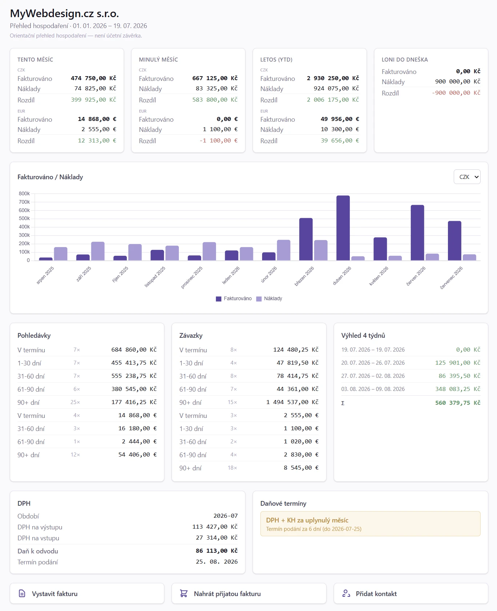

# 11. Zisk

> Návod, jak si na stránce Zisk během minuty udělat obrázek o firmě: tržby,
> náklady, zisk, kdo dluží, kdo platí pozdě a kde hrozí riziko. Pro podnikatele
> a každého, kdo chce rychlý denní přehled.

**Cesta: `Grafy → Zisk`**

## 11.1 Kdy to potřebujete

Kapitolu otevřete, když:

- chcete vědět, jak firma vychází tento měsíc a od začátku roku,
- potřebujete porovnat tržby, náklady a zisk s minulým měsícem nebo loňským rokem,
- zjišťujete, kdo vám dluží a jak dlouho po splatnosti,
- chcete vědět, na kterém odběrateli nebo dodavateli firma stojí,
- hledáte klienty, kteří se dlouho neozvali,
- potřebujete z čísla na stránce rychle přeskočit na konkrétní faktury.

<!-- cols: 24 40 36 -->
| Kdy | Co udělat | Kde v aplikaci |
|---|---|---|
| denně nebo týdně | Projít KPI karty a srovnání období | `Grafy → Zisk`, horní část stránky |
| měsíčně | Zkontrolovat pohledávky po splatnosti a platební morálku | `Grafy → Zisk`, boxy **Pohledávky (po splatnosti)**, **Závazky (po splatnosti)** a ukazatele zdraví firmy |
| čtvrtletně | Projít koncentraci klientů a dodavatelů a klienty bez objednávky | `Grafy → Zisk` |
| po skončení roku | Porovnat roky v tabulkách po rocích | `Grafy → Zisk`, tabulky **Náklady po rocích** a **Zisk po rocích** |

## 11.2 Než začnete

Stránka počítá z toho, co máte v aplikaci. Aby čísla dávala smysl:

1. **Vystavujte a evidujte faktury.** Tržby se berou z vydaných faktur, náklady z přijatých.
2. **Přiřazujte kategorie nákladů** k přijatým fakturám v jejich editoru. Bez nich
   se rozpad nákladů smrskne na jediný řádek **Bez kategorie**. Kategorie se spravují v `Firma → Kategorie`, záložka **Kategorie nákladů**.
3. **Přiřazujte kategorie tržeb** u vydaných faktur. Výchozí kategorii můžete
   nastavit na zákazníkovi i na zakázce, spravují se v `Firma → Kategorie`, záložka **Kategorie tržeb**.
4. **Párujte bankovní výpisy.** Doba inkasa (DSO) pak vychází z data skutečné úhrady.
5. **Udržujte pravidelné fakturace aktuální** (`Prodej → Pravidelné fakturace`). Jejich počet se promítá do ukazatelů a pomáhá odhadnout opakované tržby.
6. **Kontrolujte klasifikaci DPH na řádcích dokladů.** Aplikace ji ve většině případů doplní sama. Správná klasifikace zpřesní výkazy DPH v sekci **Daně**.

## 11.3 Krok za krokem: rychlý přehled firmy

1. Otevřete `Grafy → Zisk`.
2. V horní části zkontrolujte tři KPI karty: **Tržby**, **Náklady** a **Zisk** za tento měsíc.
   Šipka ▲/▼ ukazuje trend proti minulému měsíci. Zisk je zelený, když je kladný, jinak červený.
3. Pod hodnotou každé karty najdete posledních 12 měsíců, YTD (od začátku roku)
   a u obou meziroční změnu v %. Karta Zisk navíc ukazuje marži YTD.
4. Níže v tabulce srovnání období porovnejte tento měsíc, minulý měsíc,
   posledních 12 měsíců, letošek a loňský rok.
5. Chcete-li vidět faktury za číslem, klikněte na částku tržeb nebo nákladů.
   Otevře se seznam vydaných, resp. přijatých faktur s předvyplněným filtrem období.
6. Grafy **Zisk za posledních 12 měsíců** a **Kumulativní zisk YTD vs. loni** ukážou vývoj. Ztrátové měsíce jdou pod nulu.

**Jak poznáte, že je hotovo:** vidíte zisk za aktuální měsíc i za rok a víte,
jestli je lepší, nebo horší než loni.

> [!TIP]
> Klik na KPI kartu **Tržby** vás přenese na stránku Tržby, klik na kartu **Náklady** na stránku Náklady.

### Nastavení období a měny

1. Nad grafy zvolte **Období:** 3, 6, 12 nebo 24 měsíců zpět.
2. Máte-li víc měn, vyberte měnu. Výchozí volba **Vše (CZK)** sečte všechny měny
   přepočtené na CZK, konkrétní měna ukáže nativní částky. Chybějící data za zvolenou měnu se zobrazí jako 0, ne jako částka jiné měny.

Období a měna neovlivní KPI karty (hodnota za tento měsíc, 12 měsíců, YTD).

## 11.4 Krok za krokem: zjistit, kdo dluží a kdo je riziko

1. Otevřete `Grafy → Zisk` a sjeďte k boxům **Pohledávky (po splatnosti)** a **Závazky (po splatnosti)**.
2. Prohlédněte si rozdělení nezaplacených faktur podle stáří: **V termínu**,
   **1-30 dní**, **31-60 dní**, **61-90 dní** a **90+ dní** po splatnosti. Platí pro vystavené
   (pohledávky) i přijaté (závazky) faktury, po měnách.
3. V ukazatelích zdraví firmy zkontrolujte **Doba inkasa (DSO)**, **Platební morálka** a **Riziko koncentrace**.
4. V boxech **TOP klienti** a **TOP dodavatelé** zjistěte, kdo tvoří největší část objemu.
5. V boxu **Riziko ztráty klientů (60+ dní bez objednávky)** zkontrolujte klienty, kteří dlouho nic neobjednali.
   Kliknutím na klienta otevřete jeho detail.

**Jak poznáte, že je hotovo:** víte, kolik je po splatnosti, na kterých klientech
a dodavatelích firma stojí a koho je potřeba oslovit.

## 11.5 Když něco nejde

<!-- cols: 34 33 33 -->
| Co vidíte | Proč | Co udělat |
|---|---|---|
| Náklady podle kategorií ukazují jen **Bez kategorie** | Přijaté faktury nemají kategorii nákladů | V editoru přijaté faktury doplňte kategorii |
| U zvolené měny jsou nuly | V té měně nejsou za období žádné doklady | Přepněte na **Vše (CZK)** nebo jinou měnu |
| DSO je nepřesné | Faktury nejsou spárované s bankou, úhrada nemá skutečné datum | Spárujte bankovní výpisy |
| Čísla se liší od jiné stránky | Žebříčky na stránce Zisk řadí podle data vystavení | Viz [Podrobnosti a pravidla](#116-podrobnosti-a-pravidla) |
| Cash flow a pohledávky jsou vyšší než tržby | Peněžní toky a doklady po splatnosti jsou včetně DPH | Je to záměr, viz [§ 11.6.1](#1161-jak-se-pocitaji-trzby-naklady-a-zisk) |
| Tržby tento měsíc jsou vyšší než součet vystavených faktur | Karta ukazuje očekávané tržby včetně konceptů a nespárovaných proforem | Rozpad je přímo na kartě, viz [§ 11.6.2](#1162-kpi-karty) |
| Stránka hlásí **Žádná data** nebo chybí nejnovější faktury | Měsíční souhrn ještě nebyl přepočítán | Klikněte vpravo nahoře na **Přepočítat** |

## 11.6 Podrobnosti a pravidla

### 11.6.1 Jak se počítají tržby, náklady a zisk

- **Tržby tento měsíc** se berou z vydaných faktur ve stavu vystavená, odeslaná,
  upomenutá nebo zaplacená. Proformy se nepočítají.
- **Náklady tento měsíc** se berou z přijatých faktur ve stavu přijatá, zaúčtovaná nebo zaplacená.
- **Zisk** je tržby minus náklady.
- U **plátce DPH** se tržby, náklady a zisk počítají **bez DPH** (DPH je průběžná
  položka, která se odvádí a odpočítává). Stejně to dělají stránky Tržby
  a Náklady, takže čísla mezi sekcemi sedí. U neplátce jsou částky včetně DPH.
- Peněžní toky (cash flow „Co přiteče / odteče“, pohledávky a závazky po splatnosti)
  zůstávají **včetně DPH**, protože jde o reálné částky převodů.
- Stránka počítá **živě** z vydaných a přijatých faktur, stejnou metodikou jako
  Tržby a Náklady: tržby bez DPH pro plátce podle DUZP s náhradou datem vystavení,
  náklady bez DPH pro plátce se správným vyřazením spárovaných a zaplacených záloh.
  Vidíte tedy okamžitě aktuální stav i za starší roky.
- Karta **Ostatní položky ve výsledku hospodaření** ukazuje za aktuální rok výnosy,
  náklady a dopad na zisk z ostatních pohledávek a závazků. Vychází z vybraného
  výsledkového protiúčtu a rozlišuje zaúčtované položky a koncepty. Není součástí
  fakturačních KPI a historických grafů. Kauce, jistina a jiné rozvahové případy
  se do karty nezapočítávají.

### 11.6.2 KPI karty

Každá karta ukazuje hodnotu za tento měsíc (s trendem ▲/▼ proti minulému měsíci),
posledních 12 měsíců (klouzavě) a YTD. U obou je **meziroční změna v %**: 12 měsíců
proti předchozím 12 měsícům a YTD proti stejnému období loni. U nákladů je růst
červený, u tržeb a zisku zelený. Hodnoty jsou nezávislé na přepínači období.

Má-li aktuální měsíc rozpracované koncepty vydaných faktur nebo nespárované
proformy, hlavní číslo karet **Tržby** a **Zisk** ukazuje **očekávané** tržby
měsíce: vystavené faktury plus koncepty plus nespárované proformy. Pod číslem
je rozpad na **vystaveno**, **koncepty** a **proformy**. Koncepty a proformy se
nezapočítávají do dlouhodobých metrik (posledních 12 měsíců, YTD, srovnání období).

### 11.6.3 Srovnání období

Tabulka **Tržby / Náklady / Zisk / Marže** ukazuje pět období vedle sebe: tento
měsíc, minulý měsíc, posledních 12 měsíců, letos (YTD) a loňský rok. Částky tržeb
a nákladů jsou prokliknutelné na seznam vydaných, resp. přijatých faktur za dané období.

### 11.6.4 Grafy zisku

- **Zisk za posledních 12 měsíců** - sloupcový graf (klouzavé okno) s linkou téhož období o rok dříve. Ztrátové měsíce jdou pod nulu.
- **Kumulativní zisk YTD vs. loni** - narůstající křivka od ledna, porovnaná s předchozím rokem do stejného dne. Ztráta kumulaci snižuje.
- **Měsíční trend** - sloupce za posledních 12 měsíců: zelený sloupec jsou tržby, červený náklady, vedle je zisk za měsíc se značkou ↑/↓.

### 11.6.5 TOP klienti a TOP dodavatelé

Žebříček podle objemu: kdo dělá nejvíc tržeb a kdo největší náklady. U každého je
procentní podíl z celkového objemu v dané měně.

### 11.6.6 Pohledávky a závazky podle stáří

Nezaplacené faktury se řadí do skupin: **V termínu**, **1-30 dní po splatnosti**,
**31-60 dní**, **61-90 dní** a **90+ dní** (zvýrazněno červeně). Zvlášť pro vystavené
(pohledávky) a přijaté (závazky), po měnách.

### 11.6.7 Ukazatele zdraví firmy

- **DSO (Days Sales Outstanding)** - průměrná doba inkasa (datum úhrady minus datum vystavení) za posledních 12 měsíců.
- **Platební morálka** - podíl faktur zaplacených včas oproti po splatnosti.
- **Riziko koncentrace** - kolik % tržeb dělá největší klient. Úroveň rizika: nízké pod 25 %, střední pod 40 %, vysoké nad 40 %. Ukazuje také, kolik klientů tvoří 80 % tržeb (Pareto).
- **DPO (Days Payable Outstanding)** - průměrná doba úhrady dodavatelům (datum úhrady minus datum vystavení u přijatých faktur), protějšek DSO.
- **Koncentrace dodavatelů** - kolik % nákladů dělá největší dodavatel, úroveň rizika a Pareto (závislost na klíčových dodavatelích).
- **Pracovní kapitálový cyklus** - DSO minus DPO. Kladný znamená, že financujete provoz (inkasujete pomaleji, než platíte). Záporný znamená, že vás financují dodavatelé.

### 11.6.8 Náklady a tržby podle kategorií

- **Náklady podle kategorií** - koláčový nebo sloupcový graf s rozpadem nákladů podle kategorií nákladů. Bez přiřazených kategorií vidíte jediný sloupec **Bez kategorie**.
- **Tržby podle kategorií** - symetrický rozpad tržeb (tabulka na stránce Zisk, koláčový graf na stránce **Tržby**, klouzavých 12 měsíců, přepočet na CZK). Kategorii tržby vybíráte na vydané faktuře. Výchozí kategorii lze přednastavit na **zákazníkovi** i na **zakázce** (zakázka má přednost). Výchozí kategorie se použije i u importovaných, pravidelných a z proformy vyúčtovaných faktur.

### 11.6.9 Churn (klienti bez objednávky)

Zobrazí klienty, kteří **60 a více dní nemají objednávku**. U každého je poslední
faktura, počet dní bez objednávky (nad 90 dní varování, nad 180 červeně) a kumulativní tržby.
Kliknutím na klienta otevřete jeho detail.

### 11.6.10 Tabulky po rocích a měsících

Dvojice **Náklady po rocích / po měsících** (jen přijaté faktury) a **Zisk po rocích /
po měsících** (tržby, zisk a marže, tedy výsledovka). Tabulky po měsících respektují
přepínač období, tabulky po rocích ukazují všechny roky s aktivitou.

### 11.6.11 Proklik do faktur

Tabulky jsou prokliknutelné a otevřou příslušný seznam faktur s předvyplněným
filtrem (rok, měsíc, případně rozsah datumů):

- **Náklady po rocích / po měsících** - klik na řádek otevře **přijaté faktury** daného roku, resp. roku a měsíce.
- **Zisk po rocích / po měsících** - klik na tržbu otevře **vydané faktury** za daný rok, resp. měsíc.
- **Srovnání období** - tržba vede na vydané faktury, náklad na přijaté faktury za dané období.

### 11.6.12 Zisk, Tržby a Náklady

V menu **Grafy** jsou vedle Zisku dvě podrobnější stránky:

<!-- cols: 20 50 30 -->
| Stránka | Co dělá | Pro koho |
|---|---|---|
| **Zisk** (tato kapitola) | Souhrnný přehled - tržby i náklady vedle sebe, zisk, zdraví firmy (DSO/DPO, koncentrace), churn, akční úkoly | Rychlý denní přehled |
| **[Tržby](12_Trzby.md)** | Hloubková analýza jen vydaných faktur (obrat, klienti, zakázky, predikce, DPH) | Detail příjmové strany, plánování, registrační limity |
| **[Náklady](13_Naklady.md)** | Hloubková analýza jen přijatých faktur (náklady, dodavatelé, závazky, odhad výdajů) | Detail nákladové strany, odchozí platby |

> [!TIP]
> Zisk, Tržby i Náklady počítají živě z faktur stejnou metodikou, takže čísla mezi
> sekcemi sedí. Drobné rozdíly mohou vznikat jen z odlišného účelu pohledu
> (například žebříčky na stránce Zisk řadí podle data vystavení).

### 11.6.13 Další přehledy na stránce

- **Cash flow prognóza** - očekávané příjmy a výdaje po týdnech dopředu s kumulovaným zůstatkem.
- **Riziko zpoždění platby - klienti** - podíl faktur zaplacených po splatnosti a průměrné zpoždění. Klient potřebuje aspoň dvě zaplacené faktury.
- **Doba inkasa - distribuce** - rozložení počtu dní do zaplacení s mediánem.
- **Efektivita upomínek** - kolik faktur se zaplatilo bez upomínky, po první, druhé a třetí upomínce a kolik zůstává nezaplaceno.

## 11.7 Související kapitoly

- [Tržby](12_Trzby.md) - detail příjmové strany
- [Náklady](13_Naklady.md) - detail nákladové strany
- [Dimenze](114_Dimenze.md) - zisk po střediscích a projektech
