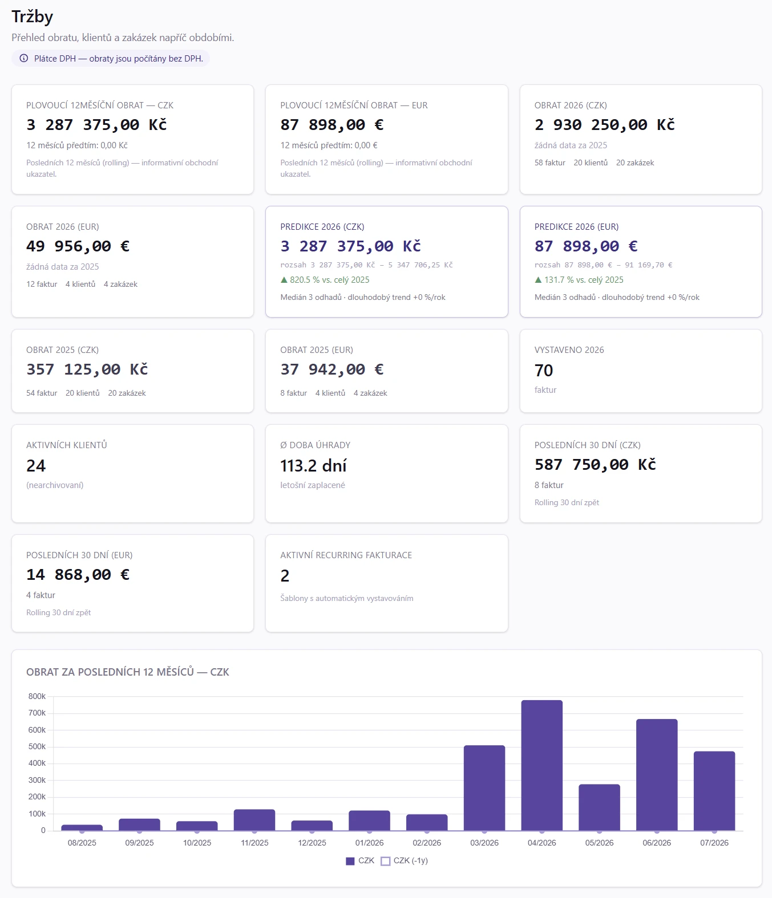

# 12. Tržby

> Návod, jak z vydaných faktur zjistit obrat, nejlepší klienty a zakázky,
> predikci roku a hlídat limity pro registraci k DPH. Pro podnikatele a účetní.
> Obdoba pro přijaté faktury je v kapitole [Náklady](13_Naklady.md).

**Cesta: `Grafy → Tržby`** (nebo klik na KPI kartu Tržby ve [Zisku](11_Zisk.md))

## 12.1 Kdy to potřebujete

Kapitolu otevřete, když:

- chcete znát obrat za rok nebo za posledních 12 měsíců a porovnat ho s minulostí,
- jste neplátce DPH a hlídáte limit pro povinnou registraci,
- využíváte paušální daň a sledujete strop zvoleného pásma,
- potřebujete vědět, kteří klienti a které zakázky tvoří největší část obratu,
- chcete odhad tržeb do konce roku,
- zjišťujete, kolik nezaplacených pohledávek je po splatnosti,
- spravujete víc firem a potřebujete jejich společný manažerský přehled.

<!-- cols: 24 40 36 -->
| Kdy | Co udělat | Kde v aplikaci |
|---|---|---|
| měsíčně | Projít obrat, aging pohledávek a top klienty | `Grafy → Tržby` |
| průběžně (neplátce) | Hlídat naplnění limitu pro registraci k DPH | dlaždice **Obrat pro registraci DPH** |
| průběžně (paušální daň) | Hlídat strop pásma paušální daně | dlaždice **Příjmy RRRR - paušální daň** |
| čtvrtletně | Zkontrolovat závislost na klientech | graf **Závislost na klientech** |
| měsíčně (víc firem) | Porovnat firmy, peníze a rizika | `Grafy → Všechny firmy` |

## 12.2 Než začnete

- Vystavujte faktury v aplikaci. Stránka počítá jen z **vydaných faktur**.
- Nahoře stránky uvidíte štítek **plátce / neplátce DPH**. Určuje, jestli se obrat počítá bez DPH (plátce), nebo s DPH (neplátce). Plátcovství nastavíte v údajích firmy.
- Pro rozpad podle kategorií vybírejte kategorii tržby na faktuře (viz [Zisk](11_Zisk.md#1168-naklady-a-trzby-podle-kategorii)).
- Pro přehled **Všechny firmy** potřebujete přístup k víc firmám a oprávnění k manažerskému pohledu.

## 12.3 Krok za krokem: zjistit obrat a stav pohledávek

1. Otevřete `Grafy → Tržby`.
2. V horní řadě dlaždic přečtěte **Plovoucí 12měsíční obrat** a porovnání s předchozími 12 měsíci (▲/▼).
3. Sledujte dlaždice **Obrat RRRR** za letošní a loňský rok a **Predikce RRRR**.
4. Na grafu **Obrat za posledních 12 měsíců** zkontrolujte vývoj a linku loňska.
5. V grafu **Aging - stáří pohledávek** se podívejte, kolik pohledávek je po splatnosti.
6. U **Top klienti** a **Top zakázky** zjistěte, kdo tvoří největší podíl.

**Jak poznáte, že je hotovo:** znáte obrat za rok, predikci a částku pohledávek po splatnosti.

## 12.4 Krok za krokem: ohlídat limit pro registraci k DPH

Platí pro neplátce DPH.

1. Otevřete `Grafy → Tržby`.
2. Najděte dlaždici **Obrat pro registraci DPH RRRR**. Progress bar ukazuje, kolik z limitu 2 000 000 Kč za kalendářní rok je naplněno. Při přiblížení k limitu se zobrazí upozornění **Blížíš se limitu 2 000 000 Kč**.
3. Při překročení 2 000 000 Kč se zobrazí varování: plátcem se stáváte od 1. 1. dalšího roku a přihlášku k registraci podáváte do 10 dnů od konce roku.
4. Při překročení 2 536 500 Kč se zobrazí varování, že jste plátcem ze zákona ihned, od dne následujícího po překročení.

**Jak poznáte, že je hotovo:** víte, kolik zbývá do limitu, a včas řešíte registraci.

Je-li relevantní i paušální daň, zobrazí se dlaždice **Příjmy RRRR - paušální daň** s naplněním stropu zvoleného pásma (§ 7a ZDP). Počítá zaplacené příjmy v kalendářním roce.

## 12.5 Krok za krokem: společný přehled všech firem

Položka **Grafy → Všechny firmy** se zobrazí při přístupu k více firmám a s oprávněním k manažerskému pohledu.

1. Otevřete `Grafy → Všechny firmy`.
2. Nahoře zvolte období. Výchozí je posledních 12 kalendářních měsíců do dneška. Pole **Od / Do** a tlačítko **Použít období** nastaví přesný rozsah do 36 měsíců. Tlačítko **Posledních 12 měsíců** vrátí výchozí rozsah.
3. Zvolte měnu. Výchozí **Vše · CZK** přepočte všechny měny, jednotlivé měny lze zobrazit samostatně.
4. Přepínejte záložky **Přehled**, **Vývoj tržeb a zisku**, **Cashflow**, **Peníze**, **Pohledávky a závazky**, **Rizika** a **Predikce**.
5. Chcete-li vyřadit převody mezi firmami skupiny, u volby **Spojené osoby** zvolte **Nezapočítat**.
6. U rizika klikněte na **Detail**, aby se otevřela příslušná firma nebo seznam dokladů.
7. Tlačítkem **Obnovit** znovu načtete aktuální záložku.

**Jak poznáte, že je hotovo:** u každé záložky vidíte součet i rozpad po firmách. Neúplné součty jsou označené.

## 12.6 Když něco nejde

<!-- cols: 34 33 33 -->
| Co vidíte | Proč | Co udělat |
|---|---|---|
| Chybí dlaždice **Obrat pro registraci DPH** | Jste plátce DPH | Dlaždice je jen pro neplátce |
| Chybí položka **Všechny firmy** | Máte jen jednu firmu nebo nemáte oprávnění k manažerskému pohledu | Požádejte správce o oprávnění |
| **Chybí kurz pro: ...** a součet je označen jako neúplný | K datu přehledu není dostupný kurz měny | Doplňte kurzy; chybějící kurz se nenahrazuje hodnotou 1 |
| **Chybí oprávnění** nebo **Výpočet se nezdařil** u firmy | Chybí právo v dané firmě, výpočet selhal, nebo firma nemá aktuální účetní období | Údaj se nezobrazuje jako nula; ověřte oprávnění a účetní období firmy |
| Bankovní zůstatek chybí | Neznámý zůstatek se nezobrazuje jako nula | Importujte výpis nebo zadejte zůstatek |

## 12.7 Podrobnosti a pravidla

### 12.7.1 KPI dlaždice

- **Plovoucí 12měsíční obrat** po měnách s meziročním srovnáním (▲/▼ proti předchozím 12 měsícům). Informativní ukazatel nezávislý na kalendářním roce.
- **Obrat pro registraci DPH** (jen neplátce) - naplnění limitu 2 000 000 Kč za kalendářní rok. Překročení 2 000 000 Kč znamená plátcovství od 1. 1. dalšího roku, překročení 2 536 500 Kč plátcovství ze zákona ihned.
- **Příjmy RRRR - paušální daň** (je-li relevantní) - naplnění stropu zvoleného pásma (§ 7a ZDP) zaplacenými příjmy kalendářního roku.
- **Obrat tento / minulý rok** po měnách s meziroční změnou, počty faktur, klientů a zakázek.
- **Obrat RRRR celkem v CZK** (při fakturaci ve více měnách) - součet všech měn přepočtený kurzem dokladu, číslo pro srovnání s jiným účetnictvím.
- **Predikce roku** po měnách - medián tří odhadů (run-rate, krátkodobý růst, dlouhodobý trend) a rozsah nejnižší až nejvyšší.
- **Vystaveno YTD** - počet vydaných faktur tento rok.
- **Aktivních klientů**, **Ø doba úhrady**, **obrat posledních 30 dní**, **aktivní pravidelné fakturace**.

### 12.7.2 Grafy a tabulky

- **Měsíční obrat** za posledních 12 měsíců s linkou loňska, po měnách.
- **Kumulativní obrat YTD** proti loňsku (do stejného dne v roce).
- **Tržby podle kategorie** (koláč, 12 měsíců, přepočet na CZK).
- **Top klienti** a **Top zakázky** - koláče za letošek a loni, tabulky za posledních 12 měsíců.
- **Stav faktur** a **stav zakázek** (donut).
- **Závislost na klientech** - podíl obratu TOP 3 / TOP 5 klientů za 12 měsíců a barevný indikátor rizika.
- **Doba úhrady - distribuce** (histogram) a **Rozpad obratu podle sazby DPH** (jen plátce).
- **Cash-flow YTD** - kumulativní křivka skutečně inkasovaných plateb (podle data úhrady).
- **Aging** - stáří neuhrazených pohledávek (aktuální, 1-30, 31-60, 61-90, 90+ dní).
- **Distribuce velikosti faktur** (12 měsíců, přepočet na CZK).
- Tabulky **Obrat po rocích** (s odhadem pro běžný rok) a **Obrat po měsících (12)**.

### 12.7.3 Ostatní pohledávky a závazky

Pod fakturačními ukazateli je samostatná karta výsledkového dopadu
[ostatních pohledávek a závazků](50_Pruvodce_ucetniho.md#50104-ostatni-pohledavky-a-zavazky).
Výnos se zde počítá jen u položky s výnosovým protiúčtem. Rozvahové položky ani samotné inkaso tržbu nezvyšují.

### 12.7.4 Všechny firmy: záložky a pravidla

- **Přehled** - dokladové tržby, náklady a zisk za zvolené období se srovnáním proti stejným datům loňska, srovnání firem a samostatný účetní výsledek aktuálního období.
- **Vývoj tržeb a zisku** - měsíční tržby, náklady a zisk, souhrn nebo vybraná firma. Krajní měsíce zahrnují jen zvolené dny, měsíce bez aktivity mají nuly.
- **Predikce** - odhad tržeb, nákladů a zisku běžného kalendářního roku. Používá stejné fakturové modely jako firemní grafy a samostatně přidává známý dopad ostatních položek podle nákladových a výnosových účtů. Rozpětí je rozdíl modelů tržeb, ne interval spolehlivosti. Predikce nezávisí na období historických grafů.
- **Cashflow** - očekávané příjmy a výdaje po týdnech na 4 až 12 týdnů. Kumulovaný čistý tok začíná nulou a není předpovědí zůstatku účtu. Daňové a mzdové závazky se zahrnují podle oprávnění, jejich vynechání je uvedeno v přehledu. Zahrnuje ostatní položky i jejich splátkové kalendáře a odečítá již zaplacené splátky. Splátky jistiny úvěru ovlivňují peníze, samy o sobě nejsou náklad. Pravidelné rozvrhy se zahrnou až po vytvoření jednotlivých položek.
- **Peníze** - bankovní účty a pokladny v původních měnách nebo společně v CZK. Banka ukazuje poslední importovaný nebo evidovaný zůstatek včetně data, pokladny jsou k dnešnímu dni.
- **Pohledávky a závazky** - stáří neuhrazených dokladů před splatností a po splatnosti, souhrn i rozpad po firmách.
- **Rizika** - pohledávky a závazky po splatnosti, dokladová ztráta a závislost na největším odběrateli nebo dodavateli.

Zůstatky a stáří pohledávek jsou aktuální, cashflow má vlastní počet týdnů. Koncentrace
odběratelů a dodavatelů používá vlastní měsíční okno uvedené v záložce Rizika.

#### Měny a kurzy

Dokladové výsledky používají evidované kurzy dokladů, pokladny jejich evidovaný
přepočet. Bankovní zůstatky, pohledávky, závazky a predikce se přepočítávají
posledním dostupným kurzem nejpozději k datu přehledu. Chybějící kurzy se nevydávají
za kurz 1 a součet je označen jako neúplný.

#### Spojené osoby

Volba **Spojené osoby** na záložkách Přehled, Vývoj tržeb a zisku, Pohledávky
a závazky a Rizika určuje, zda se započítají doklady s kontakty označenými jako
spojená osoba. **Nezapočítat** je vyřadí z tržeb, nákladů, pohledávek i závazků, takže
převody mezi firmami skupiny nenafukují součet. Kontakt se jako spojená osoba
označuje v jeho detailu. Účetní výsledek aktuálního období, cashflow a koncentrace
odběratelů se volbou nemění. Volba zůstává v adrese stránky.

#### Co součet je a není

Jde o **manažerský součet bez eliminace transakcí mezi firmami**, ne o konsolidovanou
účetní závěrku. Účetní součty spojují pouze stejnou měnu a stejný začátek i konec období.
Dokladové částky jsou u plátců bez DPH, u neplátců včetně DPH, základ je uveden u každé firmy.

#### Detail rizika

**Detail** u rizika přepne firmu včetně nového načtení oprávnění. U pohledávek
a závazků otevře doklady po splatnosti v původní měně bez omezení na rok, seznam lze
dále filtrovat. U dokladové ztráty zachová přesné období a nabídne zdrojové faktury.
Koncentrace otevře odpovídající část firemního zisku v původní měně.

#### Chyby a neúplná data

Chybějící oprávnění, chyby výpočtu a chybějící účetní období mají vlastní označení.
Neznámý zůstatek se nezobrazuje jako nula. Částečné součty uvádějí počet zahrnutých
firem a chybějících příspěvků. Záložky načítají data až při otevření, **Obnovit** načte aktuální záložku znovu.

> [!TIP]
> Pro souhrnný pohled na tržby i náklady vedle sebe (zisk, marže, zdraví firmy)
> použijte [Zisk](11_Zisk.md). Tato kapitola je čistě o příjmové straně.

## 12.8 Související kapitoly

- [Zisk](11_Zisk.md) - tržby a náklady vedle sebe
- [Náklady](13_Naklady.md) - zrcadlová stránka pro přijaté faktury
- [Průvodce účetního](50_Pruvodce_ucetniho.md#50104-ostatni-pohledavky-a-zavazky) - ostatní pohledávky a závazky
