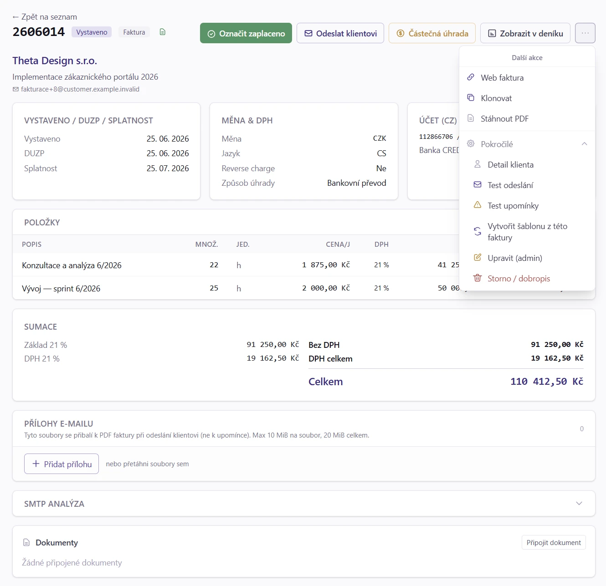
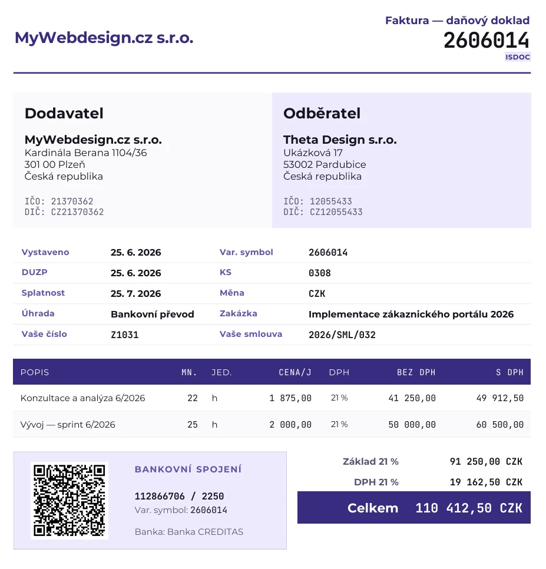

# 16. Faktura - PDF, QR platba, odeslání e-mailem

> Návod, jak vystavenou fakturu zobrazit, stáhnout, odeslat klientovi, nasdílet
> odkazem, zaevidovat její úhradu a zaúčtovat. Vystavená faktura má neměnné
> PDF, které vzniká v okamžiku vystavení a dál se nemění.

## 16.1 Kdy to potřebujete

- Právě jste fakturu vystavili a potřebujete ji poslat klientovi.
- Klient chce PDF znovu nebo chce fakturu vidět online bez přihlášení.
- Přišla platba (celá nebo jen část) a chcete ji u faktury zaevidovat.
- Jste v podvojném účetnictví a vystavenou fakturu je potřeba zaúčtovat do deníku.
- Vystavená faktura obsahuje chybu a hledáte, jak ji opravit, stornovat nebo
  zrušit storno.
- Chcete zjistit, co přesně klient e-mailem dostal.

## 16.2 Než začnete

1. **Faktura musí být vystavená.** Koncept PDF s číslem nemá, vystavení je
   popsáno v [kapitole 15](15_Faktura_editor.md).
2. **Funkční odesílání e-mailů.** Zkontrolujte ho tlačítkem **Test odeslání**
   (detail faktury, nabídka **Další akce**, část **Pokročilé**), které pošle
   e-mail jen vám, ne klientovi.
3. **Platný bankovní účet v měně faktury**, jinak se v PDF nezobrazí QR platba
   (viz [§ 16.10.7](#16107-qr-platba)). Účty spravujete v `Peníze → Bankovní účty`, záložce **Měny a účty**.
4. **E-mail klienta.** Vyplňte ho na kartě klienta nebo v kontaktech klienta,
   viz [kapitola 18](18_Klienti.md).
5. **Pro zaúčtování** firmu v režimu podvojného účetnictví a roli admin nebo
   účetní.
6. **Pro admin akce** (úprava vystavené faktury, smazání, vrácení z Zaplaceno)
   roli admin.

## 16.3 Krok za krokem: Odeslat fakturu klientovi e-mailem

1. Otevřete `Prodej → Vydané faktury` a klikněte na číslo faktury. Otevře se detail.

   

2. Volitelně si PDF prohlédněte v náhledu na detailu nebo tlačítkem **Zobrazit PDF**.
3. Klikněte na **Odeslat klientovi**. Stejným tlačítkem odešlete i už odeslanou fakturu znovu.
4. V okně zkontrolujte příjemce. Jsou předvyplnění podle kontaktů klienta
   (účel Doklady), e-mailů zakázky a hlavního e-mailu, duplicity jsou sloučené.
   Seznam můžete upravit, přidat kopii (CC), skrytou kopii (BCC) a poznámku do e-mailu.
5. Potvrďte odeslání.

Má-li klient předepsaný předmět nebo název přílohy, použijí se (viz
[§ 18.4.1](18_Klienti.md#1841-predmet-e-mailu-a-nazev-prilozeneho-pdf)).

Chcete-li odeslat víc faktur najednou, označte je v seznamu faktur a klikněte na
**Odeslat klientovi (N)**. Každá faktura jde v samostatném e-mailu.

**Jak poznáte, že je hotovo:** faktura má stav Odesláno a v activity logu je
záznam s adresami příjemců. V sekci **Historie PDF** je u odeslané verze zelený
štítek **Odesláno** a seznam příjemců.

> [!TIP]
> Před prvním ostrým odesláním použijte **Test odeslání**. E-mail přijde jen
> vám a ověříte šablonu, SMTP i vzhled PDF bez rizika.

Příloha navíc k PDF (smlouva, předávací protokol) se přidává v sekci **Přílohy
e-mailu** na detailu, viz [§ 16.10.9](#16109-prilohy-e-mailu).

## 16.4 Krok za krokem: Zobrazit nebo stáhnout PDF

1. Otevřete detail faktury (`Prodej → Vydané faktury`, klik na číslo).
2. Klikněte na **Zobrazit PDF** (otevře fakturu v nové záložce bez dialogu pro uložení)
   nebo na **Stáhnout PDF**.
3. V Chrome a Edge se u **Stáhnout PDF** otevře dialog Uložit jako. Poprvé zvolte
   složku, kam PDF dané firmy ukládáte. Prohlížeč si složku pamatuje zvlášť pro
   každou firmu a příště dialog otevře rovnou v ní.

**Jak poznáte, že je hotovo:** PDF je otevřené v záložce, případně uložené ve vámi zvolené složce.

> [!TIP]
> Firefox a Safari dialog Uložit jako nepodporují, PDF se tam stáhne do výchozí
> složky prohlížeče. Totéž platí u přijaté faktury.

## 16.5 Krok za krokem: Zaevidovat platbu nebo částečnou úhradu

1. Otevřete detail faktury.
2. Přišla celá platba: klikněte na **Označit zaplaceno** (platba na celý zbytek).
3. Přišla jen část: klikněte na **Částečná úhrada**. V okně zkontrolujte částku
   (předvyplněn je zbytek), vyplňte datum platby a podle potřeby variabilní symbol,
   referenci a poznámku. Potvrďte.
4. Pokud chcete platbu zrušit, smažte ji křížkem (✕) v boxu **Platby**.

Platby se zaevidují i samy, když spárujete bankovní výpis nebo e-mailové
avízo, viz [kapitola 29. Banka](29_Banka.md).

**Jak poznáte, že je hotovo:** v boxu **Platby** je nový řádek s datem, částkou
a zdrojem. Stav úhrady ukazuje štítek **Částečně uhrazeno**, **Přeplaceno**
nebo Zaplaceno a v sumaci jsou řádky **Uhrazeno** a **Zbývá uhradit**.

> [!WARNING]
> Platbu navázanou na bankovní transakci nesmažete křížkem. Použijte **Zrušit
> spárování** v detailu výpisu. Platbu s vystaveným daňovým dokladem smažete až po
> smazání nebo stornu tohoto dokladu.

U zálohové faktury a plátce DPH vzniká při částečné úhradě i daňový doklad
k přijaté platbě, viz [§ 16.10.2](#16102-platby-a-castecne-uhrady).

## 16.6 Krok za krokem: Zaúčtovat fakturu do deníku

Vystavení a zaúčtování jsou dva oddělené kroky. Tlačítko **Zaúčtovat** vidí jen
firma v podvojném účetnictví, dokud faktura není zaúčtovaná, ani v konceptu či stornu.

1. Otevřete detail vystavené faktury.
2. Klikněte na **Zaúčtovat** a potvrďte dotaz „Zaúčtovat doklad do účetního deníku?“.
3. Chcete-li zaúčtovat víc faktur, označte je v [seznamu faktur](14_Faktury.md#14117-hromadne-akce-prehled)
   a klikněte na **Zaúčtovat (N)**. Nabídne se jen z vybraných ty vystavené a dosud nezaúčtované.

**Jak poznáte, že je hotovo:** detail se obnoví, objeví se štítek **Zaúčtováno**
(datum je v bublině) a v menu s dalšími akcemi je **Zobrazit v deníku**. Pod
položkami je rozbalená sekce **Zaúčtování** s kontací.

> [!TIP]
> Zaúčtování při vystavení můžete zapnout automaticky, viz
> [§ 96.11](96_Nastaveni.md#969-krok-za-krokem-automaticke-uctovani).
> Pak tento krok odpadá.

Pravidla a hlášky najdete v [§ 16.9](#169-kdyz-neco-nejde) a [§ 16.10.3](#16103-zauctovani-do-deniku).

## 16.7 Krok za krokem: Sdílet fakturu odkazem (web faktura)

1. Otevřete detail vystavené faktury (koncept odkaz nemá).
2. Klikněte na **Web faktura**. První použití odkaz vytvoří.
3. V okně odkaz zkopírujte do schránky nebo ho otevřete v novém panelu.
4. Odkaz se automaticky přidává i do e-mailu při odeslání faktury jako tlačítko
   **Zobrazit fakturu online**.
5. Pokud odkaz unikl nesprávnému příjemci, v okně zvolte **Vygenerovat nový odkaz**.
   Starý odkaz okamžitě přestane platit.

**Jak poznáte, že je hotovo:** po prvním otevření klientem se na detailu
objeví štítek **Zobrazeno klientem**.

> [!WARNING]
> Kdo odkaz má, fakturu vidí. Odkaz proto posílejte jen klientovi. Pokud web
> faktura není vidět, provozovatel ji mohl vypnout, viz
> [§ 16.10.12](#161012-vypnuti-web-faktury-na-instalaci).

## 16.8 Krok za krokem: Opravit nebo zrušit vystavenou fakturu

Preferované řešení chyby je vždy **dobropis** nebo **storno + nová faktura**.
Úpravy a smazání jsou výjimečné a jen pro admina.

1. Otevřete detail faktury a v nabídce **Další akce** klikněte na **Storno / dobropis**.
2. V okně **Storno / Dobropis** zvolte jednu z možností:
   - **Vystavit dobropis (opravný daňový doklad)** (doporučeno) - vznikne koncept
     dobropisu se zápornými položkami, klient dostane oficiální opravu.
   - **Pouze interní storno** - jen interní označení, klient nedostane nic.
   - **Smazat fakturu (admin, force-delete)** - nevratné smazání, jen výjimečně.
3. Překlep v ještě neodeslané faktuře opraví admin tlačítkem **Upravit (admin)**.
4. Fakturu označenou omylem jako zaplacenou vrátíte tlačítkem **Nezaplacené**.
5. Fakturu stornovanou omylem obnovíte tlačítkem **Zrušit storno** v menu **Další akce**.

**Jak poznáte, že je hotovo:** faktura má nový stav a akce je v activity logu.

Podmínky, vedlejší účinky a omezení každé akce jsou v
[§ 16.10.14](#161014-admin-akce-nad-vystavenou-fakturou).

## 16.9 Když něco nejde

### 16.9.1 Zaúčtování selže

| Co vidíte | Proč | Co udělat |
|---|---|---|
| Doklad nemá řádky k zaúčtování | Faktura je proforma, záloha nebo storno. Ty se neúčtují (proforma až po vyúčtování). | Zaúčtujte až finální doklad. |
| Doklad v cizí měně nemá vyplněný směnný kurz | Chybí kurz k datu účetního případu. | Doplňte kurz na faktuře. |
| Pro datum dokladu neexistuje účetní období | Období není založené. | Založte ho v `Nástroje → Uzávěrka`. |
| Účetní období je uzavřené | Do uzavřeného období nelze účtovat. | Viz [Uzávěrka](72_Uzaverka.md). |
| Účetní zápis není vyvážený (MD ≠ Dal) | Špatná předkontace nebo částky. | Zkontrolujte předkontaci a částky dokladu. |
| V účtové osnově chybí potřebný účet | Účet v předkontaci chybí nebo je deaktivovaný. | Doplňte nebo aktivujte ho v [Účtovém rozvrhu](66_Ucetni_osnova.md). |
| Zápis dokladu je stornovaný | Stornovaný zápis nelze přepsat. | Opravu zaúčtujte novým zápisem. |
| Doklad nebyl nalezen | Faktura mezitím byla smazána nebo změnila stav. | Obnovte stránku. |

### 16.9.2 Ostatní situace

| Co vidíte | Proč | Co udělat |
|---|---|---|
| V PDF chybí QR platba | Bankovní účet neprošel kontrolou (mod-11 u CZ účtů, kontrolní součet IBAN u EUR). U konceptu CZK chybí variabilní symbol. | Opravte účet v `Peníze → Bankovní účty`, záložce **Měny a účty**. Koncept CZK dostane QR až s VS. |
| Tlačítko **Web faktura** chybí a odkazy hlásí neplatný odkaz | Web faktura je vypnutá pro celou instalaci. | Viz [§ 16.10.12](#161012-vypnuti-web-faktury-na-instalaci). |
| **Nezaplacené** skončí chybou | Faktura má spárovanou bankovní transakci. | V detailu výpisu klikněte na **Zrušit spárování**, faktura se vrátí do Vystaveno. |
| Platbu nejde smazat | Je navázaná na bankovní transakci nebo na daňový doklad k platbě. | Zrušte spárování, resp. nejdřív smažte nebo stornujte daňový doklad. |
| **Zrušit storno** nejde | Faktura je v uzavřeném období nebo uzamčené části účetnictví, storno je zaúčtované a zápisy nejde smazat, nebo je faktura zrušená dobropisem. | Vystavte novou fakturu. |
| Dávka **Zaúčtovat (N)** nejde | Výběr překročil 500 dokladů. | Rozdělte výběr. |
| Náhled PDF na detailu je starý po editaci | Náhled se neobnovuje sám. | Obnovte stránku (F5). |
| Přílohu nejde přidat | Překročen limit 10 MiB na soubor nebo 20 MiB celkem, nebo nepovolený formát. | Viz [§ 16.10.9](#16109-prilohy-e-mailu). |

## 16.10 Podrobnosti a pravidla

### 16.10.1 Detail faktury

Detail ukazuje:

- **Hlavičku** - variabilní symbol, typ, klient, data, částka, stav.
- **Položky** - řádky jen pro čtení.
- **Daňové zařazení** - karta se vším, co jde nastavit v editoru: reverse charge,
  klasifikace DPH (kód i popis), zjednodušený daňový doklad § 30, ceny zadané
  včetně DPH, osvobození od daně z příjmů i s důvodem a kategorie tržby.
- **Náhled PDF** - vložený náhled, který lze otevřít na celou obrazovku.
- **Zdrojové PDF z importu** - jen u faktur naimportovaných z iDokladu nebo
  Fakturoidu: původní PDF dokladu tak, jak dorazilo ze zdrojového systému
  (náhled a stažení). Je oddělené od vygenerovaného PDF, viz [21. Importy](21_Importy.md).
- **Activity log** - kdo a kdy fakturu vytvořil, vystavil, odeslal a označil jako zaplacenou.

Akční tlačítka vpravo nahoře závisí na stavu faktury:

| Stav | Dostupné akce |
|---|---|
| Vystaveno | Zobrazit PDF, Stáhnout PDF, Odeslat klientovi, Web faktura, Označit zaplaceno, Částečná úhrada, Storno / dobropis, Test odeslání, Test upomínky, **Upravit (admin)**, Zaúčtovat\* |
| Odesláno | Zobrazit PDF, Stáhnout PDF, Odeslat klientovi (znovu), Web faktura, Označit zaplaceno, Částečná úhrada, Odeslat upomínku (po splatnosti), Storno / dobropis, Zaúčtovat\* |
| Upomínka | Zobrazit PDF, Stáhnout PDF, Odeslat upomínku (další, s odstupem 14 dní), Web faktura, Označit zaplaceno, Částečná úhrada, Zaúčtovat\* |
| Zaplaceno | Zobrazit PDF, Stáhnout PDF, Web faktura, Storno / dobropis (dobropis pro vrácení peněz), Zaúčtovat\* |

\* Jen v podvojném účetnictví a dokud faktura nemá štítek **Zaúčtováno**, viz
[§ 16.10.3](#16103-zauctovani-do-deniku).

**Test odeslání** a **Test upomínky** pošlou e-mail jen na váš e-mail, ne klientovi.

### 16.10.2 Platby a částečné úhrady

Každá faktura i zálohová faktura může mít víc evidovaných plateb (splátky, více
převodů, e-mailová avíza). Platby vznikají:

- **automaticky** při párování bankovního výpisu nebo e-mailového avíza (viz
  [Banka](29_Banka.md)); i částečná platba se shodným variabilním symbolem se zaeviduje,
- tlačítkem **Částečná úhrada** (okno s částkou, datem platby, volitelným VS,
  referencí a poznámkou),
- tlačítkem **Označit zaplaceno** (zkratka pro platbu na celý zbytek).

Box **Platby** zobrazuje datum, částku, zdroj (ručně, banka, označeno zaplaceno),
referenci a u záloh odkaz na daňový doklad k platbě. Po smazání platby, která
přestala doklad pokrývat, se faktura vrátí ze stavu Zaplaceno mezi pohledávky.
Platba navázaná na bankovní transakci se maže přes **Zrušit spárování** v detailu
výpisu, platba s vystaveným daňovým dokladem až po jeho smazání nebo stornu.

Pokud iDoklad importoval související bankovní pohyb, ale nevytvořil z něj
samostatnou platbu, zobrazí se pod platbami jako **Související bankovní pohyb**
s odkazem na výpis. Faktura tak neztratí vazbu na zdrojový pohyb ani když ji
iDoklad už označil jako uhrazenou.

Stav úhrady ukazuje štítek **Částečně uhrazeno** (přijata část peněz, zbytek se
dál upomíná a počítá do pohledávek) a **Přeplaceno** (přišlo víc než částka
k úhradě). V sumaci detailu jsou řádky **Uhrazeno** a **Zbývá uhradit**; stejný
rozpis má PDF. QR platba v PDF, e-mailu i upomínce zní vždy jen na zbývající částku.

#### Zálohová faktura: daňový doklad k přijaté platbě

Plátce DPH musí ke každé úplatě přijaté před uskutečněním plnění vystavit
**daňový doklad k přijaté platbě** (§ 28 odst. 2 ZDPH) s DUZP = den přijetí
platby. U částečné úhrady zálohové faktury ho MyÚčto vystaví jako koncept
automaticky (bankovní párování) nebo na klik (zaškrtávátko v okně Částečná úhrada
či tlačítko v boxu Platby):

- DPH se počítá **shora koeficientem** (§ 37) a platba se rozdělí mezi sazby DPH
  zálohy poměrně podle jejich vah,
- doklad se čísluje v řadě faktur, do výkazů DPH, KH a Knihy DPH vstupuje
  v měsíci platby a vystavením je rovnou zaplacený,
- u **neplátce DPH** a u plnění v **přenesené daňové povinnosti** se nevystavuje
  (u reverse charge se záloha nedaní, daň vzniká až k DUZP plnění).

Finální doklad (vyúčtování) pak ke zdaněným platbám přidá **záporné odpočtové
řádky** (§ 37a), takže se zdaní jen zbytek, nic dvakrát. Vyúčtovat lze i jen
částečně uhrazenou zálohu: odpočet pokryje přijaté platby a zbytek zůstane na
finálním dokladu k úhradě. Jakmile finál existuje, další daňový doklad k platbě
už vystavit nejde (a obráceně ruční párování zálohy s daňovými doklady k platbě
je blokované) - ochrana proti dvojímu zdanění. Daňový doklad k platbě ani vazbu
finálu s odpočtovými řádky § 37a nelze samostatně stornovat nebo rozpojit;
chybný cyklus se opravuje nejdřív stornem finální faktury. U cizoměnové platby
se pro DPH použije kurz k datu přijetí platby, ne kurz původní proformy.

### 16.10.3 Zaúčtování do deníku

Vystavená faktura sama o sobě do [Účetního deníku](52_Ucetni_denik.md) nic
nezapíše. Tlačítko **Zaúčtovat** (sekundární, vedle hlavní platební nebo
upomínkové akce) se zobrazí jen firmám v podvojném účetnictví, dokud faktura nemá
štítek **Zaúčtováno** a není v konceptu ani stornu. Klik vytvoří zápis podle
[předkontace](73_Ucetni_nastroje.md#735-krok-za-krokem-predkontace).

Zaúčtovat smí jen **admin nebo účetní**. Role klient tlačítko sice uvidí, ale klik
skončí chybou oprávnění. Při selhání aplikace zobrazí konkrétní důvod, viz
tabulku v [§ 16.9.1](#1691-zauctovani-selze).

**Hromadné zaúčtování.** Aplikace účtuje doklady jeden po druhém (chyba jednoho
neblokuje ostatní) a na konci zobrazí souhrn „Zaúčtováno {ok}, chyby: {err}“
s konkrétní hláškou u každého selhaného čísla dokladu. Dávka je omezená na
**500 dokladů**.

**Automatické zaúčtování při vystavení** nastavuje admin, viz
[§ 96.11](96_Nastaveni.md#969-krok-za-krokem-automaticke-uctovani).

**Sekce Zaúčtování na detailu.** U zaúčtované faktury se pod položkami rozbalí
sekce **Zaúčtování** s kontací tak, jak je v deníku. Kromě odkazu **Otevřít v deníku** má:

- **Podle čeho se účtovalo** - [předkontaci](73_Ucetni_nastroje.md#735-krok-za-krokem-predkontace),
  ze které kontace vznikla (u vydané faktury podle klíče výnosu na hlavičce),
  její účty MD/Dal a informaci, jestli platí firemní, nebo systémové výchozí
  nastavení. Tlačítko **Upravit předkontaci** otevře rovnou ten jeden klíč
  v Nástrojích. Podrobně [§ 52.8.3](52_Ucetni_denik.md#521493-podle-ceho-se-uctovalo).
- **Přeúčtovat** (admin nebo účetní) - opraví kontaci, která už v deníku je.
  V otevřeném období se zápis přepíše, v zamčeném nebo uzavřeném vznikne storno
  a nový zápis; viz [§ 52.8.2](52_Ucetni_denik.md#521492-preuctovani-z-dokladu-sekce-zauctovani).
- **Souvisí** - protějšky zápisu (úhrady, bankovní pohyby, ručně navázané doklady)
  s odkazem do deníku i na zdrojový doklad, jejich kontací a poznámkami (např.
  poznámka zapsaná u bankovního pohybu úhrady).
- **Poznámky** - poznámky zápisu, tytéž jako v deníku a u bankovního pohybu
  ([§ 52.6.3](52_Ucetni_denik.md#521473-poznamky-k-zapisu)).

### 16.10.4 PDF struktura

Vygenerované PDF obsahuje:

1. **Hlavičku** - logo dodavatele, jméno, adresa, IČO, DIČ, kontakt.
2. **Adresáta** - klient (firma, adresa, IČO, DIČ). U zemí s národním daňovým
   číslem se tiskne navíc s nativním názvem: slovenský klient má `IČO → DIČ → IČ DPH`
   (u neplátce jen IČO a DIČ), německý nebo rakouský Steuernummer, polský NIP,
   maďarský Adószám (viz [§ 18.7.3](18_Klienti.md#1873-slovensky-klient-a-narodni-danova-cisla)).
3. **Číslo faktury** a **typ** (Faktura, Proforma, Dobropis, Storno).
4. **Data** - vystaveno, DUZP, splatnost.
5. **Bankovní spojení** - číslo účtu nebo IBAN, BIC, banka, variabilní symbol.
6. **Položky** - tabulka (Popis, Množství, Cena, DPH, Celkem).
7. **Sumář** - mezisoučet, sleva, rozpis DPH, **CELKEM**.
8. **Přepočet do CZK** (EUR a cizí měna) - u českého odběratele kurz ČNB a tabulka
   základů a DPH v CZK; u zahraničního odběratele pouze česká DPH v CZK, pokud na
   dokladu vzniká.
9. **QR platbu** vpravo dole (CZK SPAYD nebo EUR SEPA EPC).
10. **Patičku** - text z Nastavení dodavatele (volitelný).
11. **Druhou stranu s výkazem víceprací** (volitelně). Má-li faktura výkaz, je
    položka „Výkaz víceprací“ v tabulce položek podtržený odkaz, který přeskočí
    přímo na stránku s výkazem.

> [!TIP]
> **Branding hlavičky.** Má-li dodavatel v Nastavení zapnutý branding, PDF přebere jeho
> logo a akcentovou barvu (čára pod hlavičkou, nadpisy, hlavička tabulky položek,
> světlá podbarvení). Když je logo malé nebo neobsahuje název firmy, zapněte
> **Zobrazit i název firmy vedle loga**. Sémantické barvy zůstávají vždy stejné
> (dobropis červená, storno šedá).

### 16.10.5 Přepočet do CZK (faktury v cizí měně)

Pokud je faktura v jiné měně než CZK a odběratel je z ČR, PDF obsahuje navíc:

- drobný řádek v hlavním sumáři: „Kurz ČNB: 24,360 CZK / 1 EUR (2026-05-03)“,
- samostatnou tabulku **Přepočet do CZK** pod sumářem se světle šedým podbarvením,
  kde je rozpis základů a DPH po sazbách v CZK a celkové součty.

U odběratele mimo ČR se informativní kurz ani celkový přepočet do CZK netiskne.
Pokud takový doklad obsahuje českou DPH, PDF zachová pouze částku české DPH v CZK.
U reverse charge, osvobozeného plnění, vývozu a OSS se netiskne ani tato částka.
Interní kurz a kompletní korunová rekapitulace zůstávají uložené pro účetnictví,
DPH a exporty.

Kurz se ukládá na fakturu při prvním uložení a nemění se ani po vystavení, ani po
editaci položek (pokud se nezmění datum vystavení nebo měna). Nemá-li faktura
zafixovaný kurz, MyÚčto ho doplní automaticky při příštím otevření detailu nebo PDF
(uložený kurz, ČNB, poslední známý). Detail viz
[§ 15.9.4](15_Faktura_editor.md#1594-sumar-vpravo).

### 16.10.6 PDF/A-3b (archivní formát)

Všechna generovaná PDF (faktury, přijaté faktury, výkazy práce, Kniha DPH, Kniha
jízd) jsou ve formátu **PDF/A-3b** (ISO 19005-3), standardu pro dlouhodobou
archivaci. Dokument je soběstačný a vykreslí se stejně na každém zařízení i
tiskárně, dnes i za 20 let.

- **Vložené fonty** - písmo je součástí souboru, takže text jde vyhledávat a
  kopírovat a nikde nedojde k záměně fontu.
- **Barevný profil** - dokument nese profil **sRGB**. Logo nebo obrázek v jiném
  barevném prostoru (CMYK) se automaticky převede na sRGB, aby archiv zůstal
  konzistentní (PDF/A nepovoluje míchání barevných prostorů).
- **ISDOC příloha** - strukturovaná data faktury jsou vložená přímo v PDF jako
  příloha, viz [§ 20.7.2](20_Exporty.md#20725-isdoc-v-priloze-pdf).
- **Elektronický podpis** - podpis PAdES archivní konformitu zachová.

Výstup je validován referenčním ISO validátorem **veraPDF** (ISO 19005-3, varianta
3b). Procházejí všechny varianty: faktury i přijaté faktury, s logem (RGB i CMYK)
i bez, podepsané i nepodepsané.

### 16.10.7 QR platba



Pro **CZK** se generuje **SPAYD** (Short Payment Descriptor, český národní
standard). Přečte ho aplikace banky (KB, FIO, Air Bank, Raiffeisen, Revolut, Wise…).
Pro **EUR** a další měny než CZK se generuje **SEPA EPC** QR (European Payments
Council), který funguje pro všechny EUR účty v EU.

QR obsahuje:

- číslo účtu nebo IBAN,
- částku v měně faktury,
- variabilní symbol (jen CZK SPAYD; SEPA EPC ho používá jen v poznámce),
- měnu,
- zprávu pro příjemce (variabilní symbol a jméno odběratele),
- datum splatnosti (volitelné pole `DT`, jen CZK SPAYD).

Volba **Vystavené doklady: zahrnout datum splatnosti** (`Firma → Nastavení`, záložka
**Fakturace**, část **Datum splatnosti v QR platbě**) určuje, zda se do nově generovaného SPAYD kódu vloží skutečné datum
splatnosti dokladu. Ve výchozím stavu je vypnutá. Nastavení platí stejně pro QR
v PDF, e-mailu, upomínce a veřejném náhledu. Formát SEPA EPC datum splatnosti
nepodporuje, takže u jiných měn nemá přepínač vliv.

Změna volby zneplatní uložené PDF nezaplacených CZK dokladů s QR, aby se při
příštím otevření vygenerovalo podle nové volby. Předchozí vystavená verze zůstává
dohledatelná v **Historii PDF**.

> [!WARNING]
> QR se vygeneruje jen tehdy, když bankovní účet projde **kontrolou mod-11**
> (CZ účty) nebo **kontrolním součtem IBAN** (EUR). U neplatného účtu se QR
> v PDF nezobrazí, zbytek faktury je v pořádku.

**CZK a SEPA QR u konceptů.** CZK SPAYD vyžaduje variabilní symbol jako povinné
pole, takže koncepty bez VS nemají QR. SEPA EPC VS jako identifikátor nepoužívá
(jen volitelný text v poznámce), takže EUR a SEPA koncepty mají QR i bez VS. To je
užitečné pro náhled klientovi před vystavením.

**Kdy QR chybí záměrně.** QR platba se tiskne jen u způsobu úhrady **Bankovní
převod** a jen na nezaplacenou zbývající částku. Zaplacená faktura ani platební
(splátkový) kalendář QR nedostanou: kalendář rozpisuje víc plateb a QR na celou
částku by vyzýval k úhradě všech splátek najednou.

### 16.10.8 Odesílání e-mailem

**Příjemci.** E-mail jde na adresy z kontaktů klienta (účel Doklady), fakturační
e-maily zakázky (až 3 dodatečné adresy) a hlavní e-mail klienta. V okně odeslání
je můžete upravit. Předmět a tělo se berou ze šablony nového dokladu (česky nebo
anglicky podle jazyka klienta), viz [96. Nastavení](96_Nastaveni.md). Předmět
i název přiloženého PDF lze předepsat pro konkrétního klienta, viz
[§ 18.4.1](18_Klienti.md#1841-predmet-e-mailu-a-nazev-prilozeneho-pdf). Po odeslání
se stav faktury změní na Odesláno a v activity logu je záznam s adresami příjemců.

**Hromadné odeslání.** Ze [Seznamu faktur](14_Faktury.md) vyberete víc faktur a
kliknete na **Odeslat klientovi (N)**. Vzniká N samostatných e-mailů, jeden e-mail
s víc fakturami poslat nelze.

**Odesílatel a Reply-To.** Pro každého dodavatele lze nastavit:

- **From: jméno** - co se zobrazí jako odesílatel (např. „Vzorová firma s.r.o.“),
- **Reply-To** - kam má klient odpovědět (např. `fakturace@vzorova-firma.cz`, což
  nemusí být technická adresa, ze které jde SMTP).

Nastavuje se v `Systém → Firmy → [vaše firma] → Editovat`.

### 16.10.9 Přílohy e-mailu

V detailu faktury (i u konceptu) je sekce **Přílohy e-mailu**, kam lze nahrát další
soubory, které se přibalí k PDF faktury při odeslání klientovi. Typicky smlouva,
cenová nabídka, fotodokumentace, předávací protokol.

- **Přidání** - přetažením myší nebo tlačítkem **Přidat přílohu** (lze vybrat víc souborů).
- **Limity** - 10 MiB na soubor, 20 MiB celkem na fakturu.
- **Povolené formáty** - PDF, MS Office (DOC/DOCX, XLS/XLSX, PPT/PPTX),
  OpenDocument (ODT/ODS/ODP), TXT/CSV, obrázky (JPG/PNG/GIF/WEBP/HEIC/HEIF), ZIP.
  Kontroluje se skutečný obsah souboru, ne jen přípona.
- **Odeslání** - přílohy se přibalí při akci **Odeslat klientovi** i u **Test odeslání**.
- **Smazání** - křížek u řádku odstraní soubor i z disku.

> [!WARNING]
> Přílohy se **nepřibalují k upomínkám** ani k e-mailu schválení výkazu. Jdou jen
> s běžným odesláním faktury, proformy nebo dobropisu. K internímu stornu nelze
> přílohy přidat (interní typ se klientovi neposílá).

Přílohy přežijí editaci faktury i přečíslování. Smazání faktury (jen u konceptů)
přílohy odstraní spolu s ní. Klient si přílohy stáhne i z web faktury.

### 16.10.10 Elektronický podpis e-mailu (S/MIME)

Odchozí e-maily lze volitelně podepisovat certifikátem S/MIME. Nastavuje se v
`Systém → Certifikáty a elektronické podpisy` pro každého dodavatele a každý typ e-mailového
výstupu. Podpis se aplikuje až na sestavený e-mail včetně příloh a příjemce ho
ověří v běžném e-mailovém klientovi. Detail nastavení je v
[kapitole 99. Elektronické podpisy](99_Elektronicke_podpisy.md).

### 16.10.11 Web faktura (trvalý veřejný odkaz)

Každá vystavená faktura (i proforma či dobropis) může mít trvalý veřejný odkaz ve
tvaru `https://vase-domena/invoice/{token}`. Klient si na něm fakturu bez
přihlášení prohlédne a stáhne PDF. Obdoba „web faktury“ z Fakturoidu.

- **Vytvoření** - první kliknutí na **Web faktura** odkaz vytvoří, další otevření
  vrací tentýž odkaz.
- **E-mail klientovi** - odkaz se vkládá do e-mailu při akci **Odeslat klientovi**
  (tlačítko „Zobrazit fakturu online“ a textový odkaz).
- **Zobrazeno klientem** - první anonymní návštěva se zapíše a v detailu faktury
  se ukáže štítek **Zobrazeno klientem**. Datum posledního zobrazení je v okně Web
  faktura a v historii akcí, včetně stažení PDF. Náhled přihlášeného uživatele
  indikaci neovlivní.
- **Vygenerovat nový odkaz** - revokace: stávající adresa okamžitě přestane platit
  a nový odkaz se posílá i v dalších e-mailech.

Veřejná stránka zobrazuje jen to, co je na PDF faktury: dodavatele, odběratele,
položky, součty s rozpadem DPH, platební údaje s QR kódem a poznámky z dokladu.
Klient si stáhne i přílohy e-mailu nahrané k faktuře. Stav úhrady se ukazuje živě
(Uhrazeno, Částečně uhrazeno, Po splatnosti). Koncepty veřejný odkaz nemají.

Odkaz obsahuje 48znakový náhodný token, nelze ho uhodnout ani odvodit.

### 16.10.12 Vypnutí web faktury na instalaci

Odkaz vede na adresu `app.url`. Běží-li server jen v domácí nebo firemní síti či
za VPN, klient ho z e-mailu neotevře. Provozovatel proto může web fakturu pro
celou instalaci vypnout v `cfg.local.php` (nebo `cfg.php`):

```php
return [
    'invoices' => [
        'public_links' => false,
    ],
];
```

Pokud už soubor obsahuje jiné volby, doplňte klíč do existujícího pole `invoices`.
Alternativou je proměnná prostředí `MYINVOICE_INVOICE_PUBLIC_LINKS=0`. Chybějící
volba znamená zapnuto. Po změně znovu načtěte aplikaci (v Dockeru kontejner znovu
vytvořte, aby se nová konfigurace načetla).

S vypnutou web fakturou:

- e-mail s fakturou neobsahuje tlačítko **Zobrazit fakturu online** ani textový
  odkaz, PDF zůstává v příloze,
- v detailu faktury se nenabízí tlačítko **Web faktura**,
- dřív rozeslané odkazy přestanou fungovat (stránka hlásí neplatný odkaz) a znovu
  fungují po opětovném zapnutí; tokeny se vypnutím nemažou.

Nastavení platí pro všechny firmy v instalaci.

### 16.10.13 Historie PDF

V detailu faktury je sekce **Historie PDF**, seznam všech archivovaných verzí PDF,
které faktura kdy měla:

| Stav v seznamu | Co znamená |
|---|---|
| **Odesláno** (zelený štítek) | PDF v této verzi bylo skutečně odesláno klientovi e-mailem. Nikdy se nemaže, je to důkaz, co klient dostal. |
| **Vystavení** | PDF z okamžiku, kdy se koncept povýšil na vystavenou fakturu (změna variabilního symbolu nebo snapshotů). |
| **Úprava faktury** | PDF z doby před tím, než někdo fakturu editoval (typicky admin úprava). |
| **Změna výkazu** | Výkaz víceprací se změnil, původní PDF s druhou stranou výkazu se odložilo. |
| **Změna bank. údajů** | V bankovních účtech firmy se změnil bankovní účet, PDF konceptů (bez snapshotu) se zneplatnila. |

Každý řádek má tlačítka **Zobrazit** (otevře novou záložku) a **Stáhnout**. U
odeslaných verzí vidíte navíc, kam to šlo (seznam příjemců).

Vystavená faktura má snapshot dodavatele, klienta i banky, takže PDF nemůže být
změněno tichou cestou. Když se faktura opraví admin úpravou, původní verze by se
ztratila; historie PDF zachová obě a u odeslané varianty eviduje, komu konkrétně šla.

Historie PDF se nemaže automaticky. Cron `cron-cleanup.sh` odeslané verze nemaže.
Případnou individuální retenční politiku řešte až po ověřené záloze a nikdy
neodstraňujte doklad o tom, co klient skutečně obdržel.

### 16.10.14 Admin akce nad vystavenou fakturou

Sekce **Další akce** v detailu faktury skrývá nástroje přístupné jen adminovi,
používané v krajních případech.

#### Editace vystavené faktury (force=1)

V krajní nouzi (admin udělal ve vystavené faktuře překlep a klient ji ještě
nedostal):

1. Na detailu faktury klikněte na **Upravit (admin)**.
2. Otevře se editor s adresou `?force=1`.
3. Změny se uloží, původní PDF se zneplatní a v activity logu vznikne záznam o
   vynucené úpravě.

> [!WARNING]
> Editace vystavené faktury obecně není doporučená. Změny snapshotů mohou být
> v rozporu s tím, co klient dostal e-mailem. Preferujte **storno + novou fakturu**
> nebo **dobropis**.

Variabilní symbol je neměnný, úprava ho nezmění. Chcete-li číslo změnit, vystavte
storno nebo dobropis a fakturu znovu pod novým číslem.

#### Nezaplacené (vrátit ze stavu paid)

Tlačítko **Nezaplacené** je viditelné jen u faktur ve stavu Zaplaceno (jen admin).
Vrátí fakturu zpět do stavu Odesláno (pokud byla odeslaná) nebo Vystaveno, vyčistí
datum úhrady a přepočítá statistiky tržeb. Použití:

- někdo omylem označil fakturu jako zaplacenou,
- přišla vratka a peníze odešly zpět klientovi, takže faktura už není reálně zaplacená.

Pokud má faktura spárovanou bankovní transakci, akce skončí chybou s návodem.
Nejdřív v detailu výpisu klikněte na **Zrušit spárování**, které samo vrátí
transakci i fakturu (faktura do Vystaveno, transakce mezi nespárované). V activity
logu zůstane záznam s původním datem úhrady pro zpětné dohledání.

#### Smazání vystavené faktury (force-delete, admin)

Smazání je třetí možnost v okně **Storno / Dobropis** (otevřete ho akcí
**Storno / dobropis** na detailu vystavené faktury). Volby jsou:

1. **Vystavit dobropis (opravný daňový doklad)** (preferované) - vznikne koncept
   dobropisu se zápornými položkami, klient dostane oficiální opravu.
2. **Pouze interní storno** - interní označení, klient nedostane nic.
3. **Smazat fakturu (admin, force-delete)** (jen admin).

Třetí možnost **nenávratně odstraní účetní doklad** z databáze:

- cachované PDF se z disku smaže,
- archiv odeslaných verzí (historie PDF) se vymaže, soubory i záznamy,
- uživatelské přílohy se vymažou,
- má-li faktura navazující storno nebo dobropis, smažou se zároveň s ní,
- byla-li spárovaná s bankovní transakcí, transakce zůstane, jen ztratí párování
  (najdete ji znovu mezi nespárovanými),
- variabilní symbol se uvolní pro znovupoužití,
- tržby a KPI dashboardu i u klienta a zakázky se přepočítají,
- do activity logu se zapíše stav, částka, měna, smazané navázané doklady a počet
  smazaných souborů.

Pokud faktura ani žádný navázaný doklad nebyly zaúčtovány, admin smazání provede
přímo. Je-li faktura zaúčtovaná a její zápisy by šlo smazat i ručně v
`Účetnictví → Účetní deník` (otevřené období), smazání v jednom kroku smaže tyto zápisy,
u stornované faktury celou storno dvojici, a pak fakturu. V deníku předem nic mazat
nemusíte. V deníku tak po faktuře nic nezůstane a retenční lhůta se na ni
nevztahuje. Smazání zápisů se zapíše do activity logu s důvodem smazání faktury.

Leží-li zápis v **části účetnictví uzamčené k datu** (typicky po podání přiznání
k DPH), zobrazí se před smazáním velké varování: zásah změní DPH a kontrolní
hlášení za už vykázané období a je na odpovědnost účetního. Po zaškrtnutí potvrzení
se zápis i faktura smažou; přehlasovaný zámek je v activity logu.

Když zápis smazat nejde (uzavřené období), zůstává aktivní retenční ochrana
účetních a daňových záznamů. V běžící retenční lhůtě proto použijte storno nebo
dobropis.

Před skutečným smazáním systém ukáže podrobné varování podle stavu (jiné pro
vystavenou, odeslanou, zaplacenou a stornovanou) s doporučenou alternativou
(storno, dobropis, Nezaplacené).

> [!WARNING]
> Smazání vystavené faktury používejte výjimečně. Doklad může být v evidenci u vaší
> účetní a klient ho má v e-mailu; smazání u vás nevymaže to, co mají oni. Výchozí
> řešení je vystavit dobropis, které je účetně správné a nechá auditní stopu.
> Legitimní případ: fakturu jste vystavili omylem (jiný klient, špatná částka) a
> klient ji ještě nedostal. Pokud ji dostal, vystavte dobropis.

#### Zrušit storno

Tlačítko **Zrušit storno** v sekci **Další akce** vrátí interně stornovanou fakturu
nebo zálohu do stavu, ve kterém byla před stornem. Hodí se, když byla faktura
stornovaná omylem a má dál platit se stejným číslem.

- Stornovací doklad se smaže a faktura dostane zpět stav Vystaveno, Odesláno,
  Upomínka nebo Zaplaceno podle evidovaných plateb.
- Zaúčtované storno se z deníku smaže celé (zápis faktury i protizápis). Má-li
  firma zapnuté automatické zaúčtování, faktura se zaúčtuje znovu, jinak ji najdete
  mezi nezaúčtovanými doklady.
- Skladová výdejka, hotovostní úhrada do pokladny a prodej majetku se obnoví stejně
  jako při vystavení faktury.

Storno nejde zrušit, když:

- faktura spadá do uzavřeného účetního období nebo uzamčené části účetnictví
  (například po podaném přiznání k DPH), protože by se vrátila do už uzavřené
  evidence DPH,
- storno je zaúčtované v deníku a zápisy nejde smazat,
- faktura je zrušená vystaveným dobropisem. Dobropis dostal zákazník, ruší se jeho
  vlastním stornem.

V těchto případech vystavte novou fakturu. Akce se zapíše do activity logu.

### 16.10.15 Změna bankovního účtu po vystavení

Změníte-li bankovní účet v `Peníze → Bankovní účty` (záložka **Měny a účty**), automaticky se zneplatní
PDF všech faktur, které bankovní údaje vykreslují živě (koncepty a faktury bez
snapshotu). Faktury ve stavu Vystaveno a vyšším mají neměnný snapshot banky, jejich
PDF zůstává s původními údaji (správně, klient ji už dostal). V activity logu
uvidíte záznam o změně měny s počtem zneplatněných PDF.

### 16.10.16 Tipy

- Náhled PDF na detailu se po editaci neobnoví automaticky, obnovte stránku (F5).
- **Test odeslání** je nejlepší způsob, jak ověřit SMTP, DKIM a e-mailovou šablonu
  bez rizika, že e-mail půjde klientovi.
- Jeden e-mail s víc fakturami nelze poslat, každá faktura jde v samostatném e-mailu.
- Po odeslání e-mailu nejde PDF stáhnout zpět. Pokud se klient zeptá, je v jeho schránce.

## 16.11 Související kapitoly

- [14. Faktury](14_Faktury.md) - seznam, filtry a hromadné akce
- [15. Editor faktury](15_Faktura_editor.md) - vystavení, položky, cizí měna
- [18. Klienti](18_Klienti.md) - e-maily a kontakty klienta
- [22. Upomínky](22_Upominky.md) - upomínání po splatnosti
- [29. Banka](29_Banka.md) - párování plateb
- [52. Účetní deník](52_Ucetni_denik.md) - zaúčtované doklady
