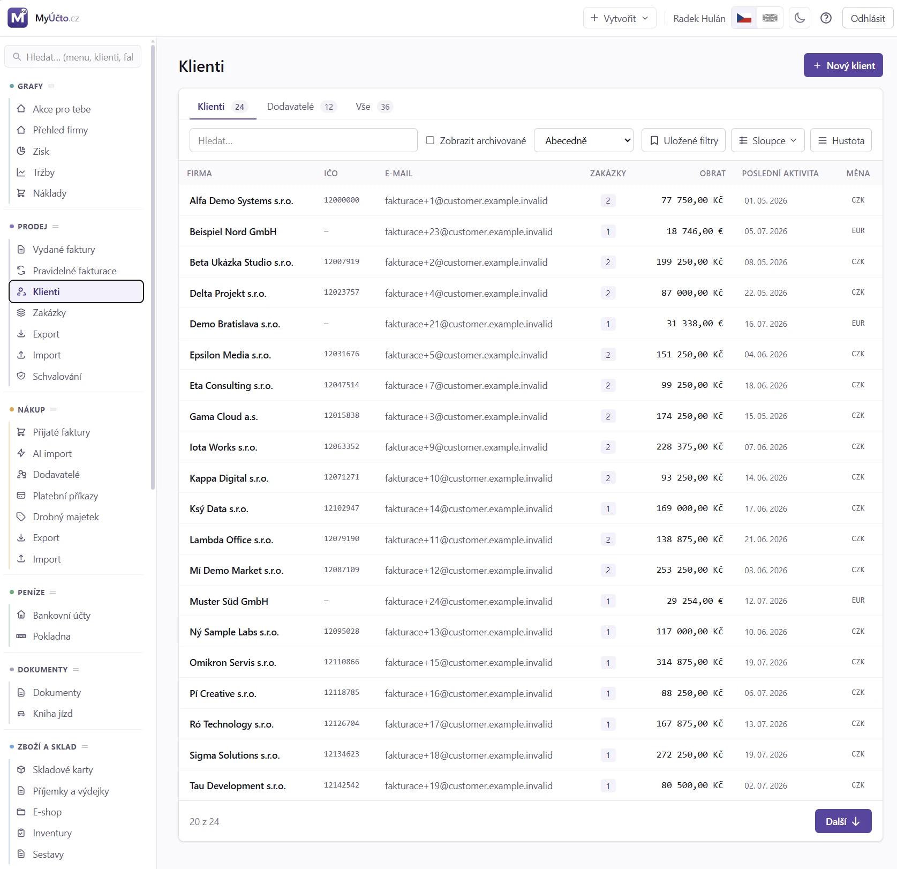
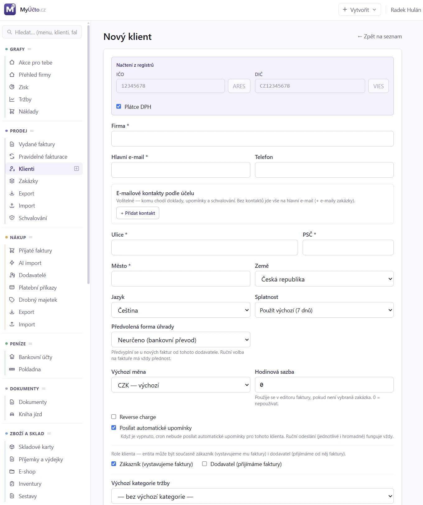

# 18. Klienti

> Návod, jak v MyÚčtu založit klienta (odběratele i dodavatele), nastavit mu
> e-mailové kontakty a splatnost a jak ho upravit nebo archivovat. Pro každého,
> kdo vystavuje faktury.

## 18.1 Kdy to potřebujete

- Chcete vystavit fakturu firmě nebo osobě, kterou ještě nemáte v seznamu.
- Potřebujete, aby faktury chodily na účtárnu a upomínky na jinou osobu.
- Klient změnil adresu nebo e-mail.
- Klient už s vámi nespolupracuje a chcete ho schovat ze seznamu.
- Potřebujete ověřit, zda je dodavatel plátce DPH.

Klient je firma nebo osoba, které vystavujete faktury. Pod klientem můžete
mít jednu nebo více **zakázek** (viz [19. Zakázky](19_Zakazky.md)), typicky
1 zakázka = 1 projekt nebo dlouhodobá spolupráce.

Jedna protistrana může být odběratelem i dodavatelem. Není potřeba zakládat
druhý záznam stejné firmy (viz [§ 18.7.7](#1877-role-odberatel-a-dodavatel)).

## 18.2 Než začnete

- Pro načtení údajů z ARES potřebujete IČO (8 číslic).
- Pro odeslání faktury nebo upomínky musí mít klient hlavní e-mail nebo
  e-mailový kontakt s odpovídajícím účelem. Hlavní e-mail je jinak volitelný.
- Pro nastavení cenové hladiny musíte mít zapnutý sklad.

## 18.3 Krok za krokem: založení klienta

1. Otevřete `Prodej → Klienti` a klikněte na **Nový klient**.
2. Do pole **IČO** zadejte 8 číslic a klikněte na **Najít v ARES (IČO)**.
   Aplikace předvyplní název, DIČ, adresu a stát.
3. Doplňte **Hlavní e-mail**.
4. Podle potřeby změňte **Výchozí měnu** a **Jazyk** (`cs` nebo `en`).
   Jazyk určuje jazyk PDF a e-mailových šablon.
5. U klienta z EU s DIČ klikněte na **Ověřit DIČ ve VIES**. Je-li DIČ platné,
   u klienta se zobrazí odznak ověření.
6. U klienta z EU s DIČ, kterému fakturujete bez DPH, zaškrtněte
   **Reverse charge**. Faktura bude bez DPH s textem „Daň přiznává odběratel“.
7. Klikněte na **Vytvořit**.

**Jak poznáte, že je hotovo:** klient je v seznamu `Prodej → Klienti` a nabízí
se v editoru faktury.

Bez IČO (fyzická osoba) zadejte alespoň jméno a adresu ručně.

> [!TIP]
> Slovenského klienta zakládáte stejně, jen se po výběru státu mění popisky
> polí (viz [§ 18.7.3](#1873-slovensky-klient-a-narodni-danova-cisla)).

## 18.4 Krok za krokem: e-mailové kontakty podle účelu

Použijte, když mají různé zprávy chodit na různé adresy: faktury na účtárnu,
upomínky na odpovědnou osobu, schvalování výkazů na projektového manažera.

1. Otevřete klienta a klikněte na **Upravit**.
2. V sekci **E-mailové kontakty podle účelu** klikněte na **Přidat kontakt**.
3. Vyplňte e-mail, volitelně jméno osoby a popisek (například „účtárna“).
4. Zaškrtněte **Účely**: **Doklady**, **Upomínky**, **Schvalování**, případně
   **Komunikace**.
5. Zvolte **Role:** **Příjemce (to)**, **Kopie (cc)** nebo **Skrytá kopie (bcc)**.
6. Chcete-li zachovat i hlavní e-mail mezi příjemci, klikněte na
   **Převzít hlavní e-mail**.
7. Uložte klienta.

**Jak poznáte, že je hotovo:** v okně odeslání faktury vidíte u každého
příjemce, odkud byl doplněn (kontakt: doklady / zakázka / hlavní e-mail).
Seznam můžete pro konkrétní odeslání ručně upravit.

> [!WARNING]
> Jakmile má účel přiřazený aktivní kontakt, hlavní e-mail se pro daný typ
> zprávy už automaticky nepřidává. Chcete-li ho zachovat, přidejte ho jako kontakt.

### 18.4.1 Předmět e-mailu a název přiloženého PDF

Použijte, když klient zpracovává přijaté faktury automaticky a předepisuje,
jak se má jmenovat předmět e-mailu a přiložený soubor.

1. Otevřete klienta a klikněte na **Upravit**.
2. Rozbalte sekci **E-mail s fakturou (volitelné)** (je nad vlastní číselnou řadou).
3. Do pole **Předmět e-mailu** zadejte formát, například
   `Klient_{DUZP_MM}_{DUZP_YYYY}_Dodavatel`.
4. Do pole **Název přiloženého PDF** zadejte formát, například
   `Dodavatel_{DUZP_MM}_{DUZP_YYYY}`. Příponu `.pdf` doplní aplikace sama.
5. Pod každým polem zkontrolujte živou **Ukázku** výsledku a klienta uložte.

**Jak poznáte, že je hotovo:** ukázka pod poli odpovídá tomu, co klient
požaduje, a e-mail s fakturou odeslaný tomuto klientovi (nejlépe přes
**Test odeslání**) má váš předmět i název přílohy. Prázdné pole znamená výchozí
text.

> [!TIP]
> Neznámý zástupný znak formulář při uložení odmítne. Seznam znaků je
> v [§ 18.7.9](#1879-predmet-e-mailu-a-nazev-prilozeneho-pdf-pravidla).

## 18.5 Krok za krokem: úprava a archivace klienta

Úprava:

1. Otevřete detail klienta (klikněte na jeho název v seznamu).
2. Klikněte na **Upravit**, změňte údaje a uložte.

Změna se projeví na nových fakturách. Vystavené faktury mají vlastní kopii
údajů klienta, ta se nemění.

Archivace:

1. V detailu klienta otevřete nabídku dalších akcí a zvolte **Archivovat**.
2. Potvrďte dotaz „Archivovat klienta?“.

**Jak poznáte, že je hotovo:** klient zmizí ze seznamu. Najdete ho po zaškrtnutí
**Zobrazit archivované** a můžete ho vrátit tlačítkem **Obnovit**. Faktury a
statistiky zůstávají zachovány.

Smazat lze jen klienta bez faktur a zakázek, jinak použijte archivaci.

## 18.6 Když něco nejde

<!-- cols: 34 30 36 -->
| Co vidíte | Proč | Co udělat |
|---|---|---|
| Fakturu ani upomínku nejde odeslat, chybí příjemce | Klient nemá hlavní e-mail ani kontakt s příslušným účelem | V **Upravit** doplňte hlavní e-mail nebo kontakt s účelem **Doklady** či **Upomínky** |
| Upomínka nebo faktura jde jen na kontakty, ne na hlavní e-mail | Účel má přiřazený aktivní kontakt, hlavní e-mail se nepřidává | Přidejte hlavní e-mail jako kontakt (**Převzít hlavní e-mail**) |
| Smazání klienta se nepodaří | Klient má faktury nebo zakázky | Použijte **Archivovat** |
| ARES klienta nenašel | ARES funguje jen pro česká IČO | Zadejte údaje ručně |
| Ověření ve VIES chvíli trvá nebo selže | VIES je pomalý a občas nedostupný | Zkuste to za chvíli |
| Změna klienta se neprojevila na vystavené faktuře | Vystavené doklady mají vlastní kopii údajů | Je to záměr, vystavené doklady jsou neměnné |

## 18.7 Podrobnosti a pravidla

### 18.7.1 Seznam klientů

Otevřete `Prodej → Klienti`.

Nahoře přepínáte mezi **Klienti**, **Dodavatelé** a **Vše**. Seznam lze
vyhledávat, třídit a zobrazit v něm archivované (**Zobrazit archivované**).
Sloupce jsou:

| Sloupec | Význam |
|---|---|
| Firma | Název firmy nebo osoby, klik otevře detail |
| IČO | České IČO, pokud je vyplněné |
| E-mail | Hlavní e-mail |
| Počet faktur | Počet faktur klienta |
| Obrat (u dodavatelů Náklady) | Souhrn faktur klienta |
| Poslední aktivita | Kdy se s klientem naposledy pracovalo |
| Plátce DPH | Jen v pohledu **Dodavatelé**: ano / ne. U neplátce nemá přijatá faktura nárok na odpočet (viz [§ 23.2.4](23_Prijate_faktury.md#23117-danova-uznatelnost-a-narok-na-odpocet)). Příznak se plní z ARES (CZ) / VIES (EU). |
| Měna | Výchozí měna pro nové faktury |
| DIČ | Daňové identifikační číslo |
| Splatnost | Výchozí splatnost klienta |
| Hladina | Cenová hladina, jen se zapnutým skladem |

Se zapnutým skladem přibude filtr **Cenová hladina**: **Default** vybere
odběratele bez hladiny, jinak odběratele s konkrétní aktivní hladinou.

Tlačítko **Smazat** je dostupné jen u klienta, který nemá žádné faktury ani
zakázky. Jinak by smazání skončilo chybou.

### 18.7.2 Pole formuláře

| Pole | Význam |
|---|---|
| Firma / jméno | Název na faktuře |
| Křestní jméno + Příjmení | Jen pro fyzické osoby (volitelné) |
| IČO | České IČO (8 číslic); slovenské funguje s ARES SK |
| DIČ | Daňové ID s prefixem země: ČR „CZ12345678“, SK „SK1234567890“, EU různě. U slovenského klienta se pole jmenuje **IČ DPH** (viz [§ 18.7.3](#1873-slovensky-klient-a-narodni-danova-cisla)) |
| Národní daňové číslo | Zobrazí se jen u zemí, kde existuje vedle VAT ID: SK **DIČ**, DE/AT **Steuernummer**, PL **NIP**, HU **Adószám**. Tiskne se na fakturu mezi IČO a DIČ/IČ DPH |
| Ulice / Město / PSČ / Země | Adresa pro fakturu |
| Hlavní e-mail | Volitelný, výchozí adresa pro odesílání faktur a upomínek |
| Telefon | Volitelný |
| Jazyk | `cs` nebo `en`, určuje jazyk PDF, e-mailových šablon a formát měny |
| Výchozí měna | Pro nové faktury (lze přepsat na faktuře) |
| Výchozí DPH | Volitelné přebití systémové výchozí sazby |
| Reverse charge | Pro EU B2B klienty s DIČ: DPH 0 % a text „Daň přiznává odběratel“. Nastavuje se u klienta, na faktuře ji lze přepsat |
| Splatnost | Předvolba **7 dnů / 14 dnů / Měsíc / Vlastní**, nebo **Použít výchozí** (dědí se z dodavatele). „Měsíc“ je kalendářní měsíc (1. 2. → 1. 3., 31. 1. → 28. 2.), ne pevných 30 dní |
| Cenová hladina | Jen se zapnutým skladem. **Default** = bez hladiny, skladové zboží se naceňuje standardní cenou. Jinak aktivní hladina firmy, podle které se naceňují skladové položky faktury (viz [§ 36.18](38_Eshop.md#381118-cenove-hladiny)) |
| Hodinová sazba | Použije se v editoru faktury, pokud není vybraná zakázka. 0 = nepoužívat |
| Posílat automatické upomínky | Vypnutím zastavíte automatické upomínky tomuto klientovi. Ruční odeslání (jednotlivé i hromadné) funguje vždy, viz [22. Upomínky](22_Upominky.md) |
| Výchozí kategorie tržby | Předvyplní se na nových vydaných fakturách klienta a po uložení se doplní i do jeho stávajících faktur bez kategorie. Kategorie zakázky má přednost |
| Poznámka | Interní text, na faktuře se nezobrazí |
| E-mail s fakturou | Volitelný předmět e-mailu a název přiloženého PDF pro klienta, viz [§ 18.4.1](#1841-predmet-e-mailu-a-nazev-prilozeneho-pdf) |

Formulář obsahuje také blok **Vlastní číselná řada (volitelné)**: vyplníte-li
formát, dostane klient vlastní řadu faktur, proformy a dobropisů s nezávislým
počítadlem, jinak se použije řada z nastavení.

### 18.7.3 Slovenský klient a národní daňová čísla

Slovenské subjekty mají **tři** identifikační čísla: IČO, **DIČ** (bez
prefixu, přiděluje ho finanční úřad každému podnikateli včetně neplátců)
a **IČ DPH** (`SK` + číslo, vzniká až registrací k DPH). Slovenská praxe
vyžaduje na faktuře všechna tři. Po výběru státu **Slovensko**:

- pole DIČ se přejmenuje na **IČ DPH** (patří sem hodnota s prefixem, například
  `SK2022638992`) a po úspěšném ověření ve VIES se DIČ předvyplní automaticky
  (totéž číslo bez prefixu),
- přibude samostatné pole **DIČ** (bez prefixu, vyplňte ho i u neplátce).

Na faktuře se pak tiskne `IČO → DIČ → IČ DPH`, u neplátce (bez IČ DPH) jen
`IČO → DIČ`. Stejné pole funguje i pro Německo a Rakousko (**Steuernummer**),
Polsko (**NIP**) a Maďarsko (**Adószám**) s odpovídajícím popiskem. Pro fakturu
do jiné země EU je legislativně povinné jen VAT ID (čl. 226 směrnice
2006/112/ES), národní čísla jsou lokální konvence.

Tlačítko **Detaily plátce DPH** u zahraničního DIČ (s jiným prefixem než CZ)
ověřuje přes evropský **VIES**: zobrazí stav registrace k DPH, název a adresu
subjektu. Český registr plátců DPH (zveřejněné účty, nespolehlivý plátce) se
používá dál jen pro česká DIČ.

### 18.7.4 Výběr příjemců e-mailů

U každého kontaktu vyplňujete:

| Pole | Význam |
|---|---|
| E-mail | Adresa kontaktu |
| Jméno osoby | Volitelné |
| Popisek | Volitelný (například „účtárna“, „PM“) |
| Účely | **Doklady** (faktury, dobropisy, poděkování za platbu) · **Upomínky** · **Schvalování** (výkazy víceprací) · **Komunikace** (jen evidence, nic se na ni automaticky neposílá) |
| Role | **Příjemce (to)** / **Kopie (cc)** / **Skrytá kopie (bcc)** |
| Aktivní | Neaktivní kontakt se při odesílání ignoruje |

Jak se příjemci vybírají:

- **Bez kontaktů** vše chodí na hlavní e-mail klienta (plus fakturační e-maily
  zakázky, viz [§ 19.9.3](19_Zakazky.md#1993-fakturacni-e-maily)). Není-li
  vyplněný ani hlavní e-mail, odeslání skončí srozumitelnou chybou.
- **Jakmile má účel přiřazený aktivní kontakt**, použijí se kontakty s tímto
  účelem a hlavní e-mail se už automaticky nepřidává (zůstává jen záchranný
  fallback).
- **Upomínky bez vlastního kontaktu** jdou na kontakty s účelem **Doklady**,
  teprve bez nich na hlavní e-mail.
- Duplicitní adresy se odstraní (priorita to > cc > bcc), neplatné se ignorují.

Limit je 10 kontaktů na klienta. Kontakty jsou dostupné i přes API v detailu
klienta. Při vytvoření a úpravě klienta přes API se celý seznam kontaktů nahrazuje.

### 18.7.5 Detail klienta

Klik na název klienta v seznamu otevře detail.

Detail není členěn do záložek, ale do sekcí pod sebou: kontakt a adresa
s výchozím nastavením, obrat (po měsících, po letech a podle zakázek),
seznam **Zakázek** s tlačítkem **+ Nová zakázka** (viz
[19. Zakázky](19_Zakazky.md)), **Vystavené faktury**, **Přijaté faktury**
a **Bankovní účty protistrany**. U dodavatelů se místo obratu ukazují náklady.
Nabídka akcí obsahuje **Upravit**, **Detaily plátce DPH** a v rozbalovací
části **Archivovat** nebo **Obnovit**.

### 18.7.6 Bankovní účty protistrany

Na detailu odběratele nebo dodavatele je sekce **Bankovní účty protistrany**.
Účet můžete přidat ručně jako české číslo účtu nebo IBAN. U českého dodavatele
s DIČ lze tlačítkem **Načíst z registru DPH** převzít všechny zveřejněné účty.

MyÚčto účet doplní také z bankovního výpisu, ale až po potvrzeném spárování
transakce s vydanou nebo přijatou fakturou. Samotná podobnost názvu či částky
nestačí. U každého účtu štítky ukazují, zda pochází z registru DPH,
z bankovního výpisu, nebo byl zadaný ručně. Jeden účet může mít více zdrojů
současně.

### 18.7.7 Role odběratel a dodavatel

Při psaní do vyhledávače odběratele na vydané faktuře se nabízejí také
dodavatelé, při hledání dodavatele na přijaté faktuře také odběratelé. Bez
hledaného textu seznam nabízí pouze protistrany s odpovídající rolí.

Vystavením vydané faktury se zapne role odběratele, úspěšným uložením přijaté
faktury role dodavatele. Dosavadní role zůstane zachovaná. Samotné hledání
ani výběr protistrany její roli nemění. V seznamu se firma s oběma rolemi
označí odznakem a role lze upravit ve formuláři klienta, dokud klient nemá
doklady příslušného druhu.

### 18.7.8 Tipy

- **ARES** funguje jen pro česká IČO. Slovenská IČO aplikace dohledává ve
  slovenském registru (ARES SK).
- **VIES** je pomalý (zhruba 1 až 2 sekundy) a občas nedostupný. Výsledek si
  aplikace pamatuje 24 hodin.
- Reverse charge se nastavuje u klienta, ale lze ho přepsat na faktuře
  v editoru.

### 18.7.9 Předmět e-mailu a název přiloženého PDF: pravidla

| Pole | Kde platí | Prázdné pole |
|---|---|---|
| Předmět e-mailu | E-mail s fakturou, zálohou i dobropisem: ruční i hromadné odeslání, automatické odeslání pravidelné fakturace a test odeslání (s prefixem `[TEST]`) | Předmět podle e-mailové šablony, standardně „Faktura 2610001 - Dodavatel“ |
| Název přiloženého PDF | Každý e-mail s PDF faktury: odeslání, upomínky i poděkování za úhradu | Podle druhu dokladu: `Faktura-2610001.pdf`, `Proforma-…`, `Dobropis-…` |

Upomínky a poděkování za úhradu si předmět ponechávají vlastní, jde o jinou
zprávu než samotnou fakturu. Předmět klienta má přednost i před předmětem
upraveným v administraci e-mailových šablon.

Formát je text se zástupnými znaky ve složených závorkách:

| Zástupný znak | Hodnota |
|---|---|
| `{VS}` | Variabilní symbol (číslo dokladu) |
| `{TYP}` | Druh dokladu v jazyce klienta: Faktura, Zálohová faktura, Opravný daňový doklad, Daňový doklad k přijaté platbě, Platební kalendář |
| `{KLIENT}` | Název klienta |
| `{DODAVATEL}` | Název dodavatele |
| `{MM}`, `{YYYY}`, `{YY}` | Měsíc a rok vystavení |
| `{DUZP_MM}`, `{DUZP_YYYY}`, `{DUZP_YY}` | Měsíc a rok zdanitelného plnění; u zálohy bez DUZP datum vystavení |

Příklad pro fakturu vystavenou 6. 10. 2026 za září (DUZP 30. 9. 2026):

| Formát | Výsledek |
|---|---|
| `Klient_{DUZP_MM}_{DUZP_YYYY}_Dodavatel` | `Klient_09_2026_Dodavatel` |
| `Dodavatel_{DUZP_MM}_{DUZP_YYYY}` (název PDF) | `Dodavatel_09_2026.pdf` |

Název souboru nesmí obsahovat znaky `\ / : * ? " < > |`. Pokud je obsahují
dosazené hodnoty (třeba lomítko v názvu firmy), nahradí se podtržítkem.

## 18.8 Související kapitoly

- [19. Zakázky](19_Zakazky.md)
- [14. Faktury](14_Faktury.md)
- [15. Faktura - editor](15_Faktura_editor.md)
- [22. Upomínky po splatnosti](22_Upominky.md)
