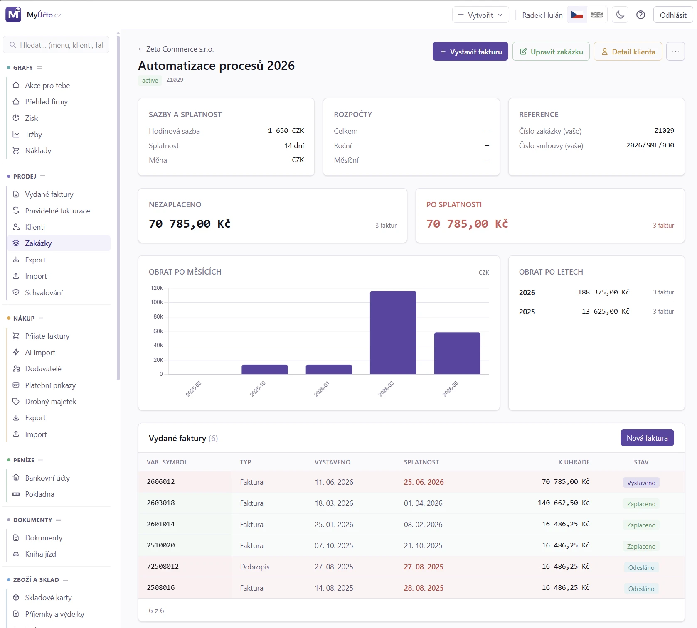

# 19. Zakázky

> Návod, jak založit zakázku (projekt nebo dlouhodobou spolupráci s klientem),
> zařadit k ní doklady a sledovat výnosy, náklady a marži. Pro každého, kdo
> potřebuje oddělit obrat nebo e-maily jednotlivých projektů.

## 19.1 Kdy to potřebujete

Zakázka má smysl, pokud chcete:

- sledovat obrat a marži po projektech (kolik jste za rok vyfakturovali za
  „Migraci CRM“ a kolik stála),
- mít pro každý projekt klienta jiné fakturační e-maily (jiná účetní),
- hlídat rozpočet (celkový, roční nebo měsíční limit),
- mít jinou hodinovou sazbu pro retainer než pro projekt,
- tisknout číslo projektu nebo smlouvy v hlavičce faktury,
- nechat zákazníka schvalovat výkaz práce před vystavením faktury,
- ukázat klientovi průběžný výkaz práce ještě před fakturou.

Pokud tyto věci nepotřebujete, fakturujte **bez zakázky**: v editoru nechte pole
„Zakázka“ prázdné a faktura se přiřadí jen ke klientovi. Hodí se to pro
jednorázové faktury (poradenství, licence).

## 19.2 Než začnete

- Zakázka vždy patří ke konkrétnímu klientovi, nejdřív proto musíte mít
  [klienta](18_Klienti.md).
- Chcete-li posílat fakturační e-maily mimo klienta, mějte připravené adresy
  (účetní, projektový manažer).
- Pro schvalování výkazu zákazníkem se musí na zakázce používat výkaz víceprací
  (viz [15. Faktura - editor](15_Faktura_editor.md#1597-schvalovani-vykazu-zakaznikem)).

## 19.3 Krok za krokem: založení zakázky

1. Otevřete detail klienta (`Prodej → Klienti`, klik na název).
2. V sekci **Zakázky** klikněte na **+ Nová zakázka**.
3. Vyplňte **Název** (například „Web e-shop“, „Retainer 2026“).
4. Podle potřeby doplňte **Číslo zakázky (vaše)**, **Číslo smlouvy (vaše)**
   a **Hodinovou sazbu**.
5. Zvolte **Měnu** a **Splatnost** (**7 dnů**, **14 dnů**, **Měsíc**
   nebo **Vlastní…**).
6. Volitelně zadejte **Celkový**, **Roční** a **Měsíční rozpočet**.
7. Přidejte **Fakturační e-maily** (viz [§ 19.9.3](#1993-fakturacni-e-maily)).
8. Klikněte na **Vytvořit**.

**Jak poznáte, že je hotovo:** zakázka je v seznamu `Prodej → Zakázky`
a v editoru faktury ji vyberete v poli „Zakázka“.

> [!TIP]
> Fakturační e-maily doporučujeme vždy. Administrátor firmy obvykle nechce, aby
> faktura šla jen jemu osobně místo na účetní oddělení.

## 19.4 Krok za krokem: zařazení dokladů a ekonomika zakázky

V detailu zakázky je blok **Ekonomika zakázky**: výnosy, náklady a jejich rozdíl
(marže) za celou akci, **bez ohledu na protistranu**. Jedna akce tak může mít
několik odběratelů (víc vydaných faktur) i několik dodavatelů (hotel, doprava,
vstupenky) a vy přesto vidíte jedno číslo.

Doklady k zakázce zařadíte takto:

1. **Vydaná faktura:** v editoru faktury vyplňte pole „Zakázka“.
2. **Přijatá faktura:** v editoru přijaté faktury vyplňte pole „Zakázka“
   v bloku *Klasifikace*.
3. **Více přijatých faktur najednou:** v seznamu přijatých faktur zaškrtněte
   doklady a v liště klikněte na **Zařadit k zakázce**.
4. **Pokladní doklad:** vyplňte pole „Zakázka“ na dokladu.

**Jak poznáte, že je hotovo:** v detailu zakázky se v bloku **Ekonomika
zakázky** objeví doklad s datem, číslem, protistranou a částkou a změní se
**Výnosy**, **Náklady** a **Marže**.

Zakázku lze zařadit i u **zaúčtovaných** dokladů. Je to jen analytické členění,
účetní zápis se nemění. V seznamu přijatých faktur můžete filtrovat podle
zakázky včetně volby **Bez zakázky**, tak dohledáte doklady, které do ekonomiky
akcí ještě nikdo nezařadil.

## 19.5 Krok za krokem: schvalování výkazu zákazníkem

1. Otevřete zakázku a klikněte na **Upravit zakázku**.
2. Zaškrtněte **Vyžaduje schválení výkazu práce zákazníkem**.
3. Uložte zakázku.
4. Fakturu s výkazem víceprací na této zakázce připravte běžným postupem
   (viz [§ 15.9.7](15_Faktura_editor.md#1597-schvalovani-vykazu-zakaznikem)).

**Jak poznáte, že je hotovo:** faktura s výkazem nejde vystavit, dokud zákazník
výkaz neschválí přes odkaz v e-mailu. Po schválení se faktura sama vystaví
a odešle. Zakázka se v detailu označí odznakem **Schválení výkazu zákazníkem**.

> [!TIP]
> Faktura bez výkazu víceprací (například fixní paušál) schvalování přeskočí
> a jde vystavit normálně.

Kam jde schvalovací e-mail, viz [§ 19.9.6](#1996-prijemci-schvalovaciho-e-mailu).
Přehled všech žádostí je v `Prodej → Schvalování` (viz
[§ 19.9.8](#1998-fronta-schvalovani)).

## 19.6 Krok za krokem: sledovací odkaz na výkaz práce

Klient tak uvidí aktuální nevyfakturované výkazy práce (hodiny i průběžnou
částku) ještě před fakturou.

1. Otevřete detail **klienta** (odkaz za všechny jeho zakázky) nebo **zakázky**
   (odkaz jen pro ni).
2. Klikněte na **Poslat odkaz na sledování výkazu práce** (na detailu zakázky je
   v nabídce **Další akce**).
3. V okně zkontrolujte v poli **Komu** předvyplněné příjemce (e-maily klienta,
   u zakázky i její fakturační e-maily). Můžete je upravit, vyplnit **Kopie (CC)**,
   **Skrytá kopie (BCC)** a **Poznámka (volitelně)**.
4. Klikněte na **Odeslat odkaz**.

**Jak poznáte, že je hotovo:** aplikace ohlásí „Odkaz odeslán na: …“ a příjemcům
dorazí e-mail s odkazem. Tentýž odkaz
vidíte v okně, můžete ho zkopírovat tlačítkem **Kopírovat** a vidíte čas
posledního odeslání a posledního zobrazení.

Odkaz zneplatníte tlačítkem **Zneplatnit odkaz**: stávající odkaz okamžitě
přestane fungovat, i pro ty, kdo už byli ověření. Při dalším odeslání vznikne
nový.

> [!WARNING]
> Odkaz je důvěrný. Kdokoli, kdo ho má a má přístup k některému povolenému
> e-mailu, si výkaz zobrazí. Dostane-li se k nesprávné osobě, zneplatněte ho.

## 19.7 Krok za krokem: pozastavení, uzavření a smazání zakázky

1. Otevřete zakázku a klikněte na **Upravit zakázku**.
2. V poli **Stav** zvolte **Pozastavené** nebo **Uzavřené** (zpět **Aktivní**).
3. Uložte.

- **Pozastavené:** zakázka zůstává v seznamu, ale v editoru faktury se objeví
  varování „Pozastaveno“. Pro nové faktury použijte jinou. **Vystavit fakturu**
  z detailu zakázky se nabízí jen u aktivní zakázky.
- **Uzavřené:** zakázka se schová z výchozího filtru. Faktury zůstávají, obrat
  se počítá. Lze obnovit zpět na **Aktivní**.
- **Smazat** (v nabídce **Další akce** na detailu zakázky) lze jen zakázku bez
  faktur. Jinak v téže nabídce zvolte **Archivovat** a potvrďte „Archivovat zakázku?“.

**Jak poznáte, že je hotovo:** v seznamu `Prodej → Zakázky` má zakázka nový stav
ve sloupci stavu. Uzavřená zakázka z výchozího seznamu zmizí, archivovaná nebo
smazaná se už nenabízí v editoru faktury.

Změna **hodinové sazby** se projeví jen na NOVÝCH položkách v editoru faktury.
Stávající koncepty si zachovají původní sazbu, dokud je ručně neupravíte.

## 19.8 Když něco nejde

<!-- cols: 34 30 36 -->
| Co vidíte | Proč | Co udělat |
|---|---|---|
| Nevím, kde přidat novou zakázku | Zakázka je vždy navázaná na klienta | Otevřete detail klienta a klikněte na **+ Nová zakázka** |
| Hláška „Zakázka má N nezaúčtovaných dokladů“ | Nezaúčtovaný doklad se do ekonomiky nezapočítá | Doklady zaúčtujte, pak se součet doplní |
| Fakturu s výkazem nejde vystavit | Zakázka vyžaduje schválení výkazu zákazníkem | Počkejte na schválení, nebo požadavek na zakázce vypněte |
| Schvalovací e-mail nedostal klient | Zakázka má fakturační e-maily a ty mají přednost | Viz tabulka v [§ 19.9.6](#1996-prijemci-schvalovaciho-e-mailu) |
| Smazání zakázky se nepodařilo | Na zakázce jsou faktury | Zakázku archivujte nebo uzavřete |
| Zákazník na sledovacím odkazu nemůže dál | Kód nepřišel nebo e-mail není mezi povolenými | Zkontrolujte e-maily klienta a zakázky, odkaz můžete zneplatnit a poslat nový |
| Faktura s „Pozastaveno“ v editoru | Zakázka má stav **Pozastavené** | Použijte jinou zakázku nebo stav změňte |

## 19.9 Podrobnosti a pravidla

### 19.9.1 Seznam zakázek

Otevřete `Prodej → Zakázky`.

Seznam ukazuje klienta, název, stav (**Aktivní** / **Pozastavené** /
**Uzavřené**), hodinovou sazbu, měnu, splatnost a obrat. Filtr nad seznamem
(**Všichni klienti**) zúží seznam na zakázky jednoho klienta a lze ho zrušit.
Splatnost je předvolba **7 dnů / 14 dnů / Měsíc / Vlastní**, „Měsíc“ je
kalendářní měsíc. Zakázka přebíjí klienta i dodavatele.

### 19.9.2 Pole zakázky

| Pole | Význam |
|---|---|
| Název | Krátké pojmenování |
| Číslo zakázky (vaše) | Volitelné, na faktuře v rámečku „Projekt č.“ |
| Číslo smlouvy (vaše) | Volitelné, na faktuře v rámečku „Smlouva č.“ |
| Hodinová sazba | Výchozí sazba pro položky typu „hodina“ v editoru faktury (lze přepsat na položce) |
| Měna | CZK / EUR / … |
| Splatnost | Předvolba 7 / 14 dnů, **Měsíc** (kalendářní) nebo **Vlastní…** počet dní |
| Celkový rozpočet | Volitelný horní limit za celou zakázku (varování v editoru při překročení) |
| Roční rozpočet | Volitelný roční limit |
| Měsíční rozpočet | Volitelný měsíční limit |
| Výchozí kategorie tržby | Předvyplní se u nových vydaných faktur zakázky a má přednost před kategorií zákazníka. Po uložení se doplní do faktur zakázky, které kategorii nemají |
| Stav | **Aktivní** (výchozí) / **Pozastavené** / **Uzavřené** |
| Poznámka | Interní text |

Číslo zakázky a smlouvy se na PDF zobrazí jen tehdy, když je vyplněné.

### 19.9.3 Fakturační e-maily

Pod hlavními poli je sekce **Fakturační e-maily**. Můžete přidat až 3 adresy,
na které se kromě klienta posílá každá vystavená faktura (účetní, projektový
manažer, asistentka).

| Pole | Význam |
|---|---|
| Pozice | 1 / 2 / 3 (řazení) |
| E-mail | Povinný |
| Popisek | Volitelný („účetní“, „PM“, „asistentka“) |
| Účely | **Doklady / Upomínky / Schvalování**, pro které typy zpráv se e-mail použije. Nevybrat nic = všechny typy (výchozí) |

Při odesílání faktury jdou kopie na hlavní e-mail klienta a fakturační e-maily
zakázky. Faktura bez zakázky jde jen na hlavní e-mail klienta. Má-li klient
**e-mailové kontakty podle účelu** (viz
[§ 18.4](18_Klienti.md#184-krok-za-krokem-e-mailove-kontakty-podle-ucelu)),
nahrazují hlavní e-mail kontakty s účelem **Doklady**.

Volba **Kombinace s e-maily klienta** určuje, jak se e-maily zakázky skládají
s kontakty a hlavním e-mailem klienta:

| Režim | Chování |
|---|---|
| **Výchozí** | U dokladů a upomínek se e-maily zakázky **přidávají**, u schvalování výkazů **nahrazují** hlavní e-mail |
| **Vždy přidat k příjemcům klienta** | E-maily zakázky se přidají k příjemcům dle kontaktů klienta u všech typů zpráv |
| **Vždy nahradit příjemce klienta** | Jsou-li e-maily zakázky vyplněné, použijí se **jen ony** (kontakty klienta se přeskočí) |

### 19.9.4 Detail zakázky

Klik na název zakázky v seznamu otevře detail.

Detail ukazuje údaje zakázky (včetně sekcí **Sazby a splatnost** a
**Reference**), obrat letos, loni a celkem, faktury na zakázce (s filtrem
stavu) a výkazy víceprací (PDF se sčítá po fakturách). Akce: **Upravit zakázku**,
**Vystavit fakturu**, **Detail klienta**, **Upravit klienta**.

### 19.9.5 Ekonomika zakázky: odkud se čísla berou

Ve firmě vedené v **podvojném účetnictví** se výnosy a náklady počítají
z účetního deníku (nákladové účty 5xx proti výnosovým 6xx). Sedí tak na
výsledovku a správně počítají dobropisy i storna. Doklad, který ještě
**není zaúčtovaný**, se do součtu nezapočítá, aplikace na to upozorní hláškou
„Zakázka má N nezaúčtovaných dokladů“. V **daňové evidenci** deník neexistuje,
proto se sčítají přímo doklady podle data vystavení. Blok vždy uvádí, ze
kterého zdroje se počítá.

### 19.9.6 Příjemci schvalovacího e-mailu

| Konfigurace | Příjemce schvalovacího e-mailu |
|---|---|
| Klient má **kontakty s účelem Schvalování** ([§ 18.4](18_Klienti.md#184-krok-za-krokem-e-mailove-kontakty-podle-ucelu)) | Tyto kontakty (plus e-maily zakázky dle režimu kombinace) |
| Zakázka má **fakturační e-maily** ([§ 19.9.3](#1993-fakturacni-e-maily)) | Jen na ně, hlavní e-mail klienta NEDOSTANE |
| Zakázka **nemá** fakturační e-maily | Hlavní e-mail klienta |

Záměr: schvalovací e-mail může dostat účetní (fakturační e-mail), zákazník se
o vícepracích dozví až s hotovou fakturou. Podrobný popis schvalování
(tlačítka, stavy, veřejná stránka) je v kapitole
[15. Faktura - editor a výkaz víceprací, § 15.9.7](15_Faktura_editor.md#1597-schvalovani-vykazu-zakaznikem).

### 19.9.7 Ověření přístupu ke sledovacímu odkazu

Odkaz je veřejný, ale chráněný:

- **Odkaz na klienta** ukazuje všechny otevřené výkazy klienta napříč
  zakázkami, **odkaz na zakázku** jen výkazy té zakázky. Náhled je živý,
  pokaždé ukáže aktuální stav konceptů faktur s výkazem práce.
- Při **prvním** otevření z prohlížeče zadá návštěvník svůj e-mail a MyÚčto na
  něj pošle **jednorázový ověřovací kód**. Po zadání se přístup uloží do
  prohlížeče (cookie) a dalších **180 dní** se kód nevyžaduje.
- Povolené jsou jen **e-maily klienta** (hlavní e-mail a kontakty), u odkazu na
  zakázku navíc její **fakturační e-maily**. Na stránce se kvůli soukromí
  zobrazují jen **maskované** adresy (například `j****@fialka.cz`).
- **Přihlášený uživatel** (vy nebo účetní) vidí náhled rovnou, bez kódu.

Obě e-mailové šablony („odkaz na sledování“ a „ověřovací kód“) upravíte
v `Systém → E-maily a certifikáty`, záložka **E-mail šablony**.

### 19.9.8 Fronta schvalování

Otevřete `Prodej → Schvalování` (jen administrátor nebo role s oprávněním
číst schvalování faktur).

Stránka soustřeďuje všechny vydané faktury aktuální firmy, které už prošly
schvalovacím workflow. Výchozí filtr ukazuje žádosti čekající na rozhodnutí,
přepínače **Čeká**, **Schváleno**, **Zamítnuto** a **Vše** zobrazují i počty
v jednotlivých stavech. Volba **Jen po termínu** omezí čekající žádosti na ty,
u kterých od poslední žádosti nebo upomínky uplynulo alespoň pět dní.

Každý řádek obsahuje variabilní symbol s odkazem na fakturu, klienta, zakázku,
částku k úhradě, stav, datum žádosti, počet odeslaných upomínek a případný
důvod zamítnutí. Prošlý schvalovací odkaz se zobrazuje jako **Expirováno**,
nejde o zamítnutí zákazníkem.

Fronta sama nic neschvaluje ani nerozesílá. Je to serverově filtrovaný přehled
nad stavem faktur aktuální firmy, stránkovaný po dávkách. Novou žádost,
upomínku nebo ruční změnu stavu provedete v detailu konkrétní faktury. Celý
schvalovací cyklus je popsán v
[§ 15.9.7](15_Faktura_editor.md#1597-schvalovani-vykazu-zakaznikem).

### 19.9.9 Tipy

- Hodinová sazba je jen výchozí, v editoru ji vždy přepíšete na položce.
- Zakázku lze archivovat, faktury i obrat zůstanou.

## 19.10 Související kapitoly

- [18. Klienti](18_Klienti.md)
- [15. Faktura - editor](15_Faktura_editor.md)
- [14. Faktury](14_Faktury.md)
- [22. Upomínky po splatnosti](22_Upominky.md)
