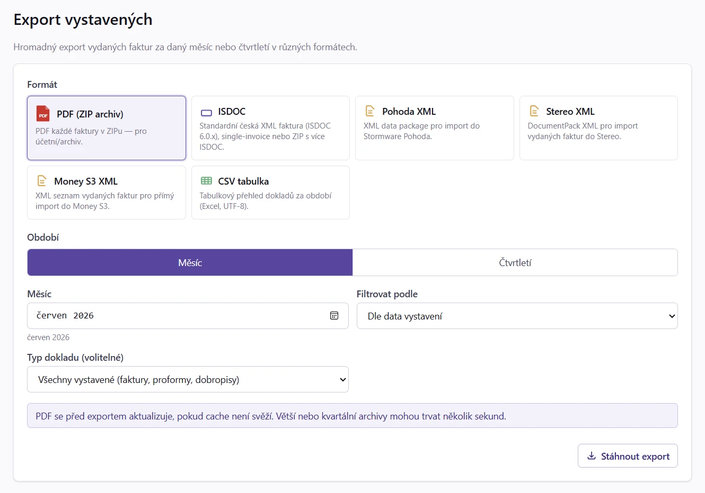

# 20. Exporty (PDF ZIP, ISDOC, Pohoda, Stereo, Money S3, CSV)

Pro účetní (interní oddělení nebo externí kancelář) nabízí MyÚčto šest
formátů hromadného exportu **vystavených faktur** a per-faktura export
**přijatých faktur** (ISDOC / Pohoda / naše PDF rekonstrukce — viz [Export přijatých faktur](24_Export_prijatych.md)).

> [!TIP]
> Pokud chceš účetní za daný měsíc předat **vše najednou v jednom ZIP** (vystavené
> i přijaté faktury, výpisy z účtu a knihu DPH, roztříděné do složek a s daňově
> korektním zařazením do období), použij **Hromadný export** v sekci Daně — viz
> [Hromadný export (ZIP)](42_Hromadny_export.md). Exporty níže
> jsou cílené na jeden formát / jeden typ dokladu.

| Formát | Pro koho | Co obsahuje |
|---|---|---|
| **PDF / PDF ZIP** | Archivace nebo tisk | Jednotlivá PDF v ZIP, nebo všechny doklady sloučené do jednoho PDF |
| **ISDOC 6.0.2** | Český národní standard pro B2B výměnu faktur | XML soubor pro každou fakturu, balené v ZIP |
| **Pohoda XML** | Stormware Pohoda — přímý import bez ručního opisu | Sloučený dataPack XML soubor |
| **Stereo XML** | Stereo for Windows — import vydaných faktur | Sloučený DocumentPack XML soubor |
| **Money S3 XML** | Seyfor Money S3 — import vydaných faktur | Sloučený `SeznamFaktVyd` XML soubor |
| **CSV** | Excel, datová kontrola a další zpracování | Jeden UTF-8 tabulkový soubor za období |

## 20.1 Obrazovka exportů

V hlavním menu **Účetnictví → Export / Import**, záložka **Export vystavených**
(firmy bez podvojného účetnictví najdou položku **Export / Import** v sekci **Daně**).



Formulář:

| Pole | Význam |
|---|---|
| Formát | `PDF / PDF ZIP` / `ISDOC` / `Pohoda XML` / `Stereo XML` / `Money S3 XML` / `CSV` |
| Období | Měsíc-rok (např. „Duben 2026") nebo celé čtvrtletí (`Q1` až `Q4`) |
| Filtrovat podle | Datum vystavení nebo DUZP (u DUZP se při prázdné hodnotě použije datum vystavení) |
| Typ | Všechny / Faktury / Zálohové / Dobropisy |

Klik **Stáhnout** → soubor stažen do prohlížeče.

Měsíční režim použij pro běžné předání dokladů za jeden měsíc. Čtvrtletní
režim použij hlavně pro účetní předání za kvartál; aplikace vybere všechny
doklady v rozsahu příslušného čtvrtletí podle zvoleného data filtru.

## 20.2 PDF / PDF ZIP

Nejjednodušší archivace. ZIP obsahuje:

```
myucto-2026-Q2.zip
├── Faktura-2604001.pdf
├── Faktura-2604002.pdf
├── Faktura-2605001.pdf
├── Faktura-2606001.pdf
├── Proforma-92604001.pdf
├── Dobropis-72604001.pdf
└── ...
```

Název ZIPu obsahuje zvolené období (`2026-04` nebo `2026-Q2`). Název
jednotlivých PDF vychází z typu dokladu a variabilního symbolu.

Použití: **roční archivace** pro účetní (předáš ZIP/měsíc), **založení do
spisu**, **odeslání e-mailem revizorovi**.

Po zapnutí volby **Sloučit do jednoho PDF** vznikne jeden vícestránkový
soubor namísto ZIP archivu. Pokud má dodavatel nakonfigurovaný podpisový
profil pro exporty, lze zapnout také **Elektronicky podepsat**; podepisuje se
výsledný sloučený soubor, ne jednotlivé faktury uvnitř ZIPu.

Stejný sloučený export lze spustit ručně nad konkrétními doklady v seznamu
faktur přes hromadnou akci **PDF export (N)**. Výběr je omezen na 200
vystavených faktur a dobropisů. Přílohy a samostatné ISDOC soubory nejsou
součástí sloučeného PDF.

## 20.3 ISDOC 6.0.2

ISDOC je český národní standard pro elektronickou výměnu faktur. Definovaný
[ISDOC.cz](http://www.isdoc.cz/) — používá ho většina českých účetních
softwarů (Money S3, Helios, Stereo, ABRA).

### 20.3.1 Struktura souboru

Každá faktura má vlastní `.isdoc` XML soubor podle ISDOC 6.0.2 schématu.
ZIP obsahuje:

```
isdoc-2026-04.zip
├── 2604001.isdoc       (XML)
├── 2604002.isdoc
├── ...
└── manifest.xml         (volitelný — seznam dokumentů)
```

### 20.3.2 DocumentType

Mapování v ISDOC:

| MyÚčto typ | ISDOC DocumentType |
|---|---|
| Faktura | `1` (běžná faktura) |
| Zálohová (proforma) | `2` (zálohová) |
| Dobropis | `5` (opravný daňový doklad) |
| Storno | (neexportuje se — interní) |

### 20.3.3 PaymentMeansCode

| Způsob platby | Kód |
|---|---|
| Bankovní převod (CZ) | `42` |
| SEPA převod (EU) | `31` |
| Hotovost | `10` |

### 20.3.4 Číslo zakázky a smlouvy

Pokud má faktura přiřazenou zakázku s vyplněným číslem zakázky / číslem
smlouvy, exportují se do ISDOC jako kolekce wrappers (XSD 6.0.2):

```xml
<OrderReferences>
  <OrderReference id="O1">
    <SalesOrderID>2026-042</SalesOrderID>      <!-- project_number -->
  </OrderReference>
</OrderReferences>
<ContractReferences>
  <ContractReference id="C1">
    <ID>SMLOUVA-001</ID>                       <!-- contract_number -->
    <IssueDate>2026-05-14</IssueDate>          <!-- IssueDate faktury -->
  </ContractReference>
</ContractReferences>
```

Některé účetní softwary tyto reference zachovávají při importu (Money S3,
Helios). MyÚčto je při [zpětném importu](21_Importy.md) také čte —
zakázka se podle `project_number` najde nebo automaticky vytvoří.

### 20.3.5 ISDOC v PDF příloze

Samotné PDF je konformní **PDF/A-3b** (ISO 19005-3, viz
[§ 16.2.2](16_Faktura_PDF.md#1622-pdfa-3b-archivni-format)). Při generování se
do něj ISDOC XML přibalí jako příloha (PDF/A-3 associated file). Účetní
programy si data extrahují přímo z PDF — stačí přeposlat jediný soubor. Pod
variabilním symbolem se v PDF zobrazí vizuální `ISDOC` badge.

- Vkládá se jen pro **CZK faktury s přiděleným VS**.
- Lze vypnout per-dodavatel v *Nastavení → Dodavatel → Vkládat ISDOC XML
  do PDF faktur* (default zapnuto).
- Adobe Reader / Foxit zobrazí ikonu sponky v sidebar „Attachments" panelu.

### 20.3.6 Import do účetního software

| Software | Kde naimportovat |
|---|---|
| **Money S3** | Karty → Faktury vydané → Načíst z ISDOC |
| **Pohoda** | Externí komunikace → Import dat → ISDOC |
| **Helios Orange** | Faktury vydané → Akce → Import ISDOC |
| **Stereo** | Účetní → Import → ISDOC |

## 20.4 Pohoda XML (Stormware data package)

Pohoda XML je **proprietary formát firmy Stormware** pro přímý import faktur
do účetního systému Pohoda. Na rozdíl od ISDOC je to **jeden velký XML**
(`dataPack`), ne soubor per fakturu.

### 20.4.1 Struktura

```xml
<?xml version="1.0" encoding="UTF-8"?>
<dat:dataPack xmlns:dat="..." xmlns:inv="..." xmlns:typ="..." version="2.0">
  <dat:dataPackItem id="2604001">
    <inv:invoice version="2.0">
      <inv:invoiceHeader>
        <inv:invoiceType>issuedInvoice</inv:invoiceType>
        <inv:number>
          <typ:numberRequested>2604001</typ:numberRequested>
        </inv:number>
        ...
```

### 20.4.2 Per-dodavatel konfigurace

Pohoda kódy se nastavují v **Nastavení → Můj dodavatel → Pokročilé → Pohoda XML export**:

| Pole | XML element | Význam | Příklad |
|---|---|---|---|
| Účet (kód) | `<inv:account>` | Bankovní účet / pokladna z číselníku Pohody | `KB` |
| Středisko | `<inv:centre>` | Kód střediska | `01` |
| Činnost | `<inv:activity>` | Kód činnosti | `100` |
| Zakázka | `<inv:contract>` | Kód zakázky | `ZAK1` |
| Předkontace | `<inv:accounting>` | Zkratka předkontace | `300` |

Všechna pole jsou volitelná a platí pro **celý export** (všechny doklady v balíčku).
Nevyplněné pole se do XML nepošle a Pohoda si po importu dosadí **vlastní default
z uživatelského nastavení cílové instalace** — u předkontace to znamená, že se
pronájem i služby zaúčtují jako to, co má instalace nastavené jako výchozí, takže
kdo předkontaci nevyplní, přepisuje ji po importu ručně u každého dokladu.

### 20.4.3 Číslo zakázky

Pokud má faktura zakázku s vyplněným číslem, exportuje se do hlavičky:

```xml
<inv:numberOrder>2026-042</inv:numberOrder>
```

Pohoda toto pole standardně načítá jako „Číslo zakázky" / „Číslo objednávky".
Pro per-supplier `pohoda_contract_code` (viz [§ 20.4.2](#2042-per-dodavatel-konfigurace))
nadále platí samostatný `<inv:contract>` blok — ten se zapisuje pro celou
číselnou řadu, `<inv:numberOrder>` per faktura.

### 20.4.4 VAT klasifikace

MyÚčto mapuje DPH sazby na **Pohoda kódy členění** (`<inv:classificationVAT>`):

| MyÚčto DPH | Odběratel s českým DIČ | Odběratel bez českého DIČ |
|---|---|---|
| 21 % | `UD` (tuzemské plnění) | `UDA5` (tuzemské plnění bez ohledu na limit) |
| 12 % | `UD` (tuzemské plnění) | `UDA5_12` (snížená, bez ohledu na limit) |
| 10 % | bez kódu (členění 3. sazby je specifické pro instalaci) | dtto |
| 0 % osvobozeno | `UNX` (nezahrnovat do přiznání) | dtto |
| reverse charge | `PNAR` (přenesená daňová povinnost) | dtto |

> ⚠️ **Proč to rozlišení.** `UDA5` znamená v Pohodě „tuzemské plnění **bez ohledu
> na limit 10 000 Kč**" a sekci **A.5** kontrolního hlášení má předvyplněnou natvrdo.
> Kdyby se posílal i plátcům, skončil by každý doklad nad limit v A.5 místo A.4 —
> a Pohoda by na to neupozornila, protože u `UDA5` žádnou chybu nevidí. Proto se
> plátci posílá `UD` a sekci A.4/A.5 si Pohoda určí sama podle výše dokladu.
> Rozhoduje DIČ protistrany ze snapshotu dokladu, ne dnešní stav karty odběratele.

### 20.4.5 Import do Pohody

1. Pohoda → **Soubor → Datová komunikace → XML import / export**
2. **Import** → vyber `pohoda-2026-04.xml`
3. Pohoda zobrazí náhled (kolik faktur, jaké částky)
4. Klik **Importovat** → faktury se založí

### 20.4.6 Co Pohoda XML neobsahuje

- **PDF přílohu faktury** (Pohoda generuje vlastní PDF z dat)
- **Výkaz víceprací** (přílohy se neexportují)
- **QR platbu** (Pohoda generuje vlastní)

Pokud klient potřebuje přesně tvoji PDF verzi, použij paralelně **PDF ZIP**.

### 20.4.7 Doklad v režimu OSS se do Pohody neexportuje

Pohoda vede sazbu DPH jako výčet českých sazeb (základní / snížená / nulová), zahraniční
sazbu ani příznak [OSS](40_OSS.md) v datovém formátu nemá kam zapsat. Export takový doklad proto **odmítne a řekne to**, místo aby polskou
sazbu 23 % tiše vydával za českou 21 %.

Řádky v režimu OSS vykaž přes **Daně → OSS přiznání** a z exportu do Pohody doklady s nimi
vyřaď.

## 20.5 Stereo XML

Stereo XML export vytváří jeden `DocumentPack` soubor pro vydané faktury za
zvolené období. Je určený pro import do **Kastner Stereo** přes volbu
**Import faktury (XML)**. Výstup používá:

- `SoftwareVendor` a `SoftwareProduct` = `myucto.cz`,
- `Payment/CurrencyCode` a `Rows/Row/CurrencyCode` s mapováním vyžadovaným Stereo
  `CZK → Kč`; ostatní měny zůstávají jako ISO kód (`EUR`, ...),
- `Payment/ConstantSymbol` jako prázdný element, pokud faktura konstantní symbol
  neobsahuje.

DPH se skládá z řádkových součtů uložených na faktuře. `LineNet` je základ řádku
bez DPH (`total_without_vat`), `LineVAT` je DPH řádku a `LineNet + LineVAT`
odpovídá částce řádku s DPH. Souhrny `TaxableTotal`, `VatTotal` a `NetTotal`
jsou součty těchto hodnot přes všechny položky.

Export zapisuje pevné mapování DPH klasifikací MyÚčto do
Stereo `TypeOfVAT`. Stereo vyžaduje jeden typ DPH pro celý doklad, proto se
stejná hodnota zapisuje do `VatInfo/TypeOfVAT` i do všech řádků dokladu. Pokud
má faktura vyplněný hlavičkový `vat_classification_code`, použije se jako
autoritativní typ pro celý Stereo doklad; jinak musí všechny položky vycházet na
stejný Stereo typ. Smíšené typy bez hlavičkové klasifikace export zastaví
s validační chybou.

| MyÚčto `vat_classification_code` | Stereo `TypeOfVAT` |
| --- | --- |
| `1`, `2` | `U` |
| `3` | `UO` |
| `20` | `IDZ` |
| `22` | `UVSP` |
| `25s` | `URP` |
| `26` | `UV` |

Volitelné účetní klasifikace Stereo jako `TypeOfOperation`, `Stredisko`, `Vykon`
nebo `Zakazka` se do exportu nezapisují. `TypeOfOperation` není podle XSD povinné a
u tuzemského režimu přenesení daňové povinnosti může import Sterea odmítnout,
pokud hodnota neodpovídá lokálnímu číselníku.

## 20.6 Money S3 XML

Money S3 export vytváří jeden XML soubor s agendou **Faktury vydané**
(`SeznamFaktVyd/FaktVyd`). Přenáší hlavičky dokladů, odběratele, položky,
platební údaje, měnu, zálohy a souhrny DPH. Dobropisy a zálohové faktury mají
vlastní řadu a příznaky odpovídající formátu Money S3.

Souhrny DPH vznikají z uložených řádkových částek a sazeb na konkrétním
dokladu. Export proto zachová i historické sazby, například 15/21 %, 14/20 %
nebo 5/22 %, a nepřepočítává staré faktury podle aktuálního číselníku. Formát
Money S3 však umí na jednom dokladu jen dvě různé nenulové sazby plus sazbu
0 %. Doklad se třemi nenulovými sazbami se odmítne s validační chybou, aby se
žádná částka nezařadila do nesprávného oddílu.

Formát nemá veřejně dostupné oficiální XSD. Před prvním ostrým převodem proto
naimportuj zkušební období do testovací agendy Money S3 a porovnej součty,
měny, sazby a číselné řady. Pro archivaci současně stáhni PDF ZIP.

## 20.7 Faktury v cizí měně (EUR / USD / …) — kurz CZK v exportu

Pro faktury v jiné měně než CZK MyÚčto automaticky přidává do exportů
**kurz ČNB** zafixovaný na faktuře — viz [§ 15.4.2](15_Faktura_editor.md#1542-faktura-v-cizi-mene-eur-usd-prepocet-do-czk).

### 20.7.1 ISDOC — `LocalCurrencyCode` + `CurrencyCode` + `CurrRate`

ISDOC export pro EUR fakturu obsahuje:

```xml
<LocalCurrencyCode>CZK</LocalCurrencyCode>     <!-- účetní měna dodavatele -->
<CurrencyCode>EUR</CurrencyCode>               <!-- faktur. měna -->
<CurrRate>24.360000</CurrRate>                 <!-- CZK / 1 EUR -->
<RefCurrRate>1</RefCurrRate>
```

Všechny `<…Amount currencyID="EUR">…</…Amount>` zůstávají v EUR. Účetní soft
si CZK ekvivalent dopočítá z `CurrRate`. Pokud faktura nemá zafixovaný kurz,
například kvůli nedostupnosti ČNB při jeho načítání, export použije `CurrRate=1` — uživatel
musí v účetním softu kurz ručně doplnit.

### 20.7.2 Pohoda XML — `inv:foreignCurrency` + `inv:homeCurrency`

Pohoda XML pro EUR fakturu obsahuje **oba** bloky v `<inv:invoiceSummary>`:

```xml
<inv:homeCurrency>                    <!-- CZK z přepočtu kurzem -->
  <typ:priceHigh>1218.00</typ:priceHigh>
  <typ:priceHighVAT>255.78</typ:priceHighVAT>
  <typ:priceSum>4055.94</typ:priceSum>
</inv:homeCurrency>
<inv:foreignCurrency>                 <!-- originál v EUR + kurz -->
  <typ:currency><typ:ids>EUR</typ:ids></typ:currency>
  <typ:rate>24.360000</typ:rate>
  <typ:amount>1</typ:amount>
  <typ:priceHigh>50.00</typ:priceHigh>
  <typ:priceHighVAT>10.50</typ:priceHighVAT>
  <typ:priceSum>166.50</typ:priceSum>
</inv:foreignCurrency>
```

Položky (`<inv:invoiceItem>`) pro non-CZK fakturu používají `<inv:foreignCurrency>`
místo `<inv:homeCurrency>` — Pohoda po importu položkové CZK hodnoty dopočítá
z globálního kurzu.

### 20.7.3 Tipy

- **Konzultuj kurz s účetní** — některé účetní software (zejm. Pohoda) má
  vlastní kurzovní lístek a může při importu kurz přepsat. Pokud chceš mít
  v Pohodě přesný kurz z faktury, nech přepis vypnutý.
- **Doplnění chybějícího kurzu** — když exportuješ fakturu bez kurzu, MyÚčto
  ho automaticky doplní (cache → ČNB → poslední známý). Když ČNB nedostupné
  a žádný kurz není, v ISDOC dostaneš `CurrRate=1` s varováním.

## 20.8 Filtrování

| Volba | Použití |
|---|---|
| Typ = Faktury (jen) | Klasický měsíční export pro účetní |
| Stav = Zaplacené | Pro výplatu DPH (jen reálně přijaté) |
| Typ = Dobropisy | Pro samostatnou agendu oprav |

## 20.9 Tipy

- **Měsíční rytmus** — exportuj 1. den následujícího měsíce za ten skončený
  měsíc.
- **Vše v jednom balíčku** — když účetní chce za měsíc kompletní podklad
  (vystavené + přijaté faktury + výpisy + kniha DPH najednou), použij raději
  [Hromadný export (ZIP)](42_Hromadny_export.md) v sekci Daně —
  vyřeší zařazení do období daňově korektně a roztřídí vše do pojmenovaných
  složek.
- **ISDOC, Pohoda, Stereo, Money S3** — pokud si nejsi jistý, který formát použít,
  **ISDOC** je univerzální (otevřený standard, fungují různé softwary).
  Pohoda XML nebo Stereo XML použij jen když víš, že příjemce používá daný
  účetní software.
- **Stáhni i PDF ZIP jako backup** — XML formáty obsahují data, ale ne grafiku
  PDF. Pokud archivuješ pro daňové účely, mít originální PDF je nutné.
- **Před prvním exportem do Pohody** → konzultuj s účetní, jaké chce kódy
  střediska / činnosti / předkontace. Bez nich import není čistý.
