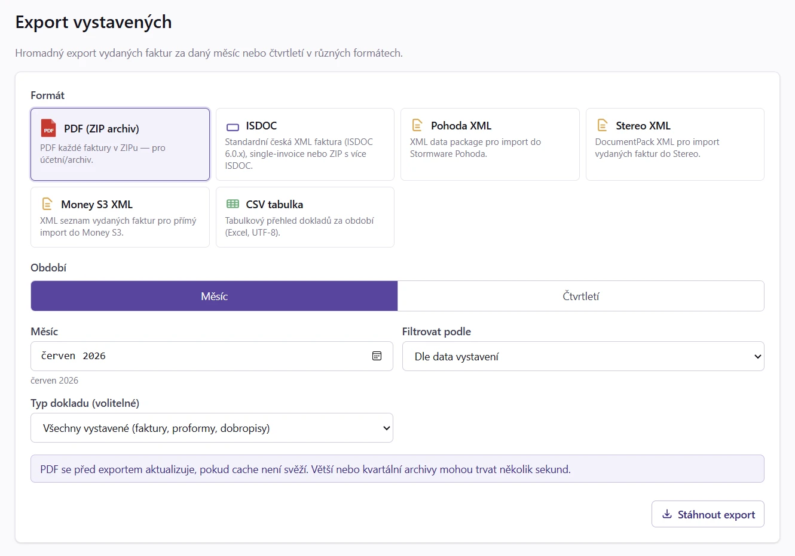

# 20. Exporty (PDF ZIP, ISDOC, Pohoda, Stereo, Money S3, CSV)

> Návod, jak předat vystavené faktury účetní nebo do účetního programu:
> který formát zvolit, na co kliknout a jak soubor naimportovat u příjemce.
> Pro každého, kdo vystavuje faktury a posílá je k zaúčtování nebo do archivu.

## 20.1 Kdy to potřebujete

- Účetní chce vystavené faktury za uplynulý měsíc nebo čtvrtletí.
- Účetní pracuje v Pohodě, Stereu nebo Money S3 a nechce doklady opisovat.
- Potřebujete archiv PDF faktur pro revizora, spis nebo e-mail.
- Potřebujete tabulku vystavených dokladů za období do Excelu.
- Faktury v cizí měně musí do účetního programu přijít i s kurzem.

MyÚčto nabízí šest formátů hromadného exportu **vystavených faktur**.
Export **přijatých faktur** je popsaný zvlášť v kapitole
[Export přijatých faktur](24_Export_prijatych.md).

<!-- cols: 22 36 42 -->
| Formát | Pro koho | Co obsahuje |
|---|---|---|
| **PDF (ZIP archiv)** | Archivace nebo tisk | Jednotlivá PDF v ZIP, nebo všechny doklady sloučené do jednoho PDF |
| **ISDOC** | Český národní standard pro výměnu faktur, funguje v různých programech | XML soubor pro každou fakturu, balené v ZIP |
| **Pohoda XML** | Stormware Pohoda, import bez ručního opisu | Sloučený dataPack XML soubor |
| **Stereo XML** | Stereo for Windows, import vydaných faktur | Sloučený DocumentPack XML soubor |
| **Money S3 XML** | Seyfor Money S3, import vydaných faktur | Sloučený XML soubor s agendou Faktury vydané |
| **CSV tabulka** | Excel, datová kontrola a další zpracování | Jeden UTF-8 tabulkový soubor za období |

> [!TIP]
> Chcete-li účetní za měsíc předat vše najednou v jednom ZIP (vystavené
> i přijaté faktury, výpisy z účtu a knihu DPH, roztříděné do složek a daňově
> správně zařazené do období), použijte **Hromadný export** v sekci Daně, viz
> [Hromadný export (ZIP)](48_Hromadny_export.md). Exporty v této kapitole jsou
> cílené na jeden formát a jeden typ dokladu.

## 20.2 Než začnete

1. **Doklady jsou vystavené.** Export bere vystavené faktury, zálohové faktury
   a dobropisy za zvolené období.
2. **Víte, co používá příjemce.** Pokud nevíte, zvolte **ISDOC**, otevřený
   standard, který čtou různé účetní programy. Pohoda XML nebo Stereo XML
   volte jen tehdy, když víte, že příjemce daný program používá.
3. **Pro Pohodu domluvte kódy s účetní.** Středisko, činnost, zakázku a předkontaci
   vyplníte v `Firma → Nastavení`, záložka **Daně a účetnictví**, sekce
   **Pohoda XML export (volitelné)**. Bez nich import není čistý, účetní
   musí předkontaci přepsat ručně u každého dokladu.
4. **Faktury v cizí měně mají kurz.** Kurz ČNB se zafixuje na faktuře při
   vystavení (viz [§ 15.9.4](15_Faktura_editor.md#1594-sumar-vpravo)).

## 20.3 Krok za krokem: export vystavených faktur za období



1. Otevřete `Prodej → Export` (stránka **Export vydaných faktur**).
2. V poli **Formát** zvolte požadovaný formát.
3. V poli **Období** zvolte **Měsíc** nebo **Čtvrtletí** a nastavte rok a měsíc,
   případně čtvrtletí (1. až 4.).
4. V poli **Filtrovat podle** zvolte **Dle data vystavení** nebo **Dle DUZP**.
5. V poli **Typ dokladu (volitelné)** nechte všechny vystavené doklady, nebo
   zvolte **Pouze faktury**, **Pouze zálohové** či **Pouze dobropisy**.
6. Klikněte na **Stáhnout export**. Soubor se stáhne do prohlížeče.

**Jak poznáte, že je hotovo:** Prohlížeč stáhne soubor se zvoleným formátem
a obdobím v názvu. Větší nebo čtvrtletní archivy mohou chvíli trvat, tlačítko
mezitím ukazuje **Připravuji export…**.

> [!TIP]
> Při formátu ISDOC jsou soubory podepsané, pokud máte zapnutý podpis výstupu
> **Vydaná faktura**, viz [99.11.1 Podpis ISDOC](99_Elektronicke_podpisy.md#999-krok-za-krokem-podpis-isdoc).

> [!TIP]
> Měsíční režim použijte pro běžné předání dokladů za jeden měsíc,
> čtvrtletní hlavně pro účetní předání za kvartál. Exportujte 1. den
> následujícího měsíce za měsíc, který skončil.

## 20.4 Krok za krokem: PDF ZIP nebo jedno sloučené PDF

1. Otevřete `Prodej → Export` a jako formát zvolte **PDF (ZIP archiv)**.
2. Nastavte období, filtr a typ dokladu jako v [§ 20.3](#203-krok-za-krokem-export-vystavenych-faktur-za-obdobi).
3. Chcete-li místo ZIP jeden vícestránkový soubor, zaškrtněte **Spojit faktury
   do jednoho PDF**. Obsahuje jen faktury, bez příloh a výkazů práce.
4. Chcete-li sloučený soubor podepsat, zaškrtněte **Elektronicky podepsat
   výsledné PDF**. Použije se aktivní podpisový profil nastavený pro PDF faktur.
   Bez použitelného profilu export oznámí chybu.
5. Klikněte na **Stáhnout export**.

**Jak poznáte, že je hotovo:** Stáhne se ZIP s PDF jednotlivých faktur, nebo
jedno sloučené PDF.

Sloučené PDF lze vytvořit i nad vybranými doklady: v seznamu faktur je označte
a použijte hromadnou akci **PDF export (N)**. Výběr je omezen na 100 vystavených
faktur a dobropisů. Přílohy a samostatné ISDOC soubory nejsou součástí
sloučeného PDF.

## 20.5 Krok za krokem: import exportu do účetního programu

Postup se liší podle programu příjemce.

**Pohoda (XML):**

1. V Pohodě zvolte **Soubor → Datová komunikace → XML import / export**.
2. Zvolte **Import** a vyberte stažený soubor.
3. Pohoda ukáže náhled (počet faktur, částky).
4. Klikněte na **Importovat**. Faktury se založí.

**Ostatní programy (ISDOC):**

<!-- cols: 30 70 -->
| Software | Kde naimportovat |
|---|---|
| **Money S3** | Karty → Faktury vydané → Načíst z ISDOC |
| **Pohoda** | Externí komunikace → Import dat → ISDOC |
| **Helios Orange** | Faktury vydané → Akce → Import ISDOC |
| **Stereo** | Účetní → Import → ISDOC |

**Stereo (XML):** v programu zvolte **Import faktury (XML)** a vyberte stažený
soubor.

**Money S3 (XML):** před prvním ostrým převodem naimportujte zkušební období do
testovací agendy a porovnejte součty, měny, sazby a číselné řady.

**Jak poznáte, že je hotovo:** Počet a součet importovaných dokladů v účetním
programu souhlasí s exportem z MyÚčta.

> [!WARNING]
> XML formáty nesou data, ne vzhled faktury. Pro daňovou archivaci stáhněte
> vždy také **PDF (ZIP archiv)**.

## 20.6 Když něco nejde

<!-- cols: 36 30 34 -->
| Co vidíte | Proč | Co udělat |
|---|---|---|
| Export Pohody doklad odmítne a uvede režim OSS | Pohoda neumí zahraniční sazbu ani příznak OSS | Řádky v OSS vykažte přes `Daně → OSS přiznání` a doklady z exportu do Pohody vyřaďte (viz [§ 20.7.3.7](#20737-doklad-v-rezimu-oss-se-do-pohody-neexportuje)) |
| Export Money S3 skončí validační chybou u dokladu | Doklad má tři různé nenulové sazby DPH, Money S3 umí jen dvě plus nulovou | Doklad upravte nebo ho do Money S3 zadejte ručně |
| Export Sterea skončí validační chybou | Položky dokladu vycházejí na různé typy DPH a faktura nemá klasifikaci DPH v hlavičce | Doplňte klasifikaci DPH na hlavičce faktury, nebo doklad upravte, aby měly všechny položky stejný typ |
| Podepsané PDF nelze stáhnout | Není aktivní podpisový profil pro PDF faktur | Nastavte profil, nebo volbu **Elektronicky podepsat výsledné PDF** vypněte |
| Stažení selhalo | Chyba při přípravě souboru | Opakujte export, případně zúžte období |
| Pohoda po importu u každého dokladu přepisuje předkontaci | Kód předkontace není vyplněný | Vyplňte jej v sekci **Pohoda XML export (volitelné)** a export opakujte |
| V účetním programu je u cizoměnové faktury kurz 1 | Faktura nemá zafixovaný kurz (ČNB byla při vystavení nedostupná) | Kurz v účetním programu doplňte ručně |
| Pohoda přepsala kurz z faktury | Pohoda má vlastní kurzovní lístek | Přepis kurzu při importu v Pohodě vypněte |

## 20.7 Podrobnosti a pravidla

### 20.7.1 PDF / PDF ZIP

ZIP obsahuje jednotlivá PDF pojmenovaná podle typu dokladu a variabilního
symbolu:

```
myucto-2026-Q2.zip
├── Faktura-2604001.pdf
├── Faktura-2604002.pdf
├── Faktura-2605001.pdf
├── Faktura-2606001.pdf
├── Proforma-92604001.pdf
├── Dobropis-72604001.pdf
└── ...
```

Název ZIPu obsahuje zvolené období (`2026-04` nebo `2026-Q2`). Použití:
roční archivace pro účetní, založení do spisu, odeslání e-mailem revizorovi.

U sloučeného PDF se podepisuje výsledný sloučený soubor, ne jednotlivé faktury.

Není-li uložené PDF faktury aktuální, aplikace ho před exportem vygeneruje znovu.

### 20.7.2 ISDOC 6.0.2

ISDOC je český národní standard pro elektronickou výměnu faktur, definovaný na
[ISDOC.cz](http://www.isdoc.cz/). Používá ho většina českých účetních programů
(Money S3, Helios, Stereo, ABRA).

#### 20.7.2.1 Struktura souboru

Každá faktura má vlastní `.isdoc` XML soubor podle schématu ISDOC 6.0.2. ZIP
obsahuje:

```
isdoc-2026-04.zip
├── 2604001.isdoc       (XML)
├── 2604002.isdoc
├── ...
└── manifest.xml         (volitelný, seznam dokumentů)
```

Máte-li zapnutý elektronický podpis výstupu **Vydaná faktura**, je každý
`.isdoc` v exportu podepsaný vaším certifikátem (XML podpis podle standardu
ISDOC). POHODA a další programy podpis při importu ověřují. Nastavení a
podrobnosti najdete v [99.11.1 Podpis ISDOC](99_Elektronicke_podpisy.md#999-krok-za-krokem-podpis-isdoc).

#### 20.7.2.2 DocumentType

| Typ v MyÚčtu | ISDOC DocumentType |
|---|---|
| Faktura | `1` (běžná faktura) |
| Zálohová (proforma) | `2` (zálohová) |
| Dobropis | `5` (opravný daňový doklad) |
| Storno | neexportuje se (interní) |

#### 20.7.2.3 PaymentMeansCode

| Způsob platby | Kód |
|---|---|
| Bankovní převod (CZ) | `42` |
| SEPA převod (EU) | `31` |
| Hotovost | `10` |

#### 20.7.2.4 Číslo zakázky a smlouvy

Má-li faktura přiřazenou zakázku s vyplněným číslem zakázky nebo smlouvy,
exportují se do ISDOC jako kolekce (XSD 6.0.2):

```xml
<OrderReferences>
  <OrderReference id="O1">
    <SalesOrderID>2026-042</SalesOrderID>      <!-- číslo zakázky -->
  </OrderReference>
</OrderReferences>
<ContractReferences>
  <ContractReference id="C1">
    <ID>SMLOUVA-001</ID>                       <!-- číslo smlouvy -->
    <IssueDate>2026-05-14</IssueDate>          <!-- IssueDate faktury -->
  </ContractReference>
</ContractReferences>
```

Některé účetní programy tyto reference při importu zachovávají (Money S3,
Helios). MyÚčto je při [zpětném importu](21_Importy.md) také čte: zakázka se
podle čísla zakázky najde, nebo se automaticky vytvoří.

#### 20.7.2.5 ISDOC v příloze PDF

PDF faktury je konformní **PDF/A-3b** (ISO 19005-3, viz
[§ 16.10.6](16_Faktura_PDF.md#16106-pdfa-3b-archivni-format)). Při generování se do
něj ISDOC XML přibalí jako příloha (PDF/A-3 associated file). Účetní programy si
data extrahují přímo z PDF, stačí přeposlat jediný soubor. Pod variabilním
symbolem se v PDF zobrazí vizuální štítek `ISDOC`.

- Vkládá se jen u **CZK faktur s přiděleným variabilním symbolem**.
- Vypnete to v `Firma → Nastavení`, záložka **Fakturace**, volbou
  **Přiložit ISDOC XML do PDF faktur** (ve výchozím stavu zapnuto).
- Adobe Reader a Foxit zobrazí přílohu v panelu příloh (ikona sponky).

### 20.7.3 Pohoda XML (Stormware data package)

Pohoda XML je proprietární formát firmy Stormware pro přímý import faktur do
účetního systému Pohoda. Na rozdíl od ISDOC je to **jeden velký XML soubor**
(`dataPack`), ne soubor na fakturu.

#### 20.7.3.1 Struktura

```xml
<?xml version="1.0" encoding="UTF-8"?>
<dat:dataPack xmlns:dat="..." xmlns:inv="..." xmlns:typ="..." version="2.0">
  <dat:dataPackItem id="2604001">
    <inv:invoice version="2.0">
      <inv:invoiceHeader>
        <inv:invoiceType>issuedInvoice</inv:invoiceType>
        <inv:number>
          <typ:numberRequested>2604001</typ:numberRequested>
        </inv:number>
        ...
```

#### 20.7.3.2 Nastavení kódů pro firmu

Kódy z číselníků Pohody vyplníte v `Firma → Nastavení`, záložka **Daně
a účetnictví**, sekce **Pohoda XML export (volitelné)**:

| Pole | XML element | Význam | Příklad |
|---|---|---|---|
| **Účet (kód)** | `<inv:account>` | Bankovní účet nebo pokladna z číselníku Pohody | `KB` |
| **Středisko** | `<inv:centre>` | Kód střediska | `01` |
| **Činnost** | `<inv:activity>` | Kód činnosti | `100` |
| **Zakázka** | `<inv:contract>` | Kód zakázky | `ZAK1` |
| **Předkontace** | `<inv:accounting>` | Zkratka předkontace | `300` |

Všechna pole jsou volitelná a platí pro **celý export** (všechny doklady
v balíčku). Nevyplněné pole se do XML nepošle a Pohoda si po importu dosadí
**vlastní výchozí hodnotu z uživatelského nastavení cílové instalace**. U
předkontace to znamená, že se pronájem i služby zaúčtují jako to, co má
instalace nastavené jako výchozí, takže kdo předkontaci nevyplní, přepisuje ji
po importu ručně u každého dokladu.

#### 20.7.3.3 Číslo zakázky

Má-li faktura zakázku s vyplněným číslem, exportuje se do hlavičky:

```xml
<inv:numberOrder>2026-042</inv:numberOrder>
```

Pohoda toto pole standardně načítá jako "Číslo zakázky" nebo "Číslo
objednávky". Pro kód zakázky z nastavení firmy (viz
[§ 20.7.3.2](#20732-nastaveni-kodu-pro-firmu)) platí samostatný blok
`<inv:contract>`, který se zapisuje pro celý export, kdežto `<inv:numberOrder>`
pro každou fakturu zvlášť.

#### 20.7.3.4 Klasifikace DPH

MyÚčto mapuje sazby DPH na kódy členění Pohody (`<inv:classificationVAT>`):

| Sazba DPH | Odběratel s českým DIČ | Odběratel bez českého DIČ |
|---|---|---|
| 21 % | `UD` (tuzemské plnění) | `UDA5` (tuzemské plnění bez ohledu na limit) |
| 12 % | `UD` (tuzemské plnění) | `UDA5_12` (snížená, bez ohledu na limit) |
| 10 % | bez kódu (členění 3. sazby je specifické pro instalaci) | dtto |
| 0 % osvobozeno | `UNX` (nezahrnovat do přiznání) | dtto |
| přenesená daňová povinnost | `PNAR` | dtto |

> [!WARNING]
> `UDA5` znamená v Pohodě "tuzemské plnění **bez ohledu na limit 10 000 Kč**"
> a sekci **A.5** kontrolního hlášení má předvyplněnou natvrdo. Kdyby se
> posílal i plátcům, skončil by každý doklad nad limit v A.5 místo A.4
> a Pohoda by na to neupozornila, protože u `UDA5` žádnou chybu nevidí.
> Proto se plátci posílá `UD` a sekci A.4 nebo A.5 si Pohoda určí sama podle
> výše dokladu. Rozhoduje DIČ protistrany ze snapshotu dokladu, ne dnešní stav
> karty odběratele.

#### 20.7.3.5 Import do Pohody

Postup viz [§ 20.5](#205-krok-za-krokem-import-exportu-do-ucetniho-programu).

#### 20.7.3.6 Co Pohoda XML neobsahuje

- PDF přílohu faktury (Pohoda generuje vlastní PDF z dat),
- výkaz víceprací (přílohy se neexportují),
- QR platbu (Pohoda generuje vlastní).

Potřebuje-li příjemce přesně vaši PDF verzi, použijte paralelně **PDF (ZIP
archiv)**.

#### 20.7.3.7 Doklad v režimu OSS se do Pohody neexportuje

Pohoda vede sazbu DPH jako výčet českých sazeb (základní, snížená, nulová),
zahraniční sazbu ani příznak [OSS](45_OSS.md) v datovém formátu nemá kam zapsat.
Export takový doklad proto **odmítne a řekne to**, místo aby polskou sazbu 23 %
tiše vydával za českou 21 %.

Řádky v režimu OSS vykažte přes `Daně → OSS přiznání` a z exportu do Pohody
doklady s nimi vyřaďte.

### 20.7.4 Stereo XML

Stereo XML export vytváří jeden soubor `DocumentPack` s vydanými fakturami za
zvolené období. Je určený pro import do **Kastner Stereo** přes volbu
**Import faktury (XML)**. Výstup používá:

- `SoftwareVendor` a `SoftwareProduct` = `myucto.cz`,
- `Payment/CurrencyCode` a `Rows/Row/CurrencyCode` s mapováním, které Stereo
  vyžaduje: `CZK` na `Kč`, ostatní měny zůstávají jako ISO kód (`EUR`, ...),
- `Payment/ConstantSymbol` jako prázdný element, pokud faktura konstantní symbol
  neobsahuje.

DPH se skládá z řádkových součtů uložených na faktuře. `LineNet` je základ
řádku bez DPH, `LineVAT` je DPH řádku a `LineNet + LineVAT` odpovídá částce
řádku s DPH. Souhrny `TaxableTotal`, `VatTotal` a `NetTotal` jsou součty těchto
hodnot přes všechny položky.

Export zapisuje pevné mapování klasifikací DPH z MyÚčta na Stereo `TypeOfVAT`.
Stereo vyžaduje jeden typ DPH pro celý doklad, proto se stejná hodnota zapisuje
do `VatInfo/TypeOfVAT` i do všech řádků dokladu. Má-li faktura vyplněnou
klasifikaci DPH v hlavičce, použije se jako autoritativní typ pro celý doklad
ve Stereu. Jinak musí všechny položky vycházet na stejný typ Stereo. Smíšené
typy bez klasifikace v hlavičce export zastaví s validační chybou.

| Klasifikace DPH v MyÚčtu | Stereo `TypeOfVAT` |
| --- | --- |
| `1`, `2` | `U` |
| `3` | `UO` |
| `20` | `IDZ` |
| `22` | `UVSP` |
| `25s` | `URP` |
| `26` | `UV` |

Volitelné účetní klasifikace Stereo jako `TypeOfOperation`, `Stredisko`,
`Vykon` nebo `Zakazka` se do exportu nezapisují. `TypeOfOperation` není podle
XSD povinné a u tuzemského režimu přenesení daňové povinnosti může import
Sterea odmítnout, pokud hodnota neodpovídá lokálnímu číselníku.

### 20.7.5 Money S3 XML

Money S3 export vytváří jeden XML soubor s agendou **Faktury vydané**
(`SeznamFaktVyd/FaktVyd`). Přenáší hlavičky dokladů, odběratele, položky,
platební údaje, měnu, zálohy a souhrny DPH. Dobropisy a zálohové faktury mají
vlastní řadu a příznaky odpovídající formátu Money S3.

Souhrny DPH vznikají z uložených řádkových částek a sazeb na konkrétním
dokladu. Export proto zachová i historické sazby, například 15/21 %, 14/20 %
nebo 5/22 %, a nepřepočítává staré faktury podle aktuálního číselníku. Formát
Money S3 však umí na jednom dokladu jen dvě různé nenulové sazby plus sazbu
0 %. Doklad se třemi nenulovými sazbami se odmítne s validační chybou, aby se
žádná částka nezařadila do nesprávného oddílu.

Formát nemá veřejně dostupné oficiální XSD. Před prvním ostrým převodem proto
naimportujte zkušební období do testovací agendy Money S3 a porovnejte součty,
měny, sazby a číselné řady. Pro archivaci současně stáhněte PDF ZIP.

### 20.7.6 Faktury v cizí měně (EUR, USD, ...): kurz CZK v exportu

U faktur v jiné měně než CZK MyÚčto automaticky přidává do exportů **kurz ČNB**
zafixovaný na faktuře, viz
[§ 15.9.4](15_Faktura_editor.md#1594-sumar-vpravo).

#### 20.7.6.1 ISDOC: LocalCurrencyCode, CurrencyCode, CurrRate

ISDOC export pro fakturu v EUR obsahuje:

```xml
<LocalCurrencyCode>CZK</LocalCurrencyCode>     <!-- účetní měna dodavatele -->
<CurrencyCode>EUR</CurrencyCode>               <!-- fakturační měna -->
<CurrRate>24.360000</CurrRate>                 <!-- CZK / 1 EUR -->
<RefCurrRate>1</RefCurrRate>
```

Všechny `<…Amount currencyID="EUR">…</…Amount>` zůstávají v EUR. Účetní program
si CZK ekvivalent dopočítá z `CurrRate`. Nemá-li faktura zafixovaný kurz,
například kvůli nedostupnosti ČNB při jeho načítání, export použije
`CurrRate=1` a kurz je třeba v účetním programu doplnit ručně.

#### 20.7.6.2 Pohoda XML: inv:foreignCurrency a inv:homeCurrency

Pohoda XML pro fakturu v EUR obsahuje **oba** bloky v `<inv:invoiceSummary>`:

```xml
<inv:homeCurrency>                    <!-- CZK z přepočtu kurzem -->
  <typ:priceHigh>1218.00</typ:priceHigh>
  <typ:priceHighVAT>255.78</typ:priceHighVAT>
  <typ:priceSum>4055.94</typ:priceSum>
</inv:homeCurrency>
<inv:foreignCurrency>                 <!-- originál v EUR + kurz -->
  <typ:currency><typ:ids>EUR</typ:ids></typ:currency>
  <typ:rate>24.360000</typ:rate>
  <typ:amount>1</typ:amount>
  <typ:priceHigh>50.00</typ:priceHigh>
  <typ:priceHighVAT>10.50</typ:priceHighVAT>
  <typ:priceSum>166.50</typ:priceSum>
</inv:foreignCurrency>
```

Položky (`<inv:invoiceItem>`) u faktury mimo CZK používají
`<inv:foreignCurrency>` místo `<inv:homeCurrency>`. Pohoda po importu položkové
CZK hodnoty dopočítá z globálního kurzu.

#### 20.7.6.3 Tipy k cizí měně

- **Domluvte kurz s účetní.** Některé účetní programy (zejména Pohoda) mají
  vlastní kurzovní lístek a mohou při importu kurz přepsat. Chcete-li mít
  v Pohodě přesný kurz z faktury, nechte přepis vypnutý.
- **Chybějící kurz se doplní.** Exportujete-li fakturu bez kurzu, MyÚčto ho
  automaticky doplní (cache, ČNB, poslední známý kurz). Je-li ČNB nedostupná
  a žádný kurz není, dostanete v ISDOC `CurrRate=1` s varováním.

### 20.7.7 Filtrování

| Volba | Použití |
|---|---|
| **Typ dokladu = Pouze faktury** | Klasický měsíční export pro účetní |
| **Typ dokladu = Pouze dobropisy** | Pro samostatnou agendu oprav |
| **Typ dokladu = Pouze zálohové** | Pro samostatný přehled záloh |
| **Filtrovat podle = Dle DUZP** | Doklady se řadí podle data zdanitelného plnění, u prázdné hodnoty se použije datum vystavení |

### 20.7.8 Doporučení

- **Měsíční rytmus:** exportujte 1. den následujícího měsíce za měsíc, který
  skončil.
- **Vše v jednom balíčku:** chce-li účetní za měsíc kompletní podklad
  (vystavené i přijaté faktury, výpisy a knihu DPH najednou), použijte raději
  [Hromadný export (ZIP)](48_Hromadny_export.md) v sekci Daně. Zařadí doklady do
  období daňově správně a roztřídí je do pojmenovaných složek.
- **Stáhněte i PDF ZIP jako zálohu:** XML formáty obsahují data, ne grafiku PDF.
  Pro daňovou archivaci je originální PDF nutné.
- **Před prvním exportem do Pohody** zjistěte od účetní, jaké chce kódy
  střediska, činnosti a předkontace.

### 20.7.9 Přímý přenos do Fakturoidu

Vedle souborových formátů umí export přenést faktury přímo do Fakturoid.cz přes
API token nastavený pro dodavatele. Na stránce `Prodej → Export` ho spustíte volbou
**Fakturoid** v poli **Formát**. Nevzniká při něm žádný soubor ke stažení.
Přihlašovací údaje k Fakturoidu se zadávají v `Firma → Externí integrace`.

## 20.8 Související kapitoly

- [Export přijatých faktur](24_Export_prijatych.md)
- [Hromadný export (ZIP)](48_Hromadny_export.md)
- [Importy](21_Importy.md)
- [Faktura jako PDF](16_Faktura_PDF.md)
- [OSS](45_OSS.md)
