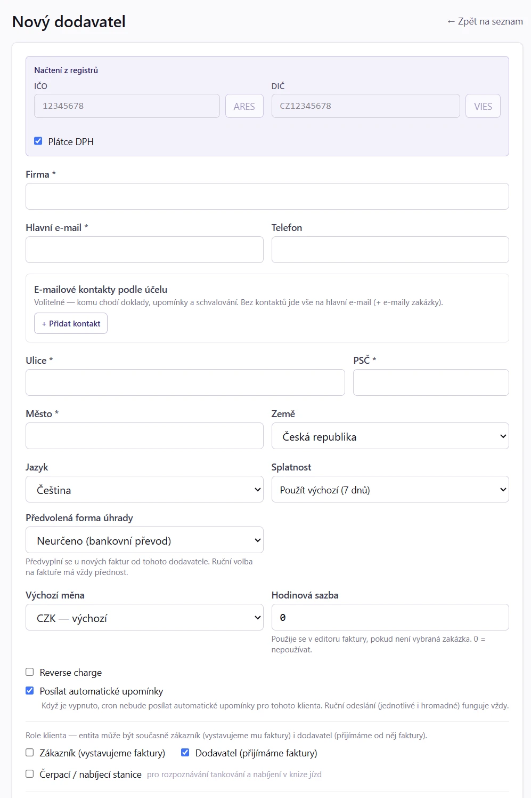
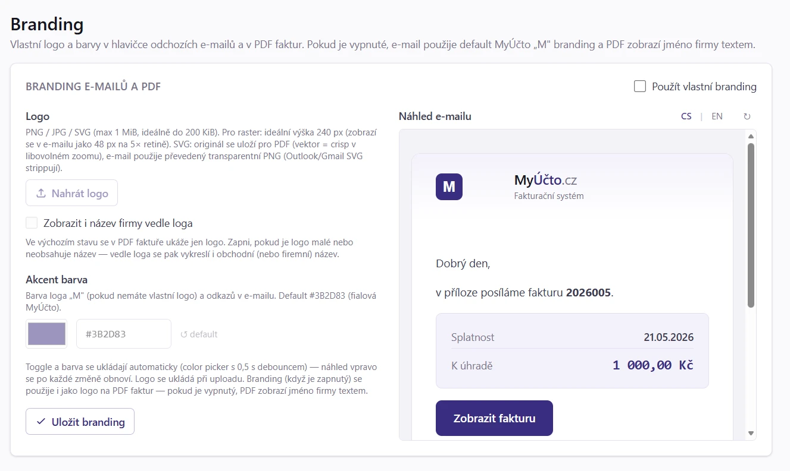

# 95. Více dodavatelů z jedné instalace

> Návod, jak z jedné instalace MyÚčta vést libovolný počet firem (dodavatelů, IČO): přepínat mezi nimi,
> zakládat je, nastavit každé vlastní číslování, branding a režim účtování a sledovat termíny napříč všemi.
> Pro administrátory, účetní kanceláře a skupiny firem.

## 95.1 Kdy to potřebujete

Typické scénáře:

- **OSVČ + s.r.o.**: Jan Novák, OSVČ + Novák s.r.o. = 2 dodavatelé.
- **Holding**: mateřská firma + 3 dceřiné = 4 dodavatelé.
- **Účetní kancelář**: fakturuje za sebe a spravuje fakturaci pro 20 klientů.
- **Sdílený workspace pro tým**: každý kolega má vlastní firmu, ale všichni vidí svého.

Kapitolu otevřete, když:

- potřebujete přidat další firmu,
- chcete přepnout z jedné firmy na druhou,
- jedné firmě chcete nastavit vlastní číslování faktur, logo, e-mailovou kopii nebo režim účetnictví,
- potřebujete firmu smazat,
- jako účetní kancelář chcete vidět termíny a resty napříč všemi firmami najednou.

Data jsou **plně izolovaná**: klienti jednoho dodavatele nejsou viditelní pro druhého, faktury mají vlastní řadu
variabilních symbolů, číselné cykly, e-mailové šablony a další nastavení.

## 95.2 Než začnete

1. **Oprávnění.** Novou firmu může založit superadmin nebo uživatel s pevnou rolí **Admin Plus**. Běžná role **Admin** pracuje jen s firmami, které jí přidělí superadmin. Smazat firmu smí superadmin. Údaje v detailu firmy smí měnit admin; jedinou výjimkou je zapnutí skladu, které smí přepnout i role **účetní**.
2. **Přístup k firmám.** Ke každému uživateli lze v `Systém → Uživatelé` v editaci účtu v části **Přístup k firmám** zaškrtnout, ke kterým firmám smí. Bez zaškrtnutí vidí všechny.
3. **Pro přehled firem** potřebujete přístup k více než jedné firmě. Role klient k přehledu nemá přístup vůbec.
4. **ARES a registr plátců DPH** pro automatické předvyplnění údajů nové firmy (volitelně).

## 95.3 Krok za krokem: přepnout firmu

Máte-li přístup k více firmám, uprostřed spodní lišty se zobrazí **přepínač dodavatele**.

1. Klikněte na přepínač a vyberte firmu.
2. Aplikace se znovu načte na úvodní stránku. Byli-li jste na detailu nebo editoru nějaké entity, přesměruje vás na seznam (entita patří jinému dodavateli, neviděli byste ji).

Je-li dodavatel jediný, přepínač se nezobrazuje.

**Jak poznáte, že je hotovo:** V přepínači je vidět zvolená firma a všechny seznamy ukazují její data.

Zvolená firma se uloží jako vaše **výchozí firma**. Otevře se i v jiném prohlížeči nebo na jiném zařízení.

> [!TIP]
> Když přijdete do aplikace bez vybrané firmy (poprvé, v novém prohlížeči nebo na jiném zařízení), otevře se
> vaše výchozí firma. Dokud žádnou nemáte, aplikace ji jednou vybere sama: ze firem, ke kterým máte přístup,
> tu s nejvíc doklady (vydané faktury a přijaté doklady), při shodě tu dříve založenou. Výběr si uloží a dál ho
> nepřepočítává. Změníte ho kdykoli přepínačem firem.

## 95.4 Krok za krokem: založit novou firmu

1. Otevřete `Systém → Firmy`.
2. Vpravo nahoře klikněte na **Nový dodavatel**.

3. Do pole **IČO - načtení z ARES** zadejte osmimístné IČO a klikněte na **Načíst z ARES**. Zbytek se předvyplní.

4. Zkontrolujte nebo doplňte údaje:
   - **Název firmy**,
   - **DIČ** (volitelné, OSVČ neplátce nechte prázdné). S DIČ se po načtení z ARES rovnou dotáhne registr plátců DPH, potvrdí plátcovství a předvyplní zveřejněný účet (tlačítko **Načíst účet z registru DPH**),
   - **Typ poplatníka**: *Podle ARES (automaticky)* (výchozí), fyzická osoba, nebo právnická osoba,
   - **Plátce DPH** a zdaňovací období. Nový plátce je ze zákona měsíční (§ 99 ZDPH); čtvrtletní zvolte, jen pokud splňujete § 99a,
   - **Ulice + č.p.**, **Město**, **PSČ** a **E-mail**,
   - volitelně první bankovní účet (číslo a kód banky; automaticky se založí v měně CZK).
5. Klikněte na **Vytvořit**.

**Jak poznáte, že je hotovo:** Firma je v tabulce a okamžitě i v přepínači. Admin Plus k nové firmě automaticky
získá práva Admin a může na ni rovnou přepnout (**Přepnout**).

Tabulka firem ukazuje **Název firmy**, **IČO / DIČ**, **Klientů** a **Faktur**. Zadání bankovního spojení můžete
dokončit v Nastavení po přepnutí na novou firmu.

Nová firma dostane stejné výchozí nastavení jako firma založená v prvotním průvodci:

- **Právnická osoba** vzniká v **podvojném účetnictví** se směrnou účtovou osnovou, otevřeným účetním obdobím pro aktuální rok a zapnutým automatickým účtováním vydaných i přijatých faktur (preset automatiky *plná automatika*).
- **Fyzická osoba** vzniká v **daňové evidenci**.
- Když typ poplatníka nevyberete, rozhodne právní forma z ARES.
- Plátci se nastaví zdaňovací období, bez výslovné volby měsíční.
- Chybějící údaje (čísla domu, CZ-NACE, spisová značka, kód finančního úřadu, zveřejněný bankovní účet) se doplní z veřejných registrů. Účet evidovaný u jiné firmy se nedoplní.

## 95.5 Krok za krokem: základní údaje a režim účtování

Nastavení aktuálně zvolené firmy je v `Firma → Nastavení`, rozdělené do záložek **Údaje firmy**, **Fakturace**
a **Daně a účetnictví**. Změny ze všech záložek se ukládají společným tlačítkem dole pod obsahem.

1. Přepněte na požadovanou firmu ([§ 95.3](#953-krok-za-krokem-prepnout-firmu)).
2. Otevřete `Firma → Nastavení`.
3. Na záložce **Údaje firmy** upravte IČO, název, adresu a kontakt. Změna se projeví na nových fakturách; vystavené faktury mají vlastní snapshot.
4. Na záložce **Daně a účetnictví** zvolte **Režim účetnictví**:
   - **Daňová evidence**: jednoduchá evidence příjmů a výdajů, výchozí pro nově založeného dodavatele (u fyzické osoby),
   - **Podvojné účetnictví**: účetní deník, hlavní kniha, výkazy, majetek.
5. Klikněte na tlačítko pro uložení dole.

**Jak poznáte, že je hotovo:** Menu po přepnutí odpovídá zvolenému režimu (viz [§ 95.13.5](#95135-rezim-uctovani-per-firma)).

> [!WARNING]
> Firma s historií se na podvojné účetnictví přepíná výhradně přes **průvodce aktivací**. Běžné uložení nastavení
> vás do něj automaticky přesměruje; režim se zapne až po úspěšné kontrole a doúčtování, takže účetní sestavy
> mezitím nevypadají jako úplné. Podrobný postup viz [Aktivace účetnictví](68_Aktivace_ucetnictvi.md) a
> [Daňová evidence](74_Danova_evidence.md). U nové firmy bez historie se režim přepne přímo a výchozí účtový
> rozvrh se založí automaticky.

**Sklad** je samostatný přepínač v detailu firmy, nezávislý na volbě daňová evidence / podvojné účetnictví
(viz [§ 95.13.5](#95135-rezim-uctovani-per-firma)).

## 95.6 Krok za krokem: číslování faktur

V nastavení firmy najdete sekci **Číslování faktur** se šablonami pro každý typ dokladu a volbou cyklu, kdy se
pořadové číslo resetuje.

1. Otevřete `Firma → Nastavení`, záložku **Fakturace** a sekci **Číslování faktur**.
2. Vyplňte šablonu pro fakturu, zálohovou fakturu a dobropis. Pod každým polem je živý náhled příštího čísla (například „Náhled: `JD2026-001`").
3. V poli **Reset číselné řady** zvolte **Roční (1. ledna)**, **Měsíční (1. dne v měsíci)**, nebo **Bez resetu (souvislá řada)**.
4. Uložte nastavení.
5. Navazujete-li na rozjetou číselnou řadu (typicky při přechodu z jiného programu), zadejte do pole **Příští číslo** číslo, kterým má řada pokračovat, a klikněte na **Nastavit počítadlo**. Ukáže se náhled výsledného čísla. Šablonu uložte před nastavením počítadla.

**Jak poznáte, že je hotovo:** V editoru nové faktury je v placeholderu předpokládané číslo podle šablony.

> [!WARNING]
> Pole **Příští číslo** se ukládá samostatně, mimo tlačítko pro uložení nastavení, protože zapisuje do počítadla
> řady, ne do nastavení firmy. Perioda resetu musí sedět se šablonou: u masky bez `{MM}` a měsíčního resetu
> spadne počítadlo prvního dne dalšího měsíce zpátky na začátek a čísla by kolidovala s už vydanými.

Podrobnosti o šablonách, placeholderech, prioritě úrovní a mezerách v číslování jsou v [§ 95.13.3](#95133-ciselne-rady-faktur).

## 95.7 Krok za krokem: branding e-mailů a PDF

V e-mailech klientům se jako **From** zobrazí název dodavatele (místo technické adresy) a jako **Reply-To** e-mail
dodavatele, takže odpovědi klientů jdou rovnou na firemní poštu. Vlastní logo a barvu nastavíte takto:

1. Otevřete `Firma → Branding` (položka je v menu hned za AI nastavením).
2. Zapněte **Použít vlastní branding** (výchozí je vypnuto = MyÚčto branding).
3. Nahrajte **Logo** (PNG, JPG nebo SVG, nejvýše 1 MiB, ideálně do 200 KiB). Logo vyměníte tlačítkem **Nahradit logo**, odstraníte tlačítkem **Odebrat**.
4. Zvolte **Akcent barvu** (hex `#RRGGBB`, color picker nebo textové pole; odkaz **↺ default** vrací výchozí).
5. Zkontrolujte živý náhled e-mailu (přepínač jazyka **CS / EN**, tlačítko **↻** pro ruční obnovení).

**Jak poznáte, že je hotovo:** V živém náhledu e-mailu vidíte vaše logo a barvu. Při zapnutém brandingu se použije
logo i barva v e-mailech i v PDF faktur, při vypnutém se e-mail i PDF vrátí k výchozímu MyÚčto brandingu.

> [!TIP]
> Přepínač a barva se ukládají automaticky (color picker s půlsekundovým zpožděním, ať se neukládá při každém
> pixelu pohybu). Logo se ukládá okamžitě po nahrání. Tlačítko **Uložit branding** je jen explicitní jistota.

Podrobnosti o logu, SVG a snapshotu jsou v [§ 95.13.4](#95134-branding-podrobnosti).

## 95.8 Krok za krokem: kopie e-mailů, poděkování za úhradu a vyúčtování k vyplacení

**Kopie odchozích e-mailů dodavateli** (audit vlastní odchozí pošty):

1. Otevřete `Firma → Nastavení`, záložku **Fakturace** a sekci **Kopie odchozích e-mailů na e-mail dodavatele**.
2. Pro každý typ zprávy (**Odeslání dokladu**, **Upomínky**, **Schvalování výkazů**) zvolte: **Dle konfigurace** (výchozí), **Neposílat**, **Kopie (CC)**, nebo **Skrytá kopie (BCC)**.
3. Uložte.

<!-- cols: 28 72 -->
| Typ zprávy | Pokrývá |
|---|---|
| **Odeslání dokladu** | Ruční odeslání faktury, proformy nebo dobropisu a automatické odeslání po schválení výkazu |
| **Upomínky** | Ruční i automatické upomínky po splatnosti (včetně proforma upomínek) |
| **Schvalování výkazů** | Žádost o schválení výkazu i schvalovací upomínky |

<!-- cols: 28 72 -->
| Volba | Co dělá |
|---|---|
| **Dle konfigurace** (výchozí) | Přebírá globální nastavení instalace; efektivní hodnota je vidět přímo ve volbě |
| **Neposílat** | Kopie se neposílá, i kdyby ji konfigurace zapínala |
| **Kopie (CC)** | Dodavatel viditelně v kopii |
| **Skrytá kopie (BCC)** | Klient kopii nevidí (výchozí chování konfigurace u schvalování) |

V modalu odeslání uvidíte kopii jako čip **kopie dodavateli** a můžete ji pro konkrétní e-mail ručně smazat.
Pokud je e-mail dodavatele už mezi příjemci, podruhé se nepřidá. Děkovný e-mail za úhradu kopii dodavateli
záměrně neposílá, o úhradě dodavatel ví.

**Poděkování za úhradu** (ve výchozím stavu vypnuté):

1. V `Firma → Nastavení` na záložce **Fakturace** najděte volby poděkování za úhradu.
2. Zapněte **Posílat poděkování za úhradu** (hlavní vypínač; bez něj se zbylé volby neuplatní).
3. Podle potřeby zapněte **Automaticky při spárování platby z banky**, **Předzaškrtnout při ručním označení jako zaplacené** a **Přiložit PDF faktury (se stavem Uhrazeno)**.
4. Text e-mailu upravíte v šabloně **Poděkování za úhradu** v `Systém → E-maily a certifikáty`, záložka **E-mail šablony**. Má samostatnou variantu pro běžnou fakturu i pro zaplacenou zálohu (proformu).

<!-- cols: 36 64 -->
| Volba | Co dělá |
|---|---|
| **Posílat poděkování za úhradu** | Hlavní vypínač funkce. Bez něj se zbylé volby neuplatní. |
| **Automaticky při spárování platby z banky** | Jakmile se platba spáruje z bankovního výpisu nebo e-mailového avíza a faktura se označí jako zaplacená, pošle se poděkování samo. |
| **Předzaškrtnout při ručním označení jako zaplacené** | V okně ručního označení faktury jako zaplacené bude volba „Odeslat zákazníkovi poděkování“ předem zaškrtnutá (jinak prázdná). |
| **Přiložit PDF faktury (se stavem Uhrazeno)** | K e-mailu se připojí PDF faktury označené jako uhrazené. |

Poděkování jde poslat i ručně v detailu faktury nebo hromadně v seznamu faktur při označování plateb. Je
idempotentní (k jedné faktuře se odešle jen jednou), neposílá se u storna ani u faktury bez e-mailu příjemce
a selhání e-mailu nikdy nezablokuje samotné označení platby. Vše se zapisuje do activity logu.

**Vyúčtování s částkou k vyplacení** (ve výchozím stavu vypnuté):

1. Na záložce **Fakturace** zapněte **Povolit vyúčtování s částkou k vyplacení**. Použijte ji, když vystavujete faktury, u kterých odpočty převáží plnění, například vrácené obaly nebo přeplatek záloh.
2. Uložte.

Se zapnutou volbou smí faktura s aspoň jedním kladným řádkem skončit zápornou částkou (viz
[Vyúčtování s částkou k vyplacení](15_Faktura_editor.md#vyuctovani-s-castkou-k-vyplaceni)), vratky faktur i dobropisů se nabízí
v [Platebních příkazech](26_Platebni_prikazy.md) a doklad placený hotově se zvolenou pokladnou se vyplatí
výdajovým pokladním dokladem; v [Pokladně](32_Pokladna.md) jde výdajový doklad s účelem „Úhrada faktury"
navázat na doklad k vyplacení. Bez volby se nic z toho nenabízí a editor dál vyžaduje kladnou částku k úhradě.

**Jak poznáte, že je hotovo:** Volby jsou uloženy a při dalším odeslání dokladu nebo zaplacení faktury se chovají podle nastavení.

## 95.9 Krok za krokem: Pohoda kódy

Plánujete-li export do Pohody, vyplňte v detailu firmy kódy pro export: **Účet (kód)** (například `KB`),
**Středisko** (`01`), **Činnost** (`100`), **Zakázka** (`ZAK1`) a **Předkontace** (`300`). Viz [20. Exporty](20_Exporty.md).

**Jak poznáte, že je hotovo:** Exportní soubor obsahuje vámi zadané kódy.

## 95.10 Krok za krokem: přehled firem (pro účetní kancelář)

Přepínání dodavatele stačí, dokud spravujete pár firem. Účetní kancelář s osmi a více klienty ale potřebuje
vidět termíny a resty napříč všemi firmami najednou.

1. Otevřete `Systém → Přehled firem`. Položka se zobrazí jen uživatelům s přístupem k více než jedné firmě.
2. Projděte tabulku. Je seřazená dle urgence: firma s nejbližším daňovým termínem nahoře, firmy bez termínu (neplátci DPH) dole.
3. Kliknutím na **název firmy** nebo na konkrétní číslo či termín přepnete aktivní firmu a rovnou se dostanete do odpovídající agendy. Například klik na nezaúčtované doklady vás přepne na firmu a otevře filtrovaný seznam faktur.

<!-- cols: 32 68 -->
| Sloupec | Význam |
|---|---|
| **Nejbližší termín** | Nejbližší DPH / KH / SH termín (dny do splatnosti, po termínu červeně) |
| **Nezaúčtováno** | Počet nezaúčtovaných dokladů (jen podvojné účetnictví) |
| **Nespárováno (banka)** | Nespárované příchozí platby z bankovních výpisů |
| **Koncepty PF** | Přijaté faktury čekající na revizi |
| **Účetní období** | Stav aktuálního fiskálního roku (otevřené / uzavírá se / uzavřené) |
| **Poslední import banky** | Kdy byl naposledy naimportován bankovní výpis |

**Jak poznáte, že je hotovo:** U všech firem vidíte termíny a resty a víte, kterou řešit jako první.

Přehled respektuje **přístup k firmám**: pokud vám admin v `Systém → Uživatelé` zaškrtl jen některé firmy,
vidíte v přehledu jen ty. Globální admin a účty bez omezení (nic nezaškrtnuto) vidí všechny firmy v instalaci.

## 95.11 Krok za krokem: smazat firmu

1. Otevřete `Systém → Firmy`.
2. Jako superadmin klikněte u firmy na **Smazat** a potvrďte.

**Jak poznáte, že je hotovo:** Firma zmizí ze seznamu.

Firmu, která žádná data nemá (čerstvě založená, nikdy nepoužitá), aplikace smaže rovnou. Posledního zbývajícího
dodavatele instalace smazat nejde vůbec („Posledního supplier nelze smazat", vždy musí zůstat aspoň jeden).

> [!WARNING]
> Firmu s účetními daty aplikace nedovolí smazat. Před smazáním zkontroluje čtrnáct tabulek (klienti, vydané
> i přijaté faktury, účetní deník, pokladní doklady a pokladny, majetek, sklad - karty, doklady i sklady,
> dokumenty, přiznání k dani z příjmů, podané daňové výkazy, příkazy k úhradě). Má-li firma v kterékoli z nich
> data, smazání skončí chybou s výčtem, co brání: „Firmu nelze smazat - obsahuje účetní data: vydané faktury,
> účetní deník. Data nejdřív odstraňte, nebo firmu archivujte." Žádné tlačítko „archivovat" ve skutečnosti
> neexistuje, text v hlášce je jen doporučení nechat firmu neaktivní. Jediná reálná cesta ke smazání firmy
> s účetní historií je napřed fyzicky odstranit její data ve všech kontrolovaných tabulkách (typicky přes
> IT nebo podporu), ne přes aplikaci. Bankovní výpisy a transakce se nekontrolují (nemají přímou vazbu na
> firmu), ale u firmy s bankovními daty prakticky existují i zaúčtované doklady, takže na ně blok narazí stejně.

## 95.12 Když něco nejde

<!-- cols: 34 30 36 -->
| Co vidíte | Proč | Co udělat |
|---|---|---|
| Přepínač dodavatele chybí | Máte přístup k jediné firmě | Požádejte admina o přístup k dalším firmám (`Systém → Uživatelé`). |
| Položka **Přehled firem** v menu chybí | Přístup jen k jedné firmě, nebo role klient | Viz [§ 95.2](#952-nez-zacnete). |
| Firmu nelze smazat, hláška vyjmenuje účetní data | Firma má data v některé z kontrolovaných tabulek | Viz varování v [§ 95.11](#9511-krok-za-krokem-smazat-firmu). |
| Tlačítko **Smazat** je neaktivní | Firma má klienty nebo vydané faktury | Data nejprve odstraňte. |
| Potvrzovací dialog tvrdí „Lze jen pokud nemá klienty ani faktury", ale smazání přesto selže | Dialog je zjednodušený a neúplný: i firma bez klientů a faktur může mít pokladnu, majetek nebo sklad | Zkontrolujte také pokladny, majetek a sklad. |
| Posledního dodavatele nelze smazat | Musí zůstat aspoň jeden | Založte jinou firmu a smažte původní. |
| Nahrání SVG loga selže: „SVG konverze není dostupná" | Server nemá PHP rozšíření `imagick` ani `rsvg-convert` | Viz [§ 95.13.4](#95134-branding-podrobnosti), nebo nahrajte PNG či JPG. |
| Vystavení hlásí chybu 409 po změně číselného cyklu | Číslo už v evidenci existuje | Upravte šablonu, viz varování v [§ 95.13.3](#95133-ciselne-rady-faktur). |
| Pole **Příští číslo** není vidět | Šablona je zděděná, nebo zákazník či kategorie ještě není uložená | Vyplňte vlastní šablonu a uložte ji. |
| Hláška o kolizi šablon v nastavení dodavatele | Šablony různých řad se neliší číslicí | Upravte šablony tak, aby se lišily číslicí. |
| Zapnutí podvojného účetnictví vás přesměruje do průvodce | Firma má historii | Dokončete [Aktivaci účetnictví](68_Aktivace_ucetnictvi.md). |
| Přepnutí zpět na daňovou evidenci odmítnuto | Fyzická osoba smí účetnictví ukončit až po 5 po sobě jdoucích účetních obdobích | Viz [§ 95.13.5](#95135-rezim-uctovani-per-firma). |

## 95.13 Podrobnosti a pravidla

### 95.13.1 Co je per-dodavatel (izolované)

Každý dodavatel má vlastní:

- **klienty**, jejich zakázky a faktury,
- **měny** a bankovní účty (CZK, EUR…),
- **číselnou řadu variabilních symbolů** (každý dodavatel má samostatné `2605001`, `2605002`…),
- **šablonu čísla faktury**: vlastní formát per typ dokladu (`{YY}{MM}{CCC}`, `JD{YYYY}-{CC}`…) a reset cyklu (rok, měsíc, nikdy), viz [§ 95.13.3](#95133-ciselne-rady-faktur),
- **výchozí nastavení**: splatnost, hodinová sazba, DPH, výchozí režim cen s DPH nebo bez DPH (*Ceny s DPH*, předvyplní přepínač u nové faktury, viz [Ceny s DPH a bez DPH](15_Faktura_editor.md#ceny-s-dph-a-bez-dph-brutto-a-netto)) a oddělené zahrnutí data splatnosti do QR vystavených a přijatých dokladů,
- **e-mailové šablony** (faktura nová, upomínka, reset hesla),
- **Pohoda kódy** pro export,
- **From: jméno a Reply-To** v odchozích e-mailech,
- **statistiky** (dashboard ukazuje data jen aktuálního dodavatele).

### 95.13.2 Co je sdílené (cross-supplier)

- **Uživatelé a role**: uživatel vidí všechny dodavatele, ke kterým má přístup.
- **Číselníky** (sazby DPH, země): společné systémové.
- **Activity log**: všechny změny se logují, ale lze filtrovat per dodavatel.
- **IP allowlist a bezpečnostní nastavení**: globální.
- **SMTP konfigurace**: globální (jméno v `From:` se ale řídí per dodavatel).
- **Cron skripty**: projedou všechny dodavatele.

### 95.13.3 Číselné řady faktur

**Šablony (per typ dokladu):**

<!-- cols: 30 70 -->
| Pole | Co zadat |
|---|---|
| Šablona pro fakturu | například `{YY}{MM}{CCC}` → `2605001` (výchozí) nebo `JD{YYYY}-{CCC}` → `JD2026-001` |
| Šablona pro zálohovou | například `9{YY}{MM}{CCC}` → `92605001` (prefix 9 = záloha) |
| Šablona pro dobropis | například `7{YY}{MM}{CCC}` → `72605001` (prefix 7 = dobropis) |

Placeholdery:

<!-- cols: 26 40 34 -->
| Token | Význam | Příklad pro 2026-04, counter=42 |
|---|---|---|
| `{YYYY}` | čtyřciferný rok | `2026` |
| `{YY}` | dvouciferný rok | `26` |
| `{MM}` | číslo měsíce (01 až 12) | `04` |
| `{C}`, `{CC}`, `{CCC}`… | counter, odsazení nulami podle počtu C | `42`, `42`, `042` |

U roku i měsíce lze zapsat **posun** ve tvaru `±N`: `{YY+30}` → `56`, `{YYYY+1}` → `2027`, `{MM-1}` → `03`. Rok se
posouvá po letech, měsíc po měsících včetně přetečení roku (`{MM+8}` v květnu → `01`).

> [!WARNING]
> Posun mění jen vypsané číslo, ne kdy se řada resetuje. Období čítače řídí výhradně volba **Reset číselné řady**.
> Řada `{YY+30}{CCC}` tedy v roce 2026 vypisuje `56001`, `56002`… a přeskočí zpátky na `001` k 1. lednu 2027,
> podle skutečného roku, ne podle toho posunutého.

Pole nechte **prázdné** a aplikace použije výchozí hodnotu z konfigurace instalace (`cfg.varsymbol.templates`:
`{YY}{MM}{CCC}` pro fakturu, `9{YY}{MM}{CCC}` pro proformu, `7{YY}{MM}{CCC}` pro dobropis). Vyplňte, jen když
chcete vlastní řadu. Chybí-li counter (`{C+}`), pole je červené s chybou „Chybí counter".

**Reset číselné řady:**

<!-- cols: 30 70 -->
| Hodnota | Kdy se counter vrací na 1 |
|---|---|
| **Roční** | 1. ledna |
| **Měsíční** | 1. dne v měsíci (výchozí, kvůli zpětné kompatibilitě) |
| **Bez resetu** | nikdy, souvislá číselná řada napříč roky |

> [!WARNING]
> Změna cyklu uprostřed roku může vyrobit duplicitní čísla. Pokud přepnete z měsíčního na roční a šablona
> obsahuje `{MM}`, dostanete v dalším měsíci stejné `{YY}{MM}001` jako už máte v evidenci. Aplikace to zachytí
> chybou 409 při vystavení, ale doporučujeme spolu se změnou cyklu upravit i šablonu (pro roční reset vyhoďte
> `{MM}`, pro bez resetu vyhoďte `{YY}` i `{MM}`).

**Navázání na rozjetou řadu.** Pod každou šablonou, která obsahuje counter, je pole **Příští číslo** s tlačítkem
**Nastavit počítadlo**. Zadáte číslo, kterým má řada v tomto systému pokračovat. Po potvrzení se ukáže náhled
výsledného čísla tak, jak ho spočítal server. Pole se ukládá samostatně, mimo tlačítko Uložit. Šablonu proto
uložte napřed a teprve pak nastavte počítadlo. K navázané řadě patří buď roční reset, nebo Bez resetu, případně
`{MM}` v šabloně; na nesoulad upozorní hláška přímo u pole.

Sestava [Úplnost číselné řady](46_Ucetni_kontroly_a_inventarizace.md#466-krok-za-krokem-uplnost-ciselne-rady-vydanych-dokladu)
začne řadu počítat až od nastaveného čísla. Kdo si řadu založí na 56, nedostane hlášení o 55 chybějících
dokladech, které nikdy nevznikly. Skutečná mezera nad tím číslem (vydáno 56 a 58) se ale hlásí dál.

**Počítadlo řady a mezery v číslování.** Pořadové číslo se čerpá až vystavením dokladu. Když vystavení neprojde
(například ho zablokuje sklad), číslo se vrátí do řady. Vrací ho také smazaný koncept, kterému už bylo číslo
přidělené (žádost o schválení výkazu), a smazaný poslední doklad řady. Kdyby počítadlo přesto stálo výš než
poslední vydané číslo, aplikace ho při dalším vystavení srovná a doklad dostane číslo hned za posledním
vydaným. Srovnání se zapíše do auditní historie i s původní hodnotou počítadla. Ručně nastavený začátek řady
(„příští faktura bude č. 100") tím zůstává nedotčený. Mezeru po smazaném dokladu uprostřed řady aplikace
nezaplňuje, tu ukáže sestava Úplnost číselné řady. Stejně se chová i interní číslování přijatých faktur.

**Vlastní řada mimo dodavatele.** Šablonu lze přebít i na nižší úrovni. Uplatní se první vyplněná v tomto pořadí:

<!-- cols: 14 36 50 -->
| Priorita | Kde se nastavuje | Kdy to použít |
|---|---|---|
| 1. Zákazník | Detail zákazníka, **Vlastní číselná řada** | Odběratel, se kterým je sjednaná samostatná řada (typicky převod z jiného systému) |
| 2. Kategorie tržby | Číselníky, **Kategorie tržeb**, *Vlastní číselná řada* | Oddělené řady podle druhu tržby (například hosting × konzultace) napříč zákazníky |
| 3. Dodavatel | Nastavení firmy | Standardní řada firmy |
| 4. Konfigurace instalace (`cfg.varsymbol.templates`) | Konfigurace instalace | Záloha, když není vyplněné nic |

Každá vyhrávající úroveň má **vlastní počítadlo**: dvě kategorie tržeb s vlastní šablonou se navzájem
nepřečíslovávají a řada dodavatele jimi neproběhne. Nevyplněná pole se dědí, takže kategorie může mít vlastní
řadu jen pro faktury a proformy nechat na dodavateli. Protože je počítadlo vlastní, dá se navázat na rozjetou
řadu nezávisle na každé úrovni: pole **Příští číslo** najdete u šablony zákazníka i kategorie tržby, ne jen
u dodavatele. Nastavuje vždy tu řadu, u jejíž šablony stojí.

Zděděná šablona pole nenabízí. Nevyplněná šablona znamená, že se doklad čísluje řadou o úroveň výš a sdílí s ní
i počítadlo; nastavovat ho odsud by vyrobilo počítadlo, ze kterého nikdo nečte. Chcete-li u takového zákazníka
nebo kategorie začít jinde, vyplňte mu nejdřív vlastní šablonu a uložte ji. Pole se také neukazuje u zákazníka
ani kategorie, které ještě nebyly uložené.

> [!WARNING]
> Šablony různých řad se musí lišit **číslicí**, ne jen písmenem nebo pomlčkou, protože bankovní párování
> variabilní symbol normalizuje na číslice. Kolizi hlásí kontrola v nastavení dodavatele (pokrývá řady
> dodavatele, zákazníků i kategorií tržeb).

**Kde se to projeví.** V editoru konceptu vidíte placeholder s předpokládaným číslem. Při vystavení se atomicky
vezme další counter z databáze a uloží jako neměnný variabilní symbol. V editoru konceptu můžete číslo přepsat
ručně, viz [Číslo dokladu - ruční zadání](15_Faktura_editor.md#cislo-dokladu-rucni-zadani-volitelne).

### 95.13.4 Branding: podrobnosti

<!-- cols: 28 72 -->
| Pole | Co dělá |
|---|---|
| **Použít vlastní branding** | Přepínač vpravo nahoře (výchozí vypnuto = MyÚčto branding). Pokud je zapnutý, hlavička e-mailů i PDF se sestaví z polí níže. |
| **Logo** | Nahrání PNG / JPG / SVG (nejvýše 1 MiB, ideálně do 200 KiB). Pro raster je ideální výška 240 px (v e-mailu se zobrazí jako 48 px pro 5× retinu). SVG: originál se uloží pro PDF (vektor = ostré v libovolném zoomu), pro e-mail se na serveru převede na průhledné PNG (Outlook a Gmail SVG odstraňují), primárně přes PHP rozšíření `Imagick` (Windows i Linux), záložně přes nástroj `rsvg-convert` (`librsvg2-bin`). Logo se v e-mailu připojí jako CID inline obrázek, takže se zobrazí bez výzvy „Display images" v Gmailu a Outlooku. |
| **Akcent barva** | Hex `#RRGGBB`: akcentová barva celého e-mailu (částky, tlačítka, odkazy, náhradní „M" box) i PDF faktury (linka pod hlavičkou, hlavička tabulky položek, řádky „Celkem" a „K úhradě", popisky, QR a banky, nadpis a odkaz výkazu víceprací). Uplatní se jen při zapnutém brandingu; jinak výchozí `#3B2D83` (fialová MyÚčto). Sémantické barvy (dobropis červená, zelené „Schválit" a „Uhrazeno", oranžová „po splatnosti") zůstávají. Color picker, textové pole a odkaz **↺ default**. |

V hlavičce se pak vykreslí logo vlevo (místo fialového „M" boxu, `max-height: 48px`), **název** dodavatele
(zobrazované jméno, záložně název firmy) a **podtitulek** (tagline dodavatele, pokud je vyplněn).

**Živý náhled.** Pod nastavením je iframe se zkušebním e-mailem (faktura `2026005` s boxem „K úhradě" a tlačítkem
„Zobrazit fakturu", obojí obarvené akcent barvou). Tlačítka **CS / EN** přepínají jazyk náhledu. Po každé změně
přepínače, barvy nebo loga se náhled obnoví automaticky; tlačítko **↻** je manuální obnovení, kdyby si cache
hrála.

**Patička e-mailu** vždy obsahuje malý šedý text „Používá účetní systém MyÚčto.cz" jako atribuci. Nezakrývá vaši
firemní identitu, jen drobně označuje použitou platformu.

**Snapshot a live branding.** Fakturační údaje (název firmy, adresa, kontakt) se v e-mailu berou ze snapshotu
zachyceného při vystavení faktury (neměnné, kvůli auditu). Naopak branding (logo, barva, přepínač) se vždy bere
live z aktuálního stavu dodavatele; pokud změníte logo, projeví se okamžitě i v e-mailech ke starým fakturám.

> [!WARNING]
> Na hostu bez Imagick i `rsvg-convert` nahrání SVG selže s hláškou „SVG konverze není dostupná". Nainstalujte
> jedno z toho: **PHP rozšíření `imagick`** (Windows `pecl install imagick`, Linux `apt install php-imagick`,
> macOS `pecl install imagick`; preferované), nebo **`librsvg2-bin`** (Linux `apt install librsvg2-bin`,
> macOS `brew install librsvg`). Docker image `ghcr.io/radekhulan/myucto` má `librsvg2-bin` zabalené, takže SVG
> funguje rovnou. PNG a JPG funguje vždy přes GD (vestavěné).

### 95.13.5 Režim účtování per firma

Kromě izolovaných dat si každý dodavatel v multi-supplier instalaci **nezávisle na ostatních** volí i svůj vlastní
režim účetnictví. Přepnutí dodavatele ve spodní liště tak nemění jen viditelná data, ale i to, jaké sekce menu
a moduly máte k dispozici. Holding s mateřskou firmou v podvojném účetnictví a dceřinou firmou v daňové evidenci
je běžný a plně podporovaný stav.

Pole **Režim účetnictví** je v `Firma → Nastavení` na záložce **Daně a účetnictví** (stejná záložka jako údaje pro
EPO a Pohoda kódy):

<!-- cols: 28 72 -->
| Volba | Význam |
|---|---|
| **Daňová evidence** | Jednoduchá evidence příjmů a výdajů, výchozí pro nově založenou fyzickou osobu |
| **Podvojné účetnictví** | Plnohodnotné podvojné účetnictví: účetní deník, hlavní kniha, výkazy, majetek |

Pole smí měnit jen admin, stejně jako ostatní údaje v detailu dodavatele. Výjimkou je zapnutí skladu, které smí
přepnout i role účetní.

Firma s historií se na podvojné účetnictví přepíná výhradně přes průvodce aktivací. Průvodce založí účtový
rozvrh, nechá zkontrolovat otevírací rozvahu, provede kontrolu nanečisto a teprve potom zpracuje faktury,
pokladnu a banku. Pokud byla podvojná evidence zapnuta dříve a historie není kompletní, zobrazí Deník, Hlavní
kniha, Předvaha, Rozvaha a Výsledovka viditelné upozornění **Historie není doúčtována - sestavy jsou neúplné**
s odkazem na dokončení aktivace. Stejný úkol se zobrazí i na Přehledu.

Založení osnovy a doúčtování historie řeší účetní stránku přechodu. Zákon u OSVČ navíc vyžaduje jednorázovou
**úpravu základu daně** o neuhrazené pohledávky, závazky a zásoby k datu přechodu (příloha č. 3 ZDP). To je
daňová záležitost mimo účetní zápisy, aplikace k ní jen připraví podklady. Podrobně viz
[Daňová evidence](74_Danova_evidence.md).

> [!WARNING]
> Fyzická osoba může vedení účetnictví ukončit až po 5 po sobě jdoucích účetních obdobích (§ 4 odst. 7 zákona
> o účetnictví). MyÚčto dřívější přepnutí zpět na daňovou evidenci odmítne. I při povoleném přechodu je nutné
> upravit základ daně podle přílohy č. 2 ZDP; přechodová sestava umí připravit podklady pro oba směry.

**Co která volba zpřístupní v menu.** Volba se v menu projeví okamžitě po přihlášení nebo po přepnutí dodavatele:

<!-- cols: 26 20 54 -->
| Režim | Sekce v menu | Obsahuje |
|---|---|---|
| **Podvojné účetnictví** | **Účetnictví** a **Nástroje** | Účetnictví: Účetní deník, Hlavní kniha, Obratová předvaha, Rozvaha, Výkaz zisku a ztráty a další sestavy. Nástroje: Účtový rozvrh, Uzávěrka (účetní období), Účetní nastavení (předkontace) a další účetní nástroje. V sekci **Nákup** navíc Drobný majetek a Majetek. |
| **Daňová evidence** | **Daňová evidence** | Peněžní deník, Pohledávky a závazky, Přechod DE → účetnictví, Číselné řady (stejná stránka, kterou podvojné účetnictví najde v `Nástroje → Účetní nastavení`) |

Podrobný popis obou modulů je v kapitolách [Účetní deník](52_Ucetni_denik.md) a [Daňová evidence](74_Danova_evidence.md).
Nezávisle na zvoleném režimu zůstávají v menu i:

- **Pokladna** (pokladní doklady) v sekci **Peníze**, dostupná pro oba režimy stejně,
- sekce **Daně** (přiznání DPH, kontrolní hlášení, souhrnné hlášení, daň z příjmu…), která se neřídí volbou účetního režimu a platí stejně pro plátce i neplátce DPH.

**Sklad je nezávislý na režimu účetnictví.** Zapnutí skladové evidence je samostatný přepínač v detailu
dodavatele, nezávislý na volbě daňová evidence / podvojné účetnictví; funguje shodně v obou režimech. Zapíná
nebo vypíná sekci menu **Sklad** (skladové karty, příjemky a výdejky, e-shop číselníky, inventury, sestavy),
podrobně viz [Sklad](37_Sklad.md).

<!-- cols: 36 64 -->
| Pole | Co dělá |
|---|---|
| **Vést skladovou evidenci** | Hlavní vypínač: zpřístupní skladové karty, doklady, inventury a sekci Sklad v menu. |
| **Automatická výdejka při vystavení faktury** | Zobrazí se, jen když je sklad zapnutý. Při vystavení faktury s položkami napojenými na skladové karty se automaticky vytvoří a zaúčtuje výdejka, bez ručního zásahu. |

> [!TIP]
> Obě pole skladu smí přepnout i role účetní, ne jen admin. Je to jediná výjimka z jinak admin-only nastavení
> dodavatele.

### 95.13.6 Identifikace firmy v rozhraní API

Aktuální dodavatel se posílá v každém API požadavku v hlavičce `X-Supplier-Id: N`. Aplikace ho posílá z
úložiště prohlížeče (`myinvoice.current_supplier_id`). Pokud hlavička chybí, server použije výchozí firmu
uživatele ([§ 95.3](#953-krok-za-krokem-prepnout-firmu)). Ukládá ji `PUT /api/auth/default-supplier` s tělem
`{"supplier_id": N}`, které volá přepínač firem.

### 95.13.7 Tipy

- **Při založení dodavatele použijte ARES**, ušetří vám pět minut opisování.
- **Nevynechejte Pohoda kódy**, pokud plánujete používat Pohoda XML export.
- **Jméno v `From:` per dodavatel** je důležité pro doručitelnost: klient vidí v inboxu „Faktury Vzorové firmy" místo „myucto@server-3.hosting.cz".
- **Ukázková data lze generovat do kterékoli firmy, která je ještě prázdná.** `php api/bin/sample.php --list` vypíše firmy i s tím, jestli už mají klienty nebo doklady; `php api/bin/sample.php --supplier=7` pak naplní zvolenou. Je-li firem víc a `--supplier` chybí, skript nehádá a volbu si vyžádá. Firmu, která data už má, generátor odmítne; nejdřív ji vyprázdněte (`php api/bin/reset.php --keep-users-supplier`, nebo v aplikaci Nastavení → Odebrat ukázková data).

## 95.14 Související kapitoly

- [Faktura: editor](15_Faktura_editor.md)
- [Aktivace účetnictví](68_Aktivace_ucetnictvi.md)
- [Daňová evidence](74_Danova_evidence.md)
- [Sklad](37_Sklad.md)
- [Exporty](20_Exporty.md)
