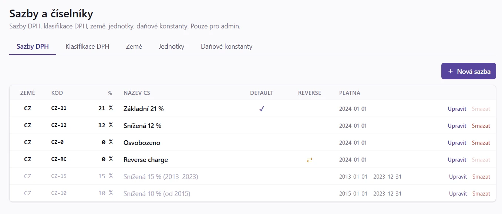

# 96. Nastavení

> Návod k nastavení aplikace a firmy: číselníky, uživatelé a role, vlastní profil, e-mailové šablony a odesílací
> profily, uložené filtry, automatické účtování, kategorie, branding, vlastní domény a profil firmy. Pro
> administrátory a každého, kdo si chce přizpůsobit práci v aplikaci.

## 96.1 Kdy to potřebujete

<!-- cols: 36 38 26 -->
| Kdy | Co udělat | Postup |
|---|---|---|
| Potřebujete zahraniční sazbu DPH, jednotku nebo upravit klasifikaci DPH | Upravit číselník | [§ 96.3](#963-krok-za-krokem-ciselniky) |
| Přichází nový kolega nebo externí účetní | Založit uživatele a přidělit roli a firmy | [§ 96.4](#964-krok-za-krokem-uzivatele-role-a-pristup-k-firmam) |
| Chcete si změnit heslo, zapnout 2FA nebo passkey | Upravit Můj profil | [§ 96.5](#965-krok-za-krokem-muj-profil) |
| Chcete změnit text e-mailu klientům | Upravit e-mailovou šablonu | [§ 96.6](#966-krok-za-krokem-e-mailove-sablony) |
| Posíláte e-maily z jiné adresy nebo přes jiný server | Nastavit odesílací profil | [§ 96.7](#967-krok-za-krokem-odesilaci-e-mailove-profily) |
| E-mail nedorazil klientovi | Zkontrolovat Odeslané e-maily a SMTP log | [§ 96.14](#9614-krok-za-krokem-diagnostika-odeslanych-e-mailu-a-activity-log) |
| Často používáte stejný filtr seznamu | Uložit filtr a nastavit sloupce | [§ 96.8](#968-krok-za-krokem-ulozene-filtry-a-zobrazeni-tabulek) |
| Chcete, aby se faktury účtovaly samy | Zapnout automatické účtování | [§ 96.9](#969-krok-za-krokem-automaticke-uctovani) |
| Potřebujete členit náklady a tržby | Spravovat kategorie | [§ 96.10](#9610-krok-za-krokem-kategorie-nakladu-a-trzeb) |
| Vystavujete pod více značkami | Zapnout brandingové profily | [§ 96.11](#9611-krok-za-krokem-brandingove-profily) |
| Klienti mají chodit na vlastní doménu | Zapnout vlastní doménu | [§ 96.12](#9612-krok-za-krokem-vlastni-domeny-klientskeho-rozhrani) |
| Převádíte firmu z jiného programu | Stáhnout a nahrát profil firmy | [§ 96.13](#9613-krok-za-krokem-profil-firmy) |

## 96.2 Než začnete

Podmenu **Systém** v hlavním menu obsahuje sekce pro konfiguraci aplikace. Co v něm vidíte, závisí na roli:

- **Přehled firem** (jen s přístupem k více firmám), **Sazby a číselníky**, **Daňové konstanty**,
- **Firmy**, viz [95. Více dodavatelů](95_Multi_supplier.md),
- **Uživatelé**, **Role a oprávnění**, **E-maily a certifikáty**, **Log**, **Plánované úlohy**, **Aktualizace** (administrátor),
- **Kompletní export dat**, **Stažení záloh**, **Diagnostika**, **Podpora** a další.

Exporty faktur nejsou v menu Systém, ale u agend (`Prodej → Export`, `Nákup → Export`), viz [20. Exporty](20_Exporty.md).

Nastavení konkrétní firmy je v sekci **Firma**: **Nastavení**, **Externí integrace**, **AI nastavení**, **Branding**,
**Kategorie**, **Dimenze**, **API tokeny**, **MCP server** a **Chybějící doklady**.

Správa opakovaně používaných fakturačních položek je kvůli návaznosti na vystavování dokladů v menu `Prodej → Ceník`.

Nastavení globálních položek smí měnit jen superadministrátor nebo administrátor; viz [§ 96.4](#964-krok-za-krokem-uzivatele-role-a-pristup-k-firmam).

## 96.3 Krok za krokem: číselníky

Otevřete `Systém → Sazby a číselníky`. Stránka sdružuje systémové číselníky v záložkách **Sazby DPH**, **Klasifikace DPH**,
**Sazby států OSS**, **Státní svátky**, **Země** a **Jednotky**. Sazby DPH, země a měrné jednotky jsou společné pro celou
instalaci; přidávat, měnit a mazat je může pouze superadministrátor. Firemní kategorie nákladů a tržeb se spravují
samostatně podle oprávnění k nastavení firmy (viz [§ 96.10](#9610-krok-za-krokem-kategorie-nakladu-a-trzeb)).
**Daňové konstanty** jsou samostatný bod menu hned pod Sazbami a číselníky ([Daňové konstanty](100_Danove_konstanty.md)).


**Přidat sazbu DPH (například zahraniční pro OSS):**

1. Na záložce **Sazby DPH** přidejte novou sazbu.
2. Vyplňte **Kód** (například `SK-23`), **Sazbu**, **Stát**, popisky CS / EN a případně **Default**, **Reverse charge**, **Platnost od**.
3. U zahraniční sazby přepište pole **Stát**, které formulář předvyplňuje na `CZ`.
4. Uložte.

**Jak poznáte, že je hotovo:** V editoru faktury se zahraniční sazba nabídne na řádku označeném jako OSS; běžný tuzemský
řádek dál používá domácí sazby.

> [!WARNING]
> Pole Stát formulář předvyplňuje na `CZ`. U zahraniční sazby ho musíte přepsat. Sazba pojmenovaná `PL-23`, která
> má ve sloupci Stát `CZ`, je pro aplikaci česká sazba 23 %, a takovou ČR nezná. Import zahraničních dokladů se v takovém
> případě zastaví a v reportu řekne, u které sazby a na jaký stát zemi opravit. Je to záměrná pojistka: kdyby se
> sazba se špatnou zemí použila, skončila by cizí daň v českém přiznání k DPH. Zemi zkontrolujte dřív, než spustíte
> import nebo hromadnou úpravu OSS.

**Přidat jednotku:** na záložce **Jednotky** zadejte **Kód** (`h`, `ks`, `den`, `měs.`), popisky CS / EN, **Default** a **Pořadí**.

**Upravit klasifikaci DPH nebo státní svátky:** viz [§ 96.16.2](#96162-klasifikace-dph) a [§ 96.16.3](#96163-statni-svatky).

**Sazby států OSS:** kontrolní číselník pro ověřování OSS dokladů. Změní-li členský stát sazbu, kterou systémový
číselník ještě nemá, zkraťte platnost systémové sazby ke dni před účinností (**Zkrátit**) a založte vedle ní vlastní
s novým procentem. Dokud to neuděláte, bude aplikace u dokladů s novou sazbou hlásit, že sazba v číselníku k datu
plnění není (podrobnosti viz [§ 96.16.1](#96161-ciselniky-podrobnosti)).

## 96.4 Krok za krokem: uživatelé, role a přístup k firmám

Stránka `Systém → Uživatelé` je jen pro superadmina.


**Založit uživatele:**

1. Klikněte na **Nový uživatel**.
2. Vyplňte **Jméno**, **E-mail** (slouží jako login), **Roli** a **Jazyk** (`cs` / `en`).
3. **Heslo** (nejméně 12 znaků) můžete u nového uživatele nechat prázdné: uživateli pak přijde e-mailem jednorázový odkaz a heslo si nastaví sám. U existujícího uživatele ponechte prázdné, pokud heslo neměníte, nebo klikněte na **Poslat odkaz na nastavení hesla**.
4. Ponechte zapnuté **Aktivní** (vypnutý uživatel se nemůže přihlásit).
5. Uložte.

**Přiřadit firmy:** v editaci uživatele vyhledejte firmu podle názvu, IČO nebo ID a přidejte ji. Každý uživatel kromě
superadmina má přístup pouze k firmám, které mu superadmin výslovně přidá. U přiřazené firmy ponechte **Výchozí roli**,
nebo vyberte jinou aktivní roli stejného typu.

**Odebrat uživatele:** aktivního uživatele nejdřív **deaktivujte**. U neaktivního se pak zobrazí **Smazat**. Smazání je
trvalé a aplikace ho odmítne, pokud jsou na uživatele navázaná firemní, účetní nebo auditní data. V takovém případě účet
ponechte deaktivovaný.

**Role a oprávnění:** `Systém → Role a oprávnění`. Superadmin může vytvořit interní roli typu **staff** nebo externí
roli typu **client** a pro každou nastavit oprávnění po modulech a významných akcích (viz [§ 96.16.4](#96164-role-a-opravneni)).

**Jak poznáte, že je hotovo:** Uživatel se přihlásí a vidí jen firmy a agendy, které mu role dovoluje. Změna role,
její deaktivace nebo odebrání firmy se projeví bez nového přihlášení a také u existujících API tokenů.

> [!WARNING]
> Aplikace brání odebrání nebo deaktivaci posledního aktivního superadmina.

## 96.5 Krok za krokem: Můj profil

Otevřete pravý horní roh, klikněte na jméno a zvolte **Můj profil**. Je to stejná obrazovka jako
[§ 8.6 Změna profilu a hesla](08_Prihlaseni.md#86-krok-za-krokem-zmena-profilu-a-hesla).

Můžete si změnit:

- **Jméno a jazyk**,
- **Heslo** (vyžaduje původní heslo),
- **TOTP**: zobrazit stav a aktivovat pomocí QR kódu a ověřovacího kódu,
- **Passkeys**: přidat, pojmenovat, přejmenovat a odvolat vlastní přístupové klíče,
- **Zámek aplikace**: převzít interval správce (**Použít nastavení správce**), nebo nastavit vlastní přísnější interval nečinnosti (1 až 1440 minut).

V uživatelském menu je také akce **Zamknout** (ruční zamknutí je dostupné vždy).

**Jak poznáte, že je hotovo:** Změna se uloží a při dalším přihlášení platí nové údaje.

> [!WARNING]
> Přidání nebo odvolání passkey vyžaduje čerstvý passkey nebo TOTP step-up; první passkey účtu bez silného faktoru
> vyžádá aktuální heslo. Odvolání passkey zneplatní ostatní session účtu. Při povinném MFA nelze odebrat poslední
> povolený silný faktor.

Správce nastavuje výchozí serverový zámek a současně horní limit osobní volby v `cfg.php`:

```php
'session' => [
    'lock_after_minutes' => 15, // kladná hodnota zámek zapne; výchozí je 0
],
```

Stejné nastavení lze předat přes `MYINVOICE_SESSION_LOCK_AFTER_MINUTES`. Automatický zámek je ve výchozím stavu vypnutý
(`0`). Při této hodnotě jej může uživatel dobrovolně zapnout v profilu v rozsahu 1 až 1440 minut. Kladná hodnota správce
platí pro uživatele, kteří zvolili **Použít nastavení správce**, a je nepřekročitelným maximem; vlastní interval proto
může být jen stejný nebo kratší. Podrobnosti jsou v [101. Bezpečnost](101_Bezpecnost.md).

## 96.6 Krok za krokem: e-mailové šablony

1. Otevřete `Systém → E-maily a certifikáty` a záložku **E-mail šablony**.


2. Seznam má pro každou šablonu samostatný řádek za každý jazyk (sloupec jazyk). Sloupec stavu ukazuje **Upraveno** (firemní úprava), nebo **Výchozí**. U řádku klikněte na **Upravit**.
3. Upravte **Předmět** (podporuje placeholdery, například `{{ varsymbol }}`), **HTML tělo (Twig)** a **Plain text tělo (Twig)**.
4. Klikněte na **Uložit šablonu**. Úpravu zrušíte tlačítkem **Obnovit výchozí**.

**Jak poznáte, že je hotovo:** Řádek šablony má stav **Upraveno** a další odeslaný e-mail daného typu použije nový text.

> [!TIP]
> Editor šablon nemá vlastní testovací odeslání. Po úpravě pošlete zkušební e-mail sami sobě (například fakturu
> na vlastní adresu) a zkontrolujte výsledek. Překlep v syntaxi Twig by rozbil odesílání všem klientům.

Seznam šablon a placeholderů je v [§ 96.16.5](#96165-e-mailove-sablony-seznam-a-placeholdery). Obsahové šablony jsou
společné pro dodavatele; vzhled e-mailů řídí branding ([§ 96.11](#9611-krok-za-krokem-brandingove-profily)).

## 96.7 Krok za krokem: odesílací e-mailové profily

Profil definuje identitu, pod kterou aplikace posílá odchozí e-maily aktuálního dodavatele.

1. Otevřete `Systém → E-maily a certifikáty` a záložku **Odesílací profily**.
2. Přidejte profil a vyplňte povinná pole (označená hvězdičkou): **From e-mail** a **From jméno**.
3. Podle potřeby zapněte **Konfigurovat Reply-To**, **Konfigurovat DKIM** (doména i selector), vyberte **S/MIME profil**, **Transport** a **Ukládat kopii do IMAP složky odeslané pošty**.
4. Klikněte na **Test**. Test pošle krátký e-mail na e-mail přihlášeného uživatele, případně na e-mail dodavatele nebo globální adresu odesílatele z konfigurace. Ve formuláři použije aktuálně vyplněné hodnoty bez uložení do databáze.
5. Uložte profil a zapněte přepínače **Výchozí profil** a **Aktivní**.

**Jak poznáte, že je hotovo:** Test hlásí, že transport e-mail přijal (včetně poslední odpovědi serveru), a případně i to, že se
kopie uložila do zadané IMAP složky.

Povinná pole jsou ve formuláři označená hvězdičkou. Před uložením i před odesláním testu aplikace zkontroluje aktuálně
zobrazené povinné položky (Reply-To, DKIM, SMTP autentizace a IMAP podle zapnutých voleb) a bez jejich vyplnění akci
nespustí. Podrobnosti viz [§ 96.16.6](#96166-odesilaci-profily-podrobnosti).

## 96.8 Krok za krokem: uložené filtry a zobrazení tabulek

Na seznamech dokladů (Vydané i Přijaté faktury, Klienti, Sklad - položky i doklady, Pokladna, Deník, Hlavní kniha,
Majetek) si každý uživatel může uložit vlastní kombinace filtrů a nastavit si, jak má tabulka vypadat. Obojí se ukládá
na uživatele, nezávisle na kolezích.

V horní liště nad tabulkou (vedle vyhledávání a filtrů stránky) jsou tři ovládací prvky: **Uložené filtry**
(rozbalovací nabídka s ikonou záložky), **Sloupce** (rozbalovací nabídka se seznamem sloupců) a **Hustota**
(přepínač komfortního a kompaktního zobrazení řádků).

**Uložit filtr:**

1. Nastavte na stránce filtry (fulltext, hodnoty filtrů, případně řazení).
2. Klikněte na **Uložené filtry**.
3. Zadejte **Název filtru**, případně zaškrtněte **Výchozí** a klikněte na **Uložit**. Tlačítko je neaktivní, pokud stránka nemá nastavený žádný filtr nebo pokud není vyplněný název.

**Použít filtr:** v nabídce **Uložené filtry** klikněte na název filtru. Přepíše aktuální filtry a řazení stránky. U aktivního
filtru (jeho uložené hodnoty přesně odpovídají tomu, co má stránka nastavené) se název zobrazí i jako štítek na
tlačítku. Když si oblíbenou kombinaci jen mírně doladíte, uložte změnu volbou **Aktualizovat tímto nastavením**
(zobrazí se jen u právě aktivního filtru).

U každého uloženého filtru jsou tři ikony: hvězdička (nastaví nebo zruší filtr jako **výchozí** pro danou stránku),
tužka (přejmenuje filtr) a koš (smaže filtr s potvrzením).

**Sloupce a hustota:**

1. Klikněte na **Sloupce** a zaškrtněte sloupce, které chcete vidět. Povinné sloupce (typicky číslo dokladu, částka, akce) jsou zašedlé.
2. Na stránkách s připravenými sestavami je lze přepnout v horní části nabídky (**Jednoduché**, **Výchozí**, **Kompletní**). Na ostatních stránkách vrátí tlačítko **Obnovit výchozí** sloupce do výchozího stavu.
3. Přepínačem **Hustota** zvolte **Komfortní** (výchozí), nebo **Kompaktní** (víc řádků na obrazovku, menší odstupy).
4. Řazení změníte kliknutím na hlavičku sloupce (cykluje vzestupně, sestupně, výchozí). Pořadí sloupců lze měnit přetažením záhlaví.

**Jak poznáte, že je hotovo:** Při příštím otevření stránky (i z jiného počítače) se obnoví vaše sloupce, hustota a řazení;
výchozí filtr se nastaví sám.

Všechny tři volby (sloupce, hustota, řazení) se ukládají **automaticky**, není potřeba nic potvrzovat. Detaily viz
[§ 96.16.7](#96167-ulozene-filtry-a-predvolby-podrobnosti).

> [!TIP]
> Uložené filtry se hodí pro opakující se pohledy, například „nezaplacené faktury po splatnosti" nebo „doklady
> k zaúčtování za tento měsíc". Místo ručního nastavování filtrů pokaždé znovu si pohled uložte jednou a příště jen
> klikněte na jeho název (nebo si ho nastavte jako výchozí).

## 96.9 Krok za krokem: automatické účtování

V sekci **Daňové nastavení** (jen u firem v režimu podvojné účetnictví; u daňové evidence se doklady neúčtují a blok se
vůbec nezobrazí) jsou dva přepínače, ve výchozím stavu vypnuté:

<!-- cols: 40 60 -->
| Přepínač | Co dělá |
|---|---|
| **Automaticky účtovat vydané faktury** | Po vystavení faktury ji aplikace rovnou zaúčtuje do deníku, stejným mechanismem jako ruční tlačítko Zaúčtovat ([Faktura PDF](16_Faktura_PDF.md#16103-zauctovani-do-deniku)). |
| **Automaticky účtovat přijaté faktury** | Po přechodu přijaté faktury na stav Přijatá ji aplikace rovnou zaúčtuje ([§ 23.11.18](23_Prijate_faktury.md#231118-zauctovani-do-deniku-a-tlacitko-zauctovat)). Na další přechody stavu (uhrazená, stornovaná…) auto-post nereaguje. |

**Postup:**

1. Otevřete `Firma → Nastavení`, záložku **Daně a účetnictví**, sekci **Daňové nastavení (EPO výkazy DPH/KH)**.
2. Zapněte požadované přepínače.
3. V boxu **Automatika účtování** zvolte preset (**Vypnuto**, **Jen návrhy**, **Asistovaná**, **Plná automatika**).
4. Případně upravte jednotlivé typy operací na vypnuto / návrh / automaticky, nastavte **Denní limit automatiky (Kč)** a zapněte **Ranní přehled e-mailem**.
5. Uložte nastavení.

**Jak poznáte, že je hotovo:** Nově vystavená nebo přijatá faktura se zaúčtuje sama; nelze-li ji zaúčtovat, zůstane
v návrhu nebo ve frontě **K doúčtování**.

<!-- cols: 26 74 -->
| Preset | Chování |
|---|---|
| **Vypnuto** | Detektory ani pravidla nevytvářejí automatické zápisy. |
| **Jen návrhy** | Vše se zobrazí ke kontrole ve frontě. |
| **Asistovaná** | Automaticky mohou projít jednoznačné spárované platby, vlastní převody a vlastní pojistné; ostatní zůstává návrhem. |
| **Plná automatika** | Deterministické operace mohou po splnění všech guardů účtovat samy; naučené, nejasné a AI položky zůstávají návrhem. |

> [!WARNING]
> Chyba zaúčtování vystavení nebo přijetí nezablokuje. Pokud automatické zaúčtování selže (chybějící kurz, uzavřené
> období…), doklad se přesto normálně vystaví nebo přijme, jen zůstane nezaúčtovaný a zaúčtujete ho ručně (chyba se
> zapíše do activity logu). Auto-post tak nikdy nemůže shodit vystavení faktury nebo příjem dokladu. Bez zapnutí zůstává
> zaúčtování ryze ruční (tlačítko na detailu nebo hromadná akce v seznamu).

Podrobnosti o pořadí pojistek a limitech jsou v [§ 96.16.8](#96168-automaticke-uctovani-podrobnosti).

## 96.10 Krok za krokem: kategorie nákladů a tržeb

Stránka `Firma → Kategorie` obsahuje číselníky platné jen pro aktuální firmu:

<!-- cols: 30 70 -->
| Záložka | Použití |
|---|---|
| **Kategorie nákladů** | Člení přijaté faktury a další náklady. U kategorie se zadává kód, název, pořadí a druh **fixní / variabilní** pro nákladové přehledy. |
| **Kategorie tržeb** | Člení tržby z vydaných faktur. Zadává se kód, název a pořadí. Volitelně i **vlastní číselná řada**: faktury s touto kategorií pak dostanou číslo z ní (vlastní řada zákazníka má přednost), viz [§ 95.13.3](95_Multi_supplier.md#95133-ciselne-rady-faktur). |

1. Otevřete `Firma → Kategorie` a zvolte záložku.
2. Přidejte kategorii, vyplňte kód, název a pořadí (u nákladů druh fixní / variabilní).
3. Uložte.

**Jak poznáte, že je hotovo:** Kategorie se nabízí v dokladech a přehledech.

U každé kategorie stránka ukazuje počet použití. Nepoužitou kategorii lze smazat; použitá se kvůli zachování historie
pouze archivuje a přestane se nabízet pro nové doklady. Archivované kategorie zůstávají v přehledu označené a lze je
znovu upravit. Kód musí být v rámci dané firmy a druhu kategorie jedinečný.

> [!TIP]
> Kategorie nemění účetní předkontaci ani klasifikaci DPH. Slouží k provoznímu členění nákladů a tržeb v dokladech
> a přehledech.

## 96.11 Krok za krokem: brandingové profily

Brandingové profily jsou volitelný modul, který se zapíná na stránce `Firma → Branding`. Dokud je vypnutý, faktury a e-maily
používají původní údaje a branding dodavatele (viz [§ 95.7](95_Multi_supplier.md#957-krok-za-krokem-branding-e-mailu-a-pdf)).

1. Otevřete `Firma → Branding` a v sekci **Brandingové profily** zapněte **Používat brandingové profily**.
2. Vytvořte profil pro obchodní značku: logo, zobrazovaný název, slogan, barvu, kontaktní údaje a patičku e-mailu. Přepínač **Používat vlastní branding v e-mailech a PDF** v profilu řídí zobrazení jeho loga a barev v e-mailech i PDF.
3. Profilu můžete přiřadit **e-mailový profil odesílatele** (SMTP účet, adresa odesílatele, Reply-To, podepisování). Není-li vybrán, použije se výchozí e-mailový profil dodavatele.
4. Označte jeden profil jako výchozí (není povinný) a/nebo ho přiřaďte zákazníkovi.
5. Zkontrolujte **Náhled e-mailu** (logo, barva, zobrazovaný název, kontakty, patička; přepínač české a anglické varianty).

**Jak poznáte, že je hotovo:** Nový koncept faktury převezme profil zákazníka a při vystavení se použitá identita uloží do
snapshotu dokladu.

Právní údaje dodavatele (firma, adresa, IČ a DIČ) zůstávají společné a profilem se nemění. Výchozí profil se použije
vždy, když faktura, pravidelná fakturace ani zákazník neurčují jiný profil. Pozdější změna profilu nebo nahrání nového
loga nezmění již vystavené faktury. Původní konfigurace brandingu e-mailů se používá při vypnutém modulu. Obsahové
e-mailové šablony zůstávají společné pro dodavatele a spravují se odděleně na záložce **E-mail šablony**.

> [!WARNING]
> E-mailový profil, který používá některý brandingový profil, nelze smazat. Chybová zpráva vypíše dotčené profily;
> nejprve jim nastavte jiného odesílatele nebo výchozí profil dodavatele.

## 96.12 Krok za krokem: vlastní domény klientského rozhraní

Funkce je volitelná a ve výchozím stavu vypnutá. Zapíná ji správce serveru v `cfg.php`
(`'domains' => ['enabled' => true]`, případně `MYINVOICE_DOMAINS_ENABLED=1`). Dokud je vypnutá, sekce s doménami
se v Nastavení vůbec nenabízí a instalace se chová jako bez ní.

> [!WARNING]
> Po zapnutí se hostname stává hranicí firmy, a tím i tvrdým filtrem. Jakýkoli host, který není hostname z `app.url`
> ani aktivní doména některé firmy, dostane `421`. To zahrnuje i variantu s `www` a bez `www`, přístup přes IP adresu
> nebo staging jméno. Zapínejte proto až ve chvíli, kdy reverse proxy posílá na aplikaci jen hostnames, o kterých víte.

**Založit a aktivovat doménu:**

1. Otevřete `Firma → Nastavení`, záložku **Údaje firmy** a sekci **Klientské domény**. Sekce se zobrazí uživateli s oprávněním Vlastní domény alespoň pro čtení; založení, ověření, aktivace a deaktivace vyžadují zápis. Domény se spravují pro právě vybranou firmu.
2. Do pole **Hostname** zadejte hostname bez schématu, portu a cesty, například `portal.klient.cz`. Wildcard není podporovaný.
3. V poli **Účel** vyberte **Klientské rozhraní**, **Veřejné odkazy**, nebo **Klientské rozhraní i veřejné odkazy**, případně zaškrtněte **Použít jako primární doménu pro nové odkazy**, a klikněte na **Přidat doménu**.
4. U poskytovatele DNS publikujte TXT záznam, který aplikace zobrazí, například:

```text
_myucto-challenge.portal.klient.cz TXT myucto-verification=<token>
```

5. Nasměrujte A/AAAA nebo CNAME domény na reverse proxy MyÚčta, zachovejte původní hlavičku `Host` a připravte důvěryhodný TLS certifikát.
6. Klikněte na **Ověřit DNS a HTTPS**.
7. Po úspěšném ověření klikněte na **Aktivovat** a aktivaci potvrďte passkey nebo TOTP.

**Jak poznáte, že je hotovo:** Doména má stav **Aktivní** a obsluhuje svůj účel.

Stavy domény: **Čeká na ověření** (publikujte DNS TXT, routing a TLS), **Ověřeno** (poslední kontrola prošla, lze
aktivovat), **Aktivní**, **Ověření selhalo** (karta ukáže důvod), **Deaktivováno** (hostname nevydává firemní data).
Rotace challenge zneplatní předchozí TXT hodnotu a vrátí neaktivní doménu do stavu čekání. Aktivní doménu nejdřív
deaktivujte. Deaktivace se projeví okamžitě; pokud nezůstane jiný aktivní alias daného účelu, nové odkazy použijí výchozí
`app.url`. Podrobnosti viz [§ 96.16.9](#96169-vlastni-domeny-podrobnosti). Provozní nastavení proxy, certifikátů a
Turnstile popisuje [§ 3.8 HTTPS přes reverse proxy](03_Instalace_Docker.md#38-krok-za-krokem-https-pres-reverse-proxy).

## 96.13 Krok za krokem: profil firmy

`Firma → Nastavení`, záložka **Daně a účetnictví**, **Profil firmy** uloží do jednoho souboru nastavení, které firma
vybudovala ručně a které převod z jiného programu nezaloží.

**Stáhnout:** klikněte na **Stáhnout profil firmy**. Uloží se soubor JSON.

**Nahrát:**

1. Klikněte na **Nahrát profil firmy** a vyberte soubor.
2. Zkontrolujte náhled po sekcích: co přibude, co se změní a co zůstane, a upozornění (profil z firmy s jiným IČO, účet, který firma v osnově nemá, klient, kterého nezná). Nic se nezapíše, dokud náhled nepotvrdíte.
3. Klikněte na **Nahrát profil**.

**Jak poznáte, že je hotovo:** Nastavení z profilu je ve firmě. Opakované nahrání téhož profilu nic nezmění.

Profil se hodí hlavně při opakovaném převodu firmy z jiného programu: stáhněte ho před smazáním firmy nebo před novým
převodem a po ostrém převodu ho nahrajte zpět. Průvodci převodem ho nabízejí přímo (viz
[§ 103.10.8](103_Prechod_z_Money_S3.md#103108-opakovany-prevod)). Nahrát profil smí jen uživatel, který smí měnit každou
část nastavení, kterou profil obsahuje (nastavení firmy, účetnictví, pravidla banky). Podrobnosti a příkazy pro
příkazovou řádku viz [§ 96.16.10](#961610-profil-firmy-podrobnosti).

## 96.14 Krok za krokem: diagnostika odeslaných e-mailů a Activity log

**Odeslané e-maily:**

1. Otevřete `Systém → E-maily a certifikáty` a záložku **Odeslané e-maily**. Zahrnuje e-maily k fakturám, upomínky, žádosti o schválení, poděkování za úhradu, připomínky pravidelné fakturace a testovací zprávy.
2. Filtrujte podle typu a výsledku **Odesláno / Selhalo**. U záznamu je čas, typ zprávy, související faktura a zákazník, příjemce, uživatel nebo systém, který odeslání spustil, a u chyby její text. Červený souhrn zobrazí jen neúspěšné pokusy.

Záložka je pouze pro čtení: zprávu z ní nelze znovu odeslat ani smazat. Stav **Odesláno** potvrzuje úspěch odesílacího
kroku aplikace, nikoli přečtení nebo doručení do schránky příjemce. Pro technickou diagnostiku SMTP komunikace použijte
záložku **SMTP log analýza** (jen pro admina, [§ 96.16.11](#961611-smtp-log-analyza)).

**Activity log:**

1. Otevřete `Systém → Log`.
2. Filtrujte podle **akce** a **entity**. V tabulce vidíte čas, uživatele, akci, entitu, payload a IP.
3. Použití: audit chyby („Kdo upravil fakturu?“, filtr entity faktura), bezpečnostní audit („Bylo to z očekávané IP?“; neúspěšné pokusy o přihlášení najdete filtrem akce `auth.login_failed`), časová osa výpadku (všechny akce v intervalu).

**Jak poznáte, že je hotovo:** Dohledali jste událost, kdo a kdy co změnil, případně stav doručení e-mailu.

> [!TIP]
> Activity log se nepromazává vůbec. Cron `cron-cleanup.sh` se ho nedotýká a žádné nastavení retence pro něj neexistuje.
> Je to záměr: auditní stopa nad účetními doklady podléhá stejné povinnosti uchovávat jako doklady samotné (§ 31 zákona
> o účetnictví), takže by ji rotace po několika měsících znehodnotila. Přehled retenčních lhůt najdete na stránce
> `Nástroje → Retenční lhůty` (viz [Nástroje](73_Ucetni_nastroje.md#738-krok-za-krokem-retencni-lhuty-a-zadrzeni-skartace)).

## 96.15 Když něco nejde

<!-- cols: 34 32 34 -->
| Co vidíte | Proč | Co udělat |
|---|---|---|
| Import zahraničního dokladu se zastaví u sazby | Sazba `PL-23` a podobné má ve sloupci Stát `CZ` | Opravte pole Stát u sazby DPH ([§ 96.3](#963-krok-za-krokem-ciselniky)). |
| Hláška „Číselník v databázi není - chybí migrace" | Po aktualizaci se nespustily databázové migrace | Spusťte `php api/bin/migrate.php`. Do té doby se neověřuje žádný stát a import zahraničních dokladů se nerozběhne. |
| Aplikace hlásí, že sazba v číselníku k datu plnění není | Členský stát změnil sazbu, kterou systémový číselník OSS ještě nemá | Zkraťte systémovou sazbu a založte vlastní s novým procentem. |
| Uživatele nejde smazat | Jsou na něj navázaná firemní, účetní nebo auditní data | Ponechte ho deaktivovaný. |
| Chybí volba nové firmy nebo menu Uživatelé | Chybí potřebná role | Viz [§ 96.4](#964-krok-za-krokem-uzivatele-role-a-pristup-k-firmam). |
| Zkušební e-mail po úpravě šablony nedorazil | Chybný odesílací profil nebo transport | Použijte **Test** v odesílacím profilu ([§ 96.7](#967-krok-za-krokem-odesilaci-e-mailove-profily)) a SMTP log. |
| Uložený filtr nejde uložit | Dosažen limit 30 filtrů, nebo duplicitní název | Smažte nepotřebný filtr nebo zvolte jiný název. |
| Automatické zaúčtování selhalo | Chybějící kurz, uzavřené období a podobně | Doklad zůstal nezaúčtovaný; zaúčtujte ho ručně, chyba je v activity logu. |
| E-mailový profil nejde smazat | Používá ho brandingový profil | Změňte profilům odesílatele ([§ 96.11](#9611-krok-za-krokem-brandingove-profily)). |
| Doména zůstává neaktivní | Změnila se challenge, nebo některá kontrola už neprojde | Opravte DNS, routing nebo TLS a ověření a aktivaci proveďte znovu. |
| Hostname vlastní domény vrací chybu | Kolize s výchozí `app.url` | Obnovte původní canonical adresu, kolidující doménu deaktivujte a smažte, nebo nastavte jiný canonical hostname. |
| Nahrání profilu firmy nic nezapsalo | Chyba v některé sekci (nahrání je atomické) | Přečtěte upozornění v náhledu a opravte příčinu. |

## 96.16 Podrobnosti a pravidla

### 96.16.1 Číselníky: podrobnosti

**Měny a bankovní účty.** Měny a bankovní účty aktuálního dodavatele jsou soustředěné na stránce
`Peníze → Bankovní účty` (viz [Bankovní účty](30_Bankovni_ucty.md)). Každý řádek představuje jeden bankovní účet v dané
měně; pokud máte víc účtů pro stejnou měnu, založte více řádků se stejným kódem měny.

<!-- cols: 30 70 -->
| Pole | Význam |
|---|---|
| Kód | ISO 4217: `CZK`, `EUR`, `USD`, `GBP` |
| Označení | „CZK - KB", „EUR - Fio": rozlišení v UI (víc účtů per měna) |
| Symbol | `Kč`, `€`, `$`, `£` |
| Název CS / EN | „Koruna" / „Crown" |
| Počet desetinných míst | Typicky 2 |
| Aktivní | Vypnutou měnu nelze použít pro nové faktury |
| Default pro kód | Pokud máte víc účtů per měna (například 2× CZK), který je výchozí |
| Účet (CZK) | Číslo účtu (například `1000000005`), kód banky (`0100`) a název banky |
| Účet (EUR) | IBAN, BIC a název banky |

> [!WARNING]
> Po změně bankovního účtu se automaticky invaliduje cache PDF všech faktur, které renderují bankovní údaje živě
> (koncepty a faktury bez snapshotu). Vystavené faktury mají neměnný snapshot banky.

Na stejné stránce je i konfigurace **bankovních e-mailových avíz**: IMAP účty, mapování bankovní účet → IMAP účet →
parser, parser provideri a přehled zpracovaných e-mailů. Detail viz [Banka](29_Banka.md).

**Sazby DPH.**



<!-- cols: 30 70 -->
| Pole | Význam |
|---|---|
| Kód | `CZ-21`, `CZ-12`, `CZ-0`, `CZ-RC`, pro OSS například `PL-23` |
| Sazba | `21`, `12`, `0`, `0` |
| Stát | Kód země, ve které sazba platí: `CZ` u tuzemských, `PL` / `SK` / `HU`… u sazeb členských států |
| Popisek CS / EN | Pro UI a PDF |
| Default | Která sazba se předvyplní v editoru |
| Reverse charge | Zatrhne se pro `CZ-RC` |
| Platnost od | Pro historické faktury (15 % v roce 2023) |

Pro OSS založte sazby jednotlivých členských států se správným kódem země, například `SK-23`. V editoru faktury se
zahraniční sazby nabídnou na řádku označeném jako OSS; běžný tuzemský řádek dál používá domácí sazby.

**OSS a daňové nastavení.** V `Firma → Nastavení`, záložce **Daně a účetnictví**, je karta **Režim OSS (One Stop Shop)**,
čtvrtá v řadě za kartami Vést účetnictví, Vést mzdy a Vést skladovou evidenci. Po zaškrtnutí se odkryje země identifikace
(typicky `CZ`), měna podání (typicky `EUR`) a volitelně datum začátku a konce registrace. Zapnutý režim zobrazí OSS pole
v editoru položek a v menu `Daně → OSS přiznání` kvartální přehled a XML export. Zařazení jednotlivých řádků do OSS už řešit
nemusíte: odvozuje se automaticky ze sazby, země odběratele a číselníku sazeb členských států, a to ve všech kanálech
včetně importu a API. Sporné případy aplikace do OSS zařadí (nebo nechá v tuzemsku, podle kanálu) a označí je k ručnímu
posouzení. Aplikace celounijní práh 10 000 EUR sleduje orientačně a upozorní na jeho blížící se překročení, ale režim sama
nezapne. Podrobnosti (odvození řádku, plnění k ručnímu posouzení, hromadná úprava, účtování, podání a evidence) má
vlastní kapitola [Režim OSS (One Stop Shop)](45_OSS.md).

**Sazby států OSS.** `Systém → Sazby a číselníky`, záložka **Sazby států OSS**. Číselník obsahuje sazby DPH členských
států, proti kterým se OSS doklady ověřují. Je to kontrolní číselník, ne sazby pro doklad; ty se zakládají v záložce Sazby DPH.
Rozdíl je podstatný: sazby DPH si zakládáte vy (a můžete v nich mít překlep), kdežto tento číselník je společný pro celou
instanci a slouží jako nezávislá autorita při rozhodování, jestli plnění patří do tuzemska, nebo do OSS. Právě proto se
ho aplikace ptá při importu, v editoru i při hromadné úpravě.

<!-- cols: 26 74 -->
| Sloupec | Význam |
|---|---|
| **Stát** | Dvoupísmenný kód členského státu |
| **Typ sazby** | Základní / Snížená / Druhá snížená / Parkovací |
| **Sazba** | Procento |
| **Platí od** / **Platí do** | Historie sazby; prázdné „Platí do" znamená, že sazba platí dosud |
| **Poznámka** | Volný text |
| **Původ** | systémová (dodaná s aplikací) nebo vlastní (přidal uživatel) |

Nahoře je filtr podle státu a zaškrtávátko **Zobrazit vyřazené**. Systémovou sazbu nelze přepsat: její data používá
aktualizační migrace k rozpoznání, co je vlastní záznam a co ne, přepsáním by se vlastní úprava při dalším upgradu
ztratila. Systémové sazbě jde jen **Zkrátit** platnost k datu a vedle ní založit novou. Vlastní sazbu lze plnou měrou
editovat i smazat. Obojí jde **Vyřadit** (schová se z výběru) a zase **Vrátit**. Číselník smí měnit jen správce instance,
protože je společný pro všechny firmy v ní.

Hláška „Číselník v databázi není - chybí migrace" znamená, že se po aktualizaci nespustily databázové migrace
(`php api/bin/migrate.php`). Není to totéž jako „stát v číselníku chybí"; aplikace ty dva stavy rozlišuje a hlásí každý
zvlášť.

Ve stejném bloku nastavení zůstává vedle ID datové schránky také **typ datové schránky** (`FO`, `PFO`, `PO`, `OVM`). Tento
údaj MyÚčto zachovává pro EPO a další elektronická podání; typ poplatníka se přitom nastavuje samostatně podle právní
formy firmy.

**Země.** Statický číselník, nemělo by být potřeba ho editovat. Obsahuje 200+ zemí podle ISO 3166-1.

**Jednotky.** Číselník měrných jednotek pro položky faktury. Globální (sdílený mezi dodavateli), nahrazuje volný textový
vstup za dropdown.

<!-- cols: 30 70 -->
| Pole | Význam |
|---|---|
| Kód | Krátký identifikátor (`h`, `ks`, `den`, `měs.`) |
| Popisek CS / EN | Co se zobrazí v UI a PDF (`hodina` / `hour`) |
| Default | Která jednotka se předvyplní při přidání nové položky (typicky `h`) |
| Pořadí | Číslo pro řazení v dropdownu |

Výchozí jednotka `hodina` dává smysl, protože nová položka přebírá hodinovou sazbu z projektu nebo klienta. Pro jednorázové
položky (paušál, licence, materiál) jednotku ručně přepnete. Při uložení faktury se řádky bez popisu i bez ceny tiše smažou,
takže v editoru můžete přidat víc řádků na zásobu a nepoužité se neuloží.

**Ceníkové položky.** `Prodej → Ceník` (jen administrátor) spravuje ceník aktuálního dodavatele. Každá položka má kód,
název, fakturační popis, jednotku, sazbu DPH a povinnou základní cenu v jedné měně. Kód je unikátní pouze v rámci
dodavatele. Přehled lze prohledávat a filtrovat podle měny a aktivního či archivovaného stavu. Tento jednoduchý ceník je
dostupný jen firmám bez aktivního modulu **Sklad**. E-shop je součástí skladového modulu a používá společné skladové karty,
ceny a zákaznické cenové výjimky; po zapnutí skladu se proto samostatný Ceník nezobrazuje v menu ani v editorech dokladů.

Pro další aktivní měny lze zadat vlastní pevnou cenu. Když zapnete **Povolit přepočet kurzem ČNB**, chybějící měnová cena
se dopočte ze základní ceny. Pevná cena v cílové měně má vždy přednost. Náhled ukazuje zdrojovou cenu, výslednou částku,
křížový kurz a skutečné datum použitého kurzovního lístku. V sekci **Individuální ceny zákazníků** lze pro položku,
zákazníka a měnu zadat odlišnou cenu. Pořadí použití je:

1. individuální cena zákazníka v měně dokladu,
2. obecná pevná cena v měně dokladu,
3. individuální cena zákazníka v základní měně přepočtená kurzem,
4. obecná základní cena přepočtená kurzem.

U uložené individuální ceny se zobrazuje také počet opakovaných šablon daného zákazníka, které jsou na položku napojené.
Ceníková položka určuje, zda jsou její ceny s DPH, nebo bez DPH. Do dokladu či šablony ji lze vložit jen při shodném
režimu. Používaná položka se při smazání archivuje, aby zůstaly zachované vazby a pevné snapshoty šablon.

### 96.16.2 Klasifikace DPH

Klasifikační kód určuje směr použití (prodej, nákup nebo oba), řádek přiznání DPHDP3, oddíl kontrolního hlášení, sazbu
a zvláštní režimy, například reverse charge, kód režimu KH, opravu nedobytné pohledávky nebo kód předmětu plnění. Podle
těchto hodnot aplikace zařazuje řádky dokladů do daňových sestav; nejde jen o popisek v editoru.

Vestavěné systémové kódy jsou společné a nelze je upravit ani smazat. Pro aktuální firmu lze vytvořit vlastní kód, upravit
ho a později archivovat. Změnu provádějte jen tehdy, když znáte její dopad na DPHDP3, kontrolní hlášení a Knihu DPH. Význam
jednotlivých polí je podrobně popsán v [Výkazech DPH](41_Vykazy_DPH.md#41139-klasifikacni-kody-dph), kde je
i kompletní tabulka vestavěných kódů.

**Kód předmětu plnění** (jde do vět KH A.1 a B.1) přijímá jednu až dvě číslice s volitelným písmenem. Číselník MFČR
obsahuje i hodnoty jako `1a` nebo `3a`. Hodnotový výčet se záměrně nevaliduje: vlastní seznam by se s číselníkem rozešel
a odmítal by legitimní kódy. Text, který nezačíná číslicí, se neuloží vůbec.

> [!WARNING]
> Kód klasifikace není číslo řádku přiznání. Většina vestavěných kódů se sice jmenuje číslem svého řádku (`1` → ř. 1,
> `40` → ř. 40), ale ne všechny: kód 42 znamená přijaté plnění bez nároku na odpočet a do přiznání nepatří vůbec, kdežto
> řádek 42 je odpočet při dovozu zboží vyměřeném celním úřadem. Podobně kód `3` patří na ř. 50, kód `22` na ř. 21 a kód
> `26` na ř. 22. Řádek přiznání se proto vybírá ze seznamu s popisky, ne opisuje jako text, a uložení dvojice, která
> tyhle záměny reprodukuje, aplikace odmítne s vysvětlením.

Vlastní kód přidávejte pro režim, který vestavěné nepokrývají, ne pro překlopení existujícího na jiný řádek. Vestavěné
varianty už pokrývají tuzemský přenos podle režimu (§ 92c odpad, § 92d nemovitost, § 92e stavební práce), zvláštní režimy
§ 89 a § 90 i rozlišení vývozu zboží od služby do 3. země. Pokud přesto namapujete kód na jiný řádek přiznání, respektuje
se to; přemapování podle skutečné sazby se spouští jen při rozporu sazby kódu se sazbou řádku, ne proti vašemu mapování.

### 96.16.3 Státní svátky

Záložka **Státní svátky** je číselník státních a ostatních svátků podle zákona č. 245/2000 Sb. Není to jen kalendář:
svátek posouvá podle § 33 odst. 4 daňového řádu všechny lhůty podání (přiznání k DPH, kontrolní i souhrnné hlášení,
přehledy OSVČ i odvody ze mzdy) a stejnou sadu používá fond pracovní doby ve mzdách. Novela zákona se tak řeší řádkem
v číselníku, ne novou verzí aplikace.

Řádek není konkrétní datum, ale pravidlo s datovanou platností:

- **Pevné datum v roce**: den se zadá ve tvaru `MM-DD` (například `07-05`).
- **Posun od Velikonoční neděle**: zadá se počet dnů (Velký pátek −2, Velikonoční pondělí +1). Datum Velikonoc aplikace dopočítá, protože ho neurčuje zákon, ale výpočet.

Platnost od a do říká, ve kterém období svátek platí. Zrušený svátek se proto nemaže, omezí se mu platnost, aby starší
období počítala termíny správně. Vedle tabulky je **náhled roku**: číselník rozpočítaný na konkrétní datumy. Slouží ke
kontrole, protože překlep v pravidle by se jinak poznal až podle propásnutého termínu. Číselník je společný pro celou
instanci, takže ho může měnit jen její správce. Je-li tabulka prázdná (instalace bez spuštěných migrací), počítá aplikace
lhůty ze seznamu zapečeného v kódu a napíše to červeně přímo na stránce.

### 96.16.4 Role a oprávnění

`Systém → Role a oprávnění` nabízí databázový číselník rolí. Superadmin může vytvořit interní roli typu **staff** nebo
externí roli typu **client** a pro každou nastavit oprávnění po modulech a významných akcích:

<!-- cols: 26 74 -->
| Úroveň | Význam |
|---|---|
| **Neviditelné** | Modul ani akce se uživateli nezobrazí a server přístup odmítne. |
| **Pouze čtení** | Uživatel vidí seznamy, detaily, historii a povolené výstupy, ale nemění data. |
| **Zápis** | Zahrnuje čtení a dovoluje příslušnou změnu nebo akci. |

Role má po vytvoření neměnný typ. Klientské role nabízejí jen funkce bezpečné pro klientský portál; interní účetnictví,
banka a globální správa se jim nepovolí. Tři předdefinované správcovské role mají pevná práva a nelze je deaktivovat,
smazat ani upravit jejich matici:

<!-- cols: 22 78 -->
| Role | Rozsah |
|---|---|
| **Superadmin** | Plný přístup k firmám i celému systému. Jako jediný spravuje uživatele, role a přiřazení firem. |
| **Admin** | Může dělat vše v přidělených firmách a pracovat s více firmami, které mu přidělí superadmin. Nemění celosystémové položky v menu Systém. |
| **Admin Plus** | Má práva role Admin a navíc může v `Systém → Firmy` založit novou firmu. K nové firmě automaticky získá práva Admin. |

U klientské role má položka **Nastavení firmy** záměrně užší význam než interní právo **Měnit nastavení firmy**. Úroveň
**Zápis** otevře v klientském menu pouze odesílací profily firmy, branding a dvě volby data splatnosti v QR
vystavených a přijatých dokladů; neotevře právní, daňové ani účetní údaje dodavatele. Díky přepisu role u konkrétní
firmy lze stejného uživatele nechat spravovat provozní nastavení firmy A a ve firmě B mu ponechat běžný klientský
přístup. Podrobný rozsah popisuje [§ 9.11.2 Delegované nastavení firmy](09_Klientsky_portal.md#9112-delegovane-nastaveni-firmy).

Předávání originálů používá záměrně oddělená práva. Klientské **Předávat doklady účetní** dovolí pouze vložit a sledovat
vlastní podání aktuální firmy. Interní **Příchozí doklady** dovolí účetní frontu číst nebo zpracovávat, včetně nahrání
dokladu, který přišel mimo portál; pro vznik faktury a případnou AI extrakci jsou navíc potřeba jejich vlastní oprávnění.
**Trvale vyřadit z příchozí fronty** je samostatné právo a žádná systémová role kromě správce ho nemá. Odmítnutí dokladu
totiž originál záměrně nemaže (zůstává v Dokumentech i v auditní stopě), takže úklid fronty i s originálem je vědomý zásah.
Komu ho chcete dát, přidejte ho v editoru rolí. Role se dají kopírovat, takže stačí jednou nastavit „správce podatelny"
a dál z něj vycházet.

Roli lze duplikovat jako základ nové role. Používanou roli nelze smazat; nejprve je nutné přeřadit uživatele a odstranit její
přepisy u firem. Používanou roli lze deaktivovat, ale její uživatelé tím okamžitě ztratí firemní oprávnění. Při souběžné
editaci aplikace odmítne starší změnu, aby si administrátoři navzájem nepřepsali nastavení.

**Přiřazení firem.** Firma se vyhledá podle názvu, IČO nebo ID; aplikace kvůli tomu nenačítá celý seznam firem. Nabídka
firem se otevře po vstupu do vyhledávacího pole a po opuštění pole se zase zavře. Přepis role u firmy se s výchozí rolí
nesčítá, pro danou firmu ji úplně nahradí. Prázdný seznam přiřazených firem znamená nulový přístup k firemním datům;
přihlášení, změna hesla, 2FA a odhlášení zůstávají dostupné. Po přepnutí firmy aplikace načte oprávnění znovu.

Praktické doporučení: role **accountant** je dobrá pro externí účetní (vidí faktury, banku, exporty i daňové výkazy, ale
nemůže upravit uživatele ani konfiguraci). Roli **readonly** dejte auditorovi nebo klientovi (vidí a exportuje totéž co
účetní, včetně DPH podkladů, ale nemůže nic změnit).

### 96.16.5 E-mailové šablony: seznam a placeholdery

<!-- cols: 34 66 -->
| Kód | Použití |
|---|---|
| `invoice_send` | Odeslání faktury klientovi |
| `invoice_reminder` | Upomínka po splatnosti |
| `proforma_reminder` | Připomínka nezaplacené zálohové faktury |
| `invoice_payment_thanks` | Poděkování za úhradu (viz [§ 95.8](95_Multi_supplier.md#958-krok-za-krokem-kopie-e-mailu-podekovani-za-uhradu-a-vyuctovani-k-vyplaceni)); má i variantu pro zálohu |
| `invoice_approval` | Žádost o schválení výkazu víceprací zákazníkem |
| `recurring_draft_reminder` | Připomínka otevřeného konceptu pravidelné fakturace |
| `password_reset` | Reset hesla (systémová) |
| `login_otp` | Ověřovací kód pro přihlášení (systémová) |
| `welcome` | Uvítací e-mail novému uživateli |
| `test` | Testovací zpráva (ladění) |

Šablona se edituje v textových polích se syntaxí Twig, každý jazyk (`cs`, `en`) je samostatný řádek seznamu.
Placeholdery závisí na typu šablony. Pro šablonu `invoice_send`:

<!-- cols: 34 66 -->
| Placeholder | Význam |
|---|---|
| `{{ varsymbol }}` | Variabilní symbol |
| `{{ amount }}` | Částka (formátovaná) |
| `{{ currency }}` | Měna |
| `{{ due_date }}` | Splatnost |
| `{{ client_name }}` | Klient |
| `{{ supplier_name }}` | Dodavatel |
| `{{ pdf_url }}` | Odkaz pro stažení PDF (pokud máte veřejný odkaz) |

### 96.16.6 Odesílací profily: podrobnosti

Profil obsahuje:

- **From e-mail** a **From jméno**: adresa a jméno v hlavičce odesílatele,
- volitelnou volbu **Konfigurovat Reply-To**: po zapnutí lze vyplnit odpovědní adresu a jméno; když není zapnutá, profil hlavičku Reply-To do e-mailu nevkládá a odpovědi tak směřují na From z profilu,
- volitelný **S/MIME profil**: certifikát, který se použije pro podepsané e-mailové výstupy; formulář hlídá shodu certifikační e-mailové identity s From e-mailem a umí From z certifikátu předvyplnit,
- volitelnou volbu **Konfigurovat DKIM**: po zapnutí je nutné vyplnit DKIM doménu i selector pro tento profil; když není zapnutá, profil DKIM podpis nepoužije,
- **Transport**: výchozí globální konfigurace, vlastní SMTP účet nebo lokální `sendmail`; u vlastního SMTP lze nastavit server, port, šifrování, typ autentizace, TLS validaci, timeout a držení spojení, SMTP heslo nebo token se ukládá šifrovaně,
- volitelnou volbu **Ukládat kopii do IMAP složky odeslané pošty**: po úspěšném odeslání přes SMTP se finální MIME zpráva uloží do zadané IMAP složky; IMAP heslo se ukládá šifrovaně; pole složky umí načíst seznam složek z aktuálně vyplněného IMAP účtu a ověřit připojení i cílovou složku včetně testovacího zápisu bez uložení profilu; lze nastavit timeout, označení uložené kopie jako přečtené a chování při chybě IMAP uložení,
- přepínače **Výchozí profil** a **Aktivní**.

Akce **Test** je ve formuláři profilu i u každého uloženého profilu. Test použije přímo vybraný profil, i když není výchozí,
takže ověřuje jeho From, Reply-To, DKIM/S/MIME, transport i volitelné uložení do IMAP složky. Po testu formulář zobrazí
buď chybu vrácenou serverem, nebo informaci, že transport e-mail přijal, včetně poslední SMTP odpovědi, pokud ji aplikace
získala. Pokud je zapnuté IMAP ukládání, test zároveň zobrazí, zda se kopie uložila do zadané složky. Při výchozí
politice chyba IMAP uložení nemění fakt, že transport e-mail přijal. Pokud má profil nastaveno **Hlásit chybu
archivace**, chyba uložení do IMAP se zapíše jako chyba archivace po doručení. Aplikace ale e-mail znovu neposílá,
protože transport ho už přijal a opakování by mohlo vytvořit duplicitu u příjemce.

Když existuje aktivní výchozí profil, používá ho aplikace pro všechny odchozí e-maily daného dodavatele. Pokud žádný
aktivní výchozí profil není, chování je stejné jako bez profilů: From se bere z globální SMTP konfigurace a jméno
odesílatele z dodavatele. Fallback na e-mail dodavatele nebo globální Reply-To z konfigurace se pro Reply-To použije
jen v tomto režimu bez aktivního profilu. Stejně tak globální DKIM doména a selector z konfigurace platí jen bez
aktivního profilu; profil s vypnutým DKIM se nepodepisuje. Ukládání do IMAP složky se také používá jen tehdy, když je
zapnuté přímo v aktivním profilu. Bez profilu ani při vypnuté volbě se žádný globální fallback nepoužije. Privátní DKIM
klíč je stále globální v konfiguraci. Odesílací profil může kromě identity zprávy změnit i samotný transport, pokud je
potřeba posílat pro různé domény přes různé SMTP účty nebo lokální MTA.

### 96.16.7 Uložené filtry a předvolby: podrobnosti

Filtry jsou vázané na konkrétní stránku (uložený filtr pro Vydané faktury se nenabízí na Klientech) a na aktuálního
dodavatele: při [přepnutí firmy](95_Multi_supplier.md) se nabídka filtrů načte znovu pro nově zvolenou firmu. Sloupce,
hustota a řazení naproti tomu nejsou vázané na dodavatele, jsou to čistě osobní preference uživatele, platné napříč
všemi firmami, ke kterým máte přístup.

Filtr označený jako **výchozí** se automaticky aplikuje při otevření stránky, ale jen tehdy, když do stránky nepřicházíte
už s vlastními filtry v adrese (například z odkazu z jiné kapitoly nebo ze záložky). Otevřete-li stránku „načisto"
z menu, výchozí uložený filtr se sám nastaví.

U sloupců systém nedovolí odškrtnout úplně poslední viditelný nepovinný sloupec: tabulka musí mít vždy aspoň jeden viditelný
sloupec navíc k povinným. Některé doplňkové sloupce jsou ve výchozím stavu skryté a zůstanou skryté, dokud si je sami
v nabídce **Sloupce** nezaškrtnete, a to i tehdy, pokud jste si dřív na stránce sloupce už upravovali. Nový doplňkový
sloupec se vám tedy sám od sebe „nevnutí" do už nastavené tabulky. Kompaktní hustota zobrazí víc řádků na obrazovku bez
scrollování, na úkor menších odstupů. Poslední zvolené řazení stránky se pamatuje stejně jako sloupce a hustota; změna se
krátce po kliknutí uloží na pozadí.

Omezení a technické poznámky:

- Na jednu stránku (a dodavatele) lze mít uloženo nejvýše 30 filtrů na uživatele; po překročení limitu ukládání odmítne s hláškou o dosaženém limitu.
- Název uloženého filtru musí být v rámci stránky unikátní; duplicitní název uložení odmítne.
- Sloupce, hustota, řazení i uložené filtry se ukládají pod stránku (například `invoices`, `journal`, `general_ledger`), každá stránka má svůj vlastní, oddělený prostor předvoleb.

### 96.16.8 Automatické účtování: podrobnosti

Pod přepínači je box **Automatika účtování**, který řídí bankovní platby, vlastní převody, odvody, pravidla a budoucí AI
návrhy společnou policy. Jednotlivé typy operací můžete pod presetem upravit na vypnuto / návrh / automaticky. AI typy
nelze nastavit na automatiku. Volitelný **Denní limit automatiky (Kč)** po vyčerpání další položky pouze navrhne
a přepínač **Ranní přehled e-mailem** připravuje souhrn pro automatizační přehled.

Podrobné nastavení je rozdělené do skupin:

- **Platby a převody**: spárované bankovní platby, vlastní převody a jejich detektor,
- **Odvody**: jednotlivé druhy daní, sociální a zdravotní pojištění a rozpoznávání odvodů,
- **Banka**: poplatky, úroky, vlastní pravidla a naučené kontace,
- **AI**: návrhy bankovních plateb a dokladů; úroveň Automaticky je zde technicky zakázaná.

Výsledná úroveň je vždy nejvýše tak automatická, jak dovoluje preset a konkrétní řádek. Nastavení **Vypnuto** detektor
nebo typ operace nepustí, **Jen návrhy** vyžaduje potvrzení a **Automaticky** pouze dovoluje motoru pokračovat
k dalším kontrolám. Není to příkaz „zaúčtuj za každou cenu".

**Bezpečnostní pořadí a limity.** Před automatickým zápisem se postupně ověří firma a oprávnění, otevřené období,
jednoznačná vazba, povolený typ operace, limit pravidla, celofiremní denní limit, duplicitní zápis a saldokontní předpis.
Kterákoli nesplněná pojistka přesune položku do návrhu nebo do **K doúčtování**; účetní doklad ani pohyb se neztratí.
Denní limit je korunový součet automaticky zpracovaných bankovních návrhů firmy za den. Prázdná hodnota znamená bez
tohoto globálního stropu, nikoli bez ostatních pojistek. Pravidlo banky může mít navíc vlastní rozsah částky a nižší
**limit pro automatiku**. Nad ním pravidlo stále může sedět, ale výsledek čeká na schválení.

Automaticky se nikdy neprovedou:

- AI návrhy a hromadné schválení AI položek,
- nejednoznačné nebo konfliktní párování,
- zápis do uzavřeného či zamčeného období,
- odvod bez existujícího dostatečného kreditního předpisu na 336/341/342/343/345,
- vlastní převod v různých měnách nebo operace s podezřením na již existující ruční zápis,
- operace nad denním či pravidlovým limitem a nepodporované cizoměnové případy.

Pro vlastní převody nestačí zapnout pouze jeden řádek: na Automaticky musí být jak **Převody mezi vlastními účty**, tak
**Rozpoznávání vlastních převodů**. Účty musí být evidované jako vlastní a mít stejnou měnu; každá noha se účtuje přes
261 a zůstává auditovatelná. Podrobnosti a práce s frontami jsou v [Automatu účtování](53_Automat.md) a kapitole
[Banka](29_Banka.md).

### 96.16.9 Vlastní domény: podrobnosti

Klientské rozhraní zahrnuje přehled, doklady, kontakty, pravidelnou fakturaci i osobní profil podle oprávnění role client;
nejde jen o adresy pod `/portal`. Více aliasů je povolených; pro každý účel může být primární nejvýše jeden aktivní
hostname. Hostname, který používá výchozí `app.url`, nelze současně založit jako vlastní doménu firmy; zadejte jiný
hostname. Pokud správce změní `app.url` až později na už uloženou vlastní doménu, aplikace odmítne běžný provoz na tomto
hostname a v health diagnostice ohlásí kolizi. Obnovte původní canonical adresu, kolidující vlastní doménu deaktivujte
a smažte, nebo nastavte jiný canonical hostname. V hostované instalaci musí vlastní hostname, směrování hlavičky `Host`
a TLS výslovně podporovat provozovatel služby; samotné oprávnění v aplikaci tuto provozní podporu nezajistí.

Přihlášení, správa passkeys a vynucené nastavení MFA používají canonical origin z `app.url`, protože WebAuthn RP ID je
svázané právě s ním. Při otevření správy passkeys nebo nastavení MFA z vlastní domény aplikace provede krátkodobý PKCE
přechod na canonical adresu a následně vytvoří novou host-only session pro původní doménu. Návrat vede jen na serverem
ověřenou stránku klientského rozhraní a zachová firmu určenou aktivním hostname; vlastní doména sama WebAuthn options ani
verify endpointy neobsluhuje. Stejná hranice platí pro výpis, přejmenování a odvolání passkeys i pro WebAuthn odemčení
zamčené session; běžné TOTP operace zůstávají samostatné a na WebAuthn originu nezávisí.

Kontrola **Ověřit DNS a HTTPS** kontroluje TXT challenge i HTTPS odpověď z přesné domény. Kontrola nepovoluje redirect,
privátní cílovou IP ani nedůvěryhodný certifikát. Dokud neprojde, hostname obslouží pouze svůj jednorázový ověřovací
endpoint, nikoli klientské rozhraní nebo firemní data. Aktivace bezprostředně zopakuje DNS i HTTPS kontrolu pro aktuální
hostname a challenge; dříve uložený stav **Ověřeno** sám nestačí. Pokud se challenge mezitím změnila nebo některá kontrola
už neprojde, doména zůstane neaktivní a aplikace zobrazí důvod. Po opravě proveďte ověření a aktivaci znovu. Tím se
zabrání tomu, aby ukradená běžná session nebo zastaralý výsledek kontroly přesměroval klienty na útočníkovu doménu.
Aktivace, změny challenge, ověření i deaktivace se zapisují do activity logu.

### 96.16.10 Profil firmy: podrobnosti

<!-- cols: 34 66 -->
| Sekce | Co obsahuje |
|---|---|
| Volby firmy | sklad, dimenze zapnuté |
| Daňový profil | typ poplatníka pro EPO, účetní vyhláška, příznaky pro přiznání, finanční úřad, sestavitel a oprávněná osoba |
| Výkazy a účetní politiky | rozsah výkazů, audit, čistý obrat, sloupec minulého období z uzavřeného výkazu, souhrnné vykázání daní vůči FÚ a rok, od kterého platí, kurz, drobný majetek, účty PHM a oprav vozidel |
| Výjimky mapování výkazů | všechny výjimky včetně platnosti po letech a korekce za pohledávkou |
| Dimenze | firemní typy a hodnoty včetně názvů, stromu, uzavření a vazby na vůz, středisko a zakázku |
| Výchozí dimenze klientů a zakázek | podle IČO klienta a čísla nebo názvu zakázky |
| Pravidla dimenzí podle účtu | maska účtů, typ dimenze, vynucení, výchozí hodnota (podle kódu, u vozidla i podle registrační značky), vozidlo podle platební karty a platnost |
| Předkontace | předkontace firmy včetně vypnutých |
| Šablony a pravidla banky | šablony bankovních pravidel a pravidla účtování banky včetně automatiky |

Profil neobsahuje doklady, účetní deník ani přístupové údaje. Odkazy v něm jsou přirozené klíče (kód účtu, kód dimenze, IČO
klienta, registrační značka), takže jde nahrát do znovu založené firmy i do jiné instalace MyÚčta.

Při nahrání platí:

- volby firmy, daňový profil a výkazy se přepíšou hodnotami z profilu,
- výjimky mapování každé verze výkazu v profilu se nahradí sadou z profilu,
- dimenze, výchozí dimenze, předkontace, šablony a pravidla banky se doplní a upraví podle kódu; co profil nezná (typicky to, co založil převod), zůstane,
- pravidlo dimenze se páruje podle typu dimenze, masky účtů a začátku platnosti; pravidlo s typem nebo výchozí hodnotou, kterou firma nemá, se přeskočí s upozorněním,
- sekci, kterou starší verze aplikace nezná, nahrání přeskočí s upozorněním,
- automatiku pravidla banky zapne nahrání stejným krokem jako tlačítko Povýšit, v historii pravidla je proto dohledatelná,
- chyba v kterékoli sekci nezapíše nic,
- opakované nahrání téhož profilu nic nezmění.

Z příkazové řádky:

```text
php api/bin/company-profile.php --ico=<IČO> --export --file=profil.json
php api/bin/company-profile.php --ico=<IČO> --import --file=profil.json --dry-run
php api/bin/company-profile.php --ico=<IČO> --import --file=profil.json
```

### 96.16.11 SMTP log analýza

`Systém → E-maily a certifikáty`, záložka **SMTP log analýza**. Přístup pouze pro **admin**.

Zatímco **Odeslané e-maily** ukazují, co se aplikace pokusila poslat (z pohledu aplikace), tato záložka ukazuje, **co se
reálně stalo na poštovním serveru**: kam byla zpráva doručena a kde nastal problém. Čte přímo logy MTA (poštovního
serveru) a převádí je na přehledný seznam událostí. Jen čte; nic neodesílá ani nemění.

Co uvidíte:

- **Souhrnné karty**: počty doručovacích pokusů, doručeno / odloženo / odmítnuto a počet přijatých podání.
- **Cílové servery s problémy**: rychlé dlaždice serverů, kam se nedaří doručovat (klik nastaví filtr na daný server).
- **Tabulka událostí** s filtry (fulltext, typ, stav, rozsah dat). Každý řádek nese čas, stav, od → komu, cílový server a IP, předmět (pokud ho log nese) a doslovnou odpověď serveru.
- **Odkaz na fakturu**: pokud událost patří k e-mailu, který aplikace sama odeslala, doplní se klikací odkaz na příslušnou fakturu. Páruje se přes příjemce a čas odeslání (z interního auditu odeslané pošty); u serverů, které logují předmět, pomůže i číslo faktury v předmětu. Pošta, kterou neposlala aplikace (například jiný systém na stejném serveru), se k faktuře neváže.

Druhy událostí (sloupec typ):

<!-- cols: 22 78 -->
| Typ | Význam |
|---|---|
| **podání** | Zpráva vstoupila na server (klient nebo aplikace → MTA). Tady je vidět obálka tak, jak byla podána, pozná se tu například chybějící příjemce. |
| **doručení** | Pokus o doručení na cílový MX. Nese výsledný stav a odpověď. |
| **událost** | Informativní nebo chybový záznam vázaný na zprávu (odložení, relay na smart host). |

Stavy:

<!-- cols: 22 78 -->
| Stav | Význam |
|---|---|
| **Doručeno** | Cílový server zprávu přijal (2xx po DATA). |
| **Zařazeno** | Přijato k doručení (podání), zatím neodesláno dál. |
| **Odloženo** | Dočasné selhání (4xx): greylisting, plná schránka, rDNS. Server to zkusí znovu. |
| **Odmítnuto** | Trvalé odmítnutí (5xx): antispam politika, neexistující schránka, neověřený odesílatel. |
| **Chyba** | Neúplný dialog nebo chyba spojení. |

**Box „SMTP analýza" v detailu faktury.** Když je analýza zapnutá, najdete u každé odeslané faktury (sekce pod historií PDF
a aktivitou, jen pro admina) rozbalovací box, který na kliknutí dohledá v logu doručení právě této faktury. Prohledá den
odeslání a následující den pro její příjemce a ukáže per-příjemce stav (doručeno / odloženo / odmítnuto) i jednotlivé
pokusy s odpovědí serveru.

Typické použití:

- „Došlo to klientovi?": fulltext na e-mail příjemce ukáže poslední stav doručení a odpověď jeho serveru.
- Diagnostika odložení: `450 4.7.1 cannot find your hostname` značí chybějící PTR/rDNS záznam vaší odchozí IP; `452 inbox out of storage` znamená plnou schránku příjemce.
- Diagnostika odmítnutí: `541/554 antispam policy`, `550 unauthenticated` ukazují na problém s reputací, SPF, DKIM nebo DMARC.

Konfigurace je v `cfg.php` (vzor v `cfg.sample.php`) v sekci `smtp_log`:

<!-- cols: 24 76 -->
| Klíč | Význam |
|---|---|
| `enabled` | `true` = záložka je aktivní. |
| `connector` | Parser pro konkrétní server: `hmailserver`, `mailenable` nebo `postfix`. |
| `path` | Glob vzor k log souborům (absolutní cesta). Hvězdička pokryje denní rotaci. |
| `max_files` | Strop počtu souborů (nejnovější dle data). |
| `max_bytes` | Strop velikosti čteného souboru; větší se čtou od konce. |

Příklady cest:

- **hMailServer**: `C:\Program Files (x86)\hMailServer\Logs\hmailserver_*.log`
- **MailEnable**: `C:\Program Files\Mail Enable\Logging\SMTP\SMTP-Activity-*.log` (čte se sada SMTP-Activity; SMTP-Debug a W3C `ex*` se ignorují)
- **Postfix v Dockeru**: `/data/log/mail/mail.log*` (log z hostitele, viz níže)

**Postfix na hostiteli Docker instalace.** Aplikace v kontejneru posílá poštu přes Postfix na hostiteli, který ve výchozím
stavu loguje jen do systémového journalu. Ten na čerstvém Debianu přežije jen do restartu a kontejner do něj nevidí.
Postfix proto nechte zapisovat přímo do datového svazku aplikace, vedle jejích vlastních logů (`/data/log`). Log tak
přečká restart i aktualizaci a je v zálohách svazku:

```bash
VOL=$(docker volume inspect myucto_app-data --format '{{.Mountpoint}}')
install -d -m 755 "$VOL/log/mail"
postconf -e "maillog_file = $VOL/log/mail/mail.log" maillog_file_permissions=0644
postfix reload
```

Denní rotaci zajistí `logrotate` (`/etc/logrotate.d/postfix-myucto`):

```text
/var/lib/docker/volumes/myucto_app-data/_data/log/mail/mail.log {
    daily
    rotate 90
    dateext
    dateyesterday
    dateformat -%Y-%m-%d
    nocompress
    missingok
    notifempty
    copytruncate
}
```

V `cfg.php` pak `connector` = `postfix` a `path` = `/data/log/mail/mail.log*`. Rotované soubory nesou v názvu den, za který
log je, takže filtr data načte jen potřebné soubory. Chcete-li v přehledu i předmět zprávy, přidejte do Postfixu
`header_checks = regexp:/etc/postfix/header_checks` se řádkem `/^Subject:/ INFO`.

> [!WARNING]
> Uživatelské rozhraní podporuje konektory `hmailserver`, `mailenable` a `postfix`. Pro jiný poštovní server analýzu
> nezapínejte: jeho logy se bez odpovídajícího parseru nenačtou správně.

### 96.16.12 Elektronické podpisy, datová schránka a odesílací brána

Správa elektronických podpisů je na záložce **Certifikáty a elektronické podpisy** ve stránce
`Systém → E-maily a certifikáty` (viz [Elektronické podpisy](99_Elektronicke_podpisy.md)). Konfigurace se skládá ze sady
podpisových profilů a z mapování profilů na jednotlivé výstupy.

`Mzdy → Datová schránka` spravuje přístupy, příchozí zprávy, příjemce, výzvy a odchozí podání právě vybrané firmy. Přehled
všech přihlašovacích metod, ručního inboxu a odeslání je v kapitole [Datová schránka](97_Datova_schranka.md). Globální
registraci externí aplikace spravuje provozovatel v `Mzdy → Odesílací brána ISDS`; popisuje ji kapitola
[Odesílací brána ISDS](98_Odesilaci_brana_ISDS.md). Mzdové formuláře a jejich věcný stav popisuje kapitola
[Podání a hlášení](85_Podani_a_hlaseni.md).

## 96.17 Související kapitoly

- [Více dodavatelů z jedné instalace](95_Multi_supplier.md)
- [Elektronické podpisy](99_Elektronicke_podpisy.md)
- [Datová schránka](97_Datova_schranka.md)
- [Odesílací brána ISDS](98_Odesilaci_brana_ISDS.md)
- [Daňové konstanty](100_Danove_konstanty.md)
- [Bezpečnost](101_Bezpecnost.md)
- [Exporty](20_Exporty.md)
