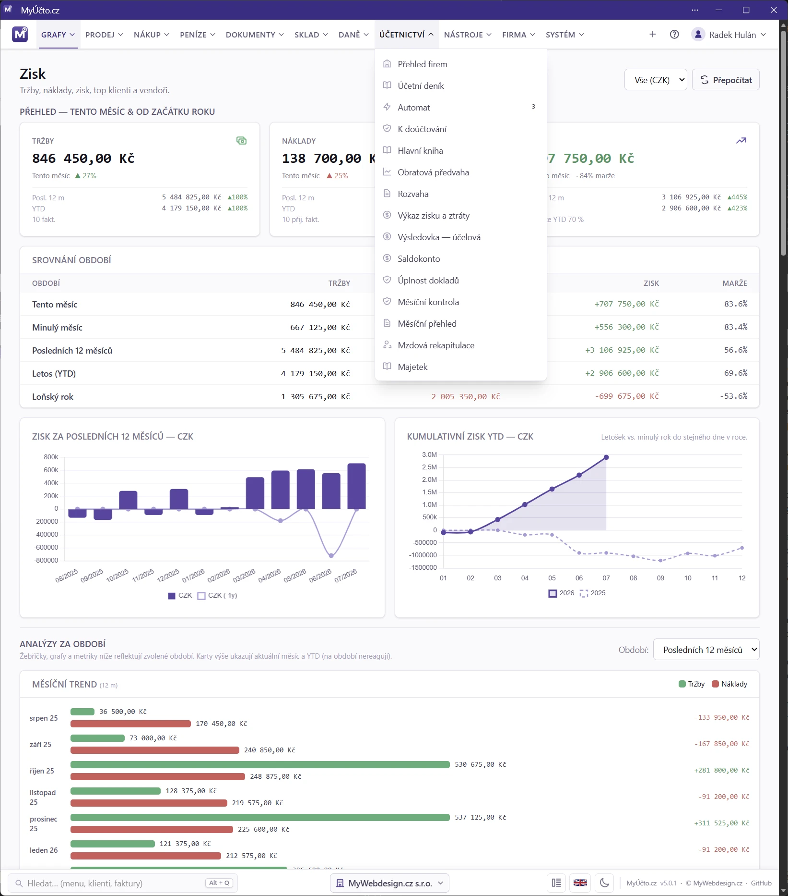

# MyÚčto.cz — uživatelský manuál

[🌐 MyUcto.cz](https://myucto.cz/) [📦 Docker](https://github.com/radekhulan/myucto/pkgs/container/myucto) [🏢 MyWebdesign.cz s.r.o.](https://mywebdesign.cz/)

Vítej v manuálu k účetnímu systému **MyÚčto.cz**. Kapitoly jsou seřazené
podle struktury menu v aplikaci — od instalace, přes vystavování a příjem faktur,
finanční přehledy, sklad, účetnictví a daňové výkazy, až po systémová nastavení.

První kapitoly **Instalace** jsou technické (cílí na osobu, která systém
nasazuje). Zbytek je psaný pro běžného uživatele — bez programátorského žargonu.

---

### Instalace a start

1. [Úvod](01_Uvod.md)
2. [Instalace — Quickstart](02_Instalace_Quickstart.md)
3. [Instalace — Docker](03_Instalace_Docker.md)
4. [Instalace — Nativní](04_Instalace_Nativni.md)
5. [Po instalaci a CLI](05_Po_instalaci.md)
6. [Převod dat z MyInvoice do MyÚčto](06_Prevod_z_MyInvoice.md)
7. [První spuštění](07_Setup_wizard.md)
8. [Přihlášení](08_Prihlaseni.md)
9. [Klientský portál](09_Klientsky_portal.md)

### Grafy

10. [Přehled](10_Prehled.md)
11. [Zisk](11_Zisk.md)
12. [Tržby](12_Trzby.md)
13. [Náklady](13_Naklady.md)

### Prodej

14. [Faktury (seznam)](14_Faktury.md)
15. [Editor faktury](15_Faktura_editor.md)
16. [Faktura PDF a e-mail](16_Faktura_PDF.md)
17. [Pravidelné faktury](17_Pravidelne_fakturace.md)
18. [Klienti](18_Klienti.md)
19. [Zakázky](19_Zakazky.md)
20. [Exporty](20_Exporty.md)
21. [Importy](21_Importy.md)
22. [Upomínky](22_Upominky.md)

### Nákup

23. [Přijaté faktury](23_Prijate_faktury.md)
24. [Export přijatých](24_Export_prijatych.md)
25. [AI extrakce](25_AI_extrakce.md)
26. [Platební příkazy](26_Platebni_prikazy.md)
27. [Drobný majetek](27_Drobny_majetek.md)

### Peníze

28. [Banka — výpisy a párování](28_Banka.md)
29. [Bankovní účty a avíza](29_Bankovni_ucty.md)
30. [Pokladna](30_Pokladna.md)

### Dokumenty

31. [Dokumenty](31_Dokumenty.md)
32. [Kniha jízd](32_Kniha_jizd.md)

### Sklad

33. [Sklad](33_Sklad.md)
34. [E-shop](34_Eshop.md)

### Daně

35. [Fakturujeme — daňový průvodce](35_Fakturujeme.md)
36. [Výkazy DPH](36_Vykazy_DPH.md)
37. [Kniha DPH](37_Kniha_DPH.md)
38. [Daň z příjmů](38_Dan_z_prijmu.md)
39. [Souhrnné hlášení](39_Souhrnne_hlaseni.md)
40. [Daňový optimalizátor](40_Danovy_optimalizator.md)
41. [Hromadný export](41_Hromadny_export.md)

### Účetnictví

42. [Průvodce účetního](42_Pruvodce_ucetniho.md)
43. [Přehled firem](43_Prehled_firem.md)
44. [Účetní deník](44_Ucetni_denik.md)
45. [Automat účtování](45_Automat.md)
46. [K doúčtování](46_Rucni_fronta_doctovani.md)
47. [Hlavní kniha](47_Hlavni_kniha.md)
48. [Obratová předvaha](48_Obratova_predvaha.md)
49. [Rozvaha](49_Rozvaha.md)
50. [Výkaz zisku a ztráty — druhové členění](50_Vysledovka_druhova.md)
51. [Výsledovka — účelové členění](51_Vysledovka_ucelova.md)
52. [Saldokonto](52_Saldokonto.md)
53. [Úplnost dokladů](53_Uplnost_dokladu.md)
54. [Měsíční kontrola](54_Mesicni_kontrola.md)
55. [Měsíční přehled](55_Mesicni_report.md)
56. [Mzdová rekapitulace a mzdový list](56_Mzdy.md)
57. [Úplné mzdy — aktivace a zaměstnanci](57_Uplne_mzdy.md)
58. [Majetek](58_Majetek.md)
59. [Účetní kontroly a inventarizace — metodika](59_Ucetni_kontroly_a_inventarizace.md)

### Nástroje

60. [Šablony](60_Sablony.md)
61. [Účtový rozvrh](61_Ucetni_osnova.md)
62. [Zápočty](62_Zapocty.md)
63. [Aktivace a doúčtování](63_Aktivace_ucetnictvi.md)
64. [Inventarizace účtů](64_Inventarizace_rozvahovych_uctu.md)
65. [Peněžní toky a změny vlastního kapitálu](65_Vykazy_podle_paragrafu_18.md)
66. [Spojené osoby](66_Propojene_osoby.md)
67. [Uzávěrka](67_Uzaverka.md)
68. [Nástroje](68_Ucetni_nastroje.md)
69. [EPO podání, archív a daňová rekonciliace](69_Archiv_podani_a_rekonciliace.md)

### Daňová evidence

70. [Daňová evidence](70_Danova_evidence.md)

### Firma

71. [Více dodavatelů](71_Multi_supplier.md)
72. [Nastavení](72_Nastaveni.md)
73. [Elektronické podpisy](73_Elektronicke_podpisy.md)

### Systém

74. [Daňové konstanty](74_Danove_konstanty.md)
75. [Bezpečnost](75_Bezpecnost.md)
76. [Aktualizace](76_Aktualizace.md)
77. [REST API](77_API.md)
78. [Licence a aktivace](78_Licence_a_aktivace.md)
79. [MCP server (napojení AI asistenta)](79_MCP_server.md)

### Reference

99. [Řešení problémů](99_Reseni_problemu.md)
